<script src="https://cdn.mathjax.org/mathjax/latest/MathJax.js?config=TeX-AMS-MML_HTMLorMML" type="text/javascript"></script>
<script type="text/x-mathjax-config">
  MathJax.Hub.Config({
    tex2jax: {
      inlineMath: [ ['$','$'], ["\\(","\\)"] ],
      processEscapes: true
    }
  });
</script>
# GAN学习笔记
本文跟随[《A Review on Generative Adversarial Networks:Algorithms, Theory, and Applications》](https://arxiv.org/pdf/2001.06937.pdf)一文对GAN进行系统性学习。
[toc]
## 0. 数学基础
### 0.1 信息论基础
  #### [KL散度](https://zh.wikipedia.org/wiki/相对熵)

  <span id="KL定义">定义：</span>
  $D_{\mathrm {KL} }(P||Q)=\sum \limits_i P(i)ln\frac{P(i)}{Q(i)}$

  $D_{\mathrm {KL} }(P\|Q)=-\sum _{i}P(i)\ln {\frac {Q(i)}{P(i)}}$

  $D_{{{\mathrm  {KL}}}}(P\|Q)=\int _{{-\infty }}^{\infty }p(x)\ln {\frac  {p(x)}{q(x)}}\,{{\rm {d}}}x$

  #### [JS散度](https://en.wikipedia.org/wiki/Jensen-Shannon_divergence)

<span id="JS定义">定义：</span>
  $ {JSD}(P \parallel Q)= {\frac{1}{2}} D_{KL}(P \parallel M)+ {\frac{1}{2}} D_{KL}(Q \parallel M )\\
  M=\frac{1}{2}(P+Q)$

  #### [互信息](https://zh.wikipedia.org/wiki/互信息)

  <span id="互信息定义">定义：</span>
  $I(X;Y)=\sum \limits_{y \in Y} \sum \limits_{x \in X} p(x,y)\log (\frac{p(x,y)}{p(x)p(y)})$

  $I(X;Y)=\int_Y\int_Xp(x,y)\log (\frac{p(x,y)}{p(x)p(y)})dxdy$

  #### [边缘熵\信息熵](https://zh.wikipedia.org/wiki/熵_(信息论))
  其实就是信息熵。
  <span id="边缘熵定义">定义：</span>
  $H(x)= -\sum \limits_{x \in \mathcal{X}}^{} p(x)\log p(x) $

  #### [条件熵](https://zh.wikipedia.org/wiki/%E6%9D%A1%E4%BB%B6%E7%86%B5)
  <span id="条件熵定义">定义：</span>
  $H(Y|X)=-\sum\limits_{x \in \mathcal{X}}^{} \sum\limits_{y \in \mathcal{Y}}^{}p(x,y)\log p(y|x)$

  #### EM距离
  <span id="EM距离定义">定义：</span>
  $W(P_r, P_g) = \inf \limits_{\gamma \sim \Pi (P_r, P_g)} \mathbb{E}_{(x, y) \sim \gamma} [||x - y||]$

### 0.2 函数理论
  #### [利普希茨连续（Lipschitz continuity）](https://zh.wikipedia.org/wiki/%E5%88%A9%E6%99%AE%E5%B8%8C%E8%8C%A8%E9%80%A3%E7%BA%8C)

 <span id="利普希茨连续定义">定义：</span>

对于在实数集的子集的函数$f\colon D\subseteq {\mathbb  {R}}\to {\mathbb  {R}}$ ，若存在常数$K$，使得$|f(a)-f(b)|\leq K|a-b|\quad \forall a,b\in D$，则称$f$ 符合利普希茨条件，对于$f$ 最小的常数$K$ 称为 $f$的利普希茨常数。

## 1.起源
  Generative Adversarial Network(GAN) 生成对抗网络于2014年由Ian Goodfellow发表论文的[《Generative Adversarial Nets》](https://arxiv.org/pdf/1406.2661.pdf)中提出。
### 1.1 思想

  GAN基本思想是让两个学习模型在相互对抗中互相提升，本质上是两个模型的训练目标存在冲突甚至是相反。
  
  在这篇GAN中网络的目标为：
  >模型1：学习生成足够逼真的图像并欺骗模型2使其认为是真的图像  
  模型2：学习分辨图像是真的还是模型1生成的假图像

  从两个训练目标来看，如果模型1的目标达成那就意味着模型2的目标是没有达成的，因为它没办法分辨图像的真假。同样的，如果模型2的目标达成，那模型1的目标也无法达成，因为它做不到欺骗模型2.

  这就是所谓的零和博弈。
  >零和博弈（英语：zero-sum game），又称零和游戏或零和赛局，与非零和博弈相对，是博弈论的一个概念，属非合作博弈。零和博弈表示所有博弈方的利益之和为零或一个常数，即一方有收入，其他方必有所失。在零和博弈中，博弈各方是不合作的。也可以说：自己的幸福是建立在他人的痛苦之上的，二者的大小完全相等，因而双方都想尽一切办法以实现“损人利己”。零和博弈的例子有赌博、期货和选举等。————维基百科

  在逻辑上可表达为 目标1 ⊕ 目标2。

  其中负责生成数据的模型1称为生成器(Generator)，而模型2称为判别器(Discriminator)。
  
  特点:
  >1.无监督学习，即训练GAN只需要不带标签的数据  
  >2.不依赖任何先验假设,这是使用神经网络模型带来的  
  >3.不依赖具体网络模型，GAN是一种框架性质的网络，对于具体使用的神经网络结构没有过多要求

###  1.2 模型

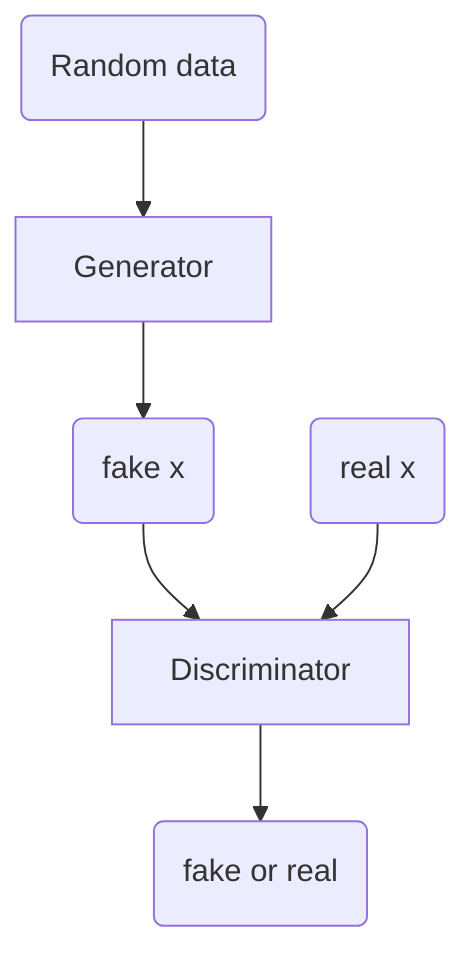

使用随机噪声数据（一般服从高斯正态分布）让生成器生成假的数据。而判别器以生成的假数据和真实的数据以及他们的标签（人为添加）作为训练数据进行训练，就像普通二分类网络那样。

### 1.3 损失函数
GAN的损失函数被定义为一个最大最小博弈公式：

$$\min \limits_{G} \max\limits_{D} V(G,D) = \mathbb{E}_{x\sim p_{data}(x)}[\log  D(x)]+\mathbb{E}_{z\sim p_{z}(z)}[\log  (1-D(G(z))]$$

两部分分别表示x服从数据分布时的对数期望和z服从z的分布时的对数期望。

根据训练目标，生成器希望判别器认为它生成的数据是真的，即D(G(z))->1。即生成器希望第二部分的期望接近负无穷。

与之相反如果忽略掉G的部分，然后把G(z)看成是标签为0的训练数据，那这其实就是一个二分类的交叉熵损失函数的倒数，其最大化对应交叉熵损失的最小化。

也就是说，这损失函数其实是两个模型的损失函数的整体表达。

对于生成器应该写作:
$$\min \limits_{G}\mathbb{E}_{z\sim p_{z}(z)}[\log  (1-D(G(z))]$$
或者是：
$$\min \limits_{G}-\mathbb{E}_{z\sim p_{z}(z)}[\log  D(G(z))]$$

而对于判别器，就应该写作：
  $$\min \limits_{D} -\mathbb{E}_{x\sim p_{data}(x)}[1\cdot \log  D(x)]-\mathbb{E}_{z\sim p_{z}(z)}[(1-0)\cdot \log  (1-D(G(z))]$$

### 1.4 训练方法
  GAN使用轮流训练的办法来训练这两个网络，先训练判别器然后训练生成器并且重复这个过程。 
  为了平衡两个网络之间的收敛速度的参与，还设置了参数k来进行调节。即对判别器先进行k轮训练而生成器只训练一次，或者反过来。

### 1.5 数学证明

命题1：对于给定的生成器G，生成器D的最优解为：

$$D^*_G(x)=\frac{p_{data}(x)}{p_{data}(x)+p_g(x)}$$

首先把V(G,D)从期望形式变成积分形式。
$$V(G,D)=\int _x p_{data}(x)\log (D(x))dx +\int _z p_{z}(z)\log (1-D(G(z)))dz \\ =\int _x p_{data}(x)\log (D(x))+p_g(x)\log (1-D(x))dx$$

考虑函数$f(x)=alnx+bln(1-x)$,a、b为正实数。

通过简单求导，可知f(x)在$\frac{a}{a+b}$处会取得最大值。

所以D的最优解为$D^*_G(x)=\frac{p_{data}(x)}{p_{data}(x)+p_g(x)}$

把这个最优解带入整体损失函数有：
$\min \limits_{G} \max\limits_{D} V(G,D)\\=C(G)\\=\min \limits_{G}V(G,D^*_G(x))\\=\mathbb{E}_{x\sim p_{data}(x)}[\log  D^*_G(x)]+\mathbb{E}_{z\sim p_{z}(z)}[\log  (1-D^*_G(G(z))]\\=\mathbb{E}_{x\sim p_{data}(x)}[\log  D^*_G(x)]+\mathbb{E}_{x\sim p_{g}(x)}[\log  (1-D^*_G(x)]\\=\mathbb{E}_{x\sim p_{data}(x)}[\log \frac{p_{data}(x)}{p_{data}(x)+p_g(x)}]+\mathbb{E}_{x\sim p_{g}(x)}[\log  \frac{p_{g}(x)}{p_{data}(x)+p_g(x)}]$

   根据[KL散度](#KL定义)的定义,上式可以写作
   $$C(G)=\mathbb{E}_{x\sim p_{data}(x)}[\log \frac{p_{data}(x)}{\frac{1}{2}(p_{data}(x)+p_g(x))}]+\mathbb{E}_{x\sim p_{g}(x)}[\log  \frac{p_{g}(x)}{\frac{1}{2}(p_{data}(x)+p_g(x))}]-\log 4\\ 
   =-\log 4+KL(p_{data}||\frac{p_{data}(x)+p_g(x)}{2})+KL(p_{g}||\frac{p_{data}(x)+p_g(x)}{2})$$

考虑[JS散度](#JS定义)的定义，又可以写成：
$$C(G)=-\log 4+2JS(p_{g}||p_{data})$$

   
当$p_g=p_{data}$时，有$D^*_G(x)=\frac{1}{2} , C(G)=-1og4$  (常数的期望是它自己)。

而JS散度表示的是两个分布的差异，其值大于0，当C(G)取得最小值的时候JS散度为0，当且仅当$p_g=p_{data}$。

这个结论告诉我们，GAN中训练的全局最优解总是生成器胜出。

## 2 GAN 的变体
 GAN有很多出名的变体，这些变体稍微更改了GAN的网络结构或者是对损失函数进行了改进。
### 2.1 InfoGAN
 InfoGAN来自[《InfoGAN: Interpretable Representation Learning by Information Maximizing Generative Adversarial Nets》](https://arxiv.org/pdf/1606.03657.pdf)。

 其对GAN的改进主要是关于噪声和生成器生成数据的可知性的问题。可以这么理解这个问题，原始GAN你可以下命令让它生成一堆手写数字图片，但是你没办法让它生成内容为1的手写数字图片，而InfoGAN的目标是让生成器能够生成自己想要的数字图片。

 其主要工作是在GAN的最大最小博弈损失函数上加上一项，这一项就是上面所说的目标的损失。

 就其本质来说，只是在原本的GAN上增加了一个训练目标，原本的GAN是双目标的学习（不包含正则化），而InfoGAN是三目标学习。

 但是其实际意义的提升却比这点改进更多。
 
 可以想象一下，假如有个能生成衣服设计的神经网络，一个能够根据你的要求设计衣服的神经网络和一个随机生成一些衣服的神经网络，大多数人都会选择前者，而后者的应用范围太小了。

#### 2.1.1 增加项（目标）
 InfoGAN希望让网络学习从特定的分布或者特定但是带有噪声的分布中生成需要的数据，比如说希望数字1加上一个（-0.5，0.5）的随机噪声就可以得到一些不完全相同的数字1的手写图像。

 这个新增的项基于[互信息](#互信息定义)（mutual information），并且使用[边缘熵](#边缘熵定义)和[条件熵](#条件熵定义)的表达形式：
 $$I(X;Y)=H(X)-H(X|Y)$$

 根据定义可知，当X，Y相互独立的时候$I(X;Y)=0$，即观察Y对预测X的值没有任何帮助。

 另外根据$I(X;Y)\ge0$以及需要的目标，这个目标可以转化为$\max \limits_{\theta}I(X;Y)$。

 整体损失函数写作：
 $$\min \limits_{G} \max\limits_{D} V_1(G,D)= V(G,D)-\lambda I(c;G(z,c))$$

 其中，c代表一个先验分布的随机变量取值，z依然是随机噪声。

 表示的是在已知c的情况下，尽可能地可以确定生成器生成地数据。

下面开始推导：
$I(c;G(z,c))=H(c)-H(c|G(z,c))\\
=H(c)+\sum \sum  p(c,G(z,c))\log  P(c|G(z,c))\\
=H(c)+\mathbb{E}_{x\sim G(z,c)}[\sum p(c|x)\log  P(c|x)]$

这里使用一个辅分布$Q(c|x)$来帮助推导。
$KL(P(c|x)||Q(c|x))=\sum p(c|x)\log  P(c|x) - \sum p(c|x)\log  Q(c|x)$
所以
$I(c;G(z,c))\\
=H(c)+\mathbb{E}_{x\sim G(z,c)}[KL(P(c|x)||Q(c|x))+\sum p(c|x)\log  Q(c|x)]\\
 \ge \mathbb{E}_{x\sim G(z,c)}[\mathbb{E}_{c'\sim P(c|x)}[\log Q(c'|x)]]+H(c)$

 能够进行放缩的原因是KL散度是不小于0.
 
 把这个结果记为：
 $L_1(G,Q)=\mathbb{E}_{x\sim G(z,c)}[\mathbb{E}_{c'\sim P(c|x)}[\log Q(c'|x)]]+H(c)\\
 =\mathbb{E}_{x\sim G(z,c),c\sim P(c)[\log Q(c|x)]}+H(c)$

 这函数是$I(c;G(z,c))$的下界，当Q接近P的时候，其KL散度接近0。换句话来说，$I(c;G(z,c))$是$L_1(G,Q)$的上界，当Q接近P的时候，$L_1(G,Q)$是最大值。

 所以，学习的目标就从学习一个有些虚无的互信息变成了学习某个分布（神经网络：你说学这个啊，我老熟了），而这个被学习的分布P就是你提前设定的，这里是一个手写数字（Image）到数字（int）的映射，也就是熟知的手写数字识别。

 最终损失函数变成了：
 $\min \limits_{G,Q} \max\limits_{D} V_1(G,D)= V(G,D)-\lambda L_1(G,Q)$
 

#### 2.1.2 算法
 在《InfoGAN: Interpretable Representation Learning by Information Maximizing Generative Adversarial Nets》这篇文章里，作者将Q和D合二为一。

 首先是生成器的输入参数，c使用与D同分布的数据向量，比如说判别器的输出为0-9的one-hot向量，那c也是对于的向量。

 在c的基础上再增加几维的随机变量一起输入生成器，之后的步骤和GAN相似。

 不同的是，D不再是判断真假，而是变成了识别数字这样就随便把Q的分布也学习了，而D学习到x->c的表达，生成器通过相反的训练目标把c->x的表达学习到了。

 同时，D还在提升判断能力，G会使用各种办法欺骗D，所以会生成各种不同风格的手写数字来达成目的。

 如果把两部分的训练拆开来看，一边是一个GAN而另一边是一个编码解码网络，只不过多了一个随机数据项。
 
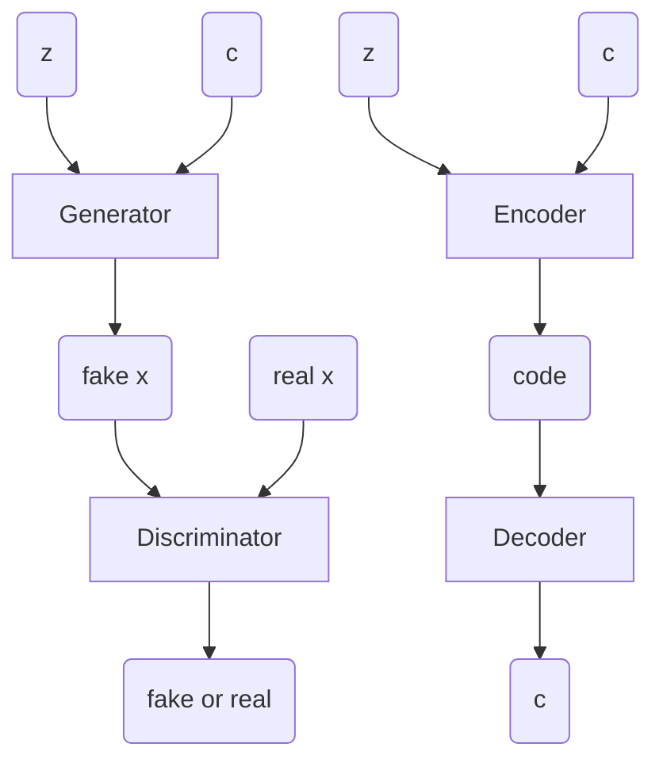
生成器从左边学习手写数字应该是怎么样的，然后在右边学习手写数字和数字的对应。

就像是你的美术老师教了你怎么画数字，但是你不知道这些图形代表了什么，接着下一节上数学课，老师教你怎么把数字和符号对应起来。

### 2.2 Conditional GANs (cGANs 或 CGAN)
 条件生成对抗网络被提出于[《Conditional Generative Adversarial Nets》](https://arxiv.org/pdf/1411.1784.pdf)。

 这篇文章里没有多少数学证明，就只是给了怎么做。

 cGANs模型的思路跟InfoGAN相似，都是额外加入标签进行训练。

 做个比喻来描述CGAN的思路：生成器像是一个学生，它要根据具体题目给出题目的答案，而判别器像是一位评卷老师，老师只需要知道对于某一个题目的解答是否正确就行了，为此评卷老师需要学习什么样的答案不对什么样的是错的，而学生在一次次考零分的过程中学习到了怎么解答题目。

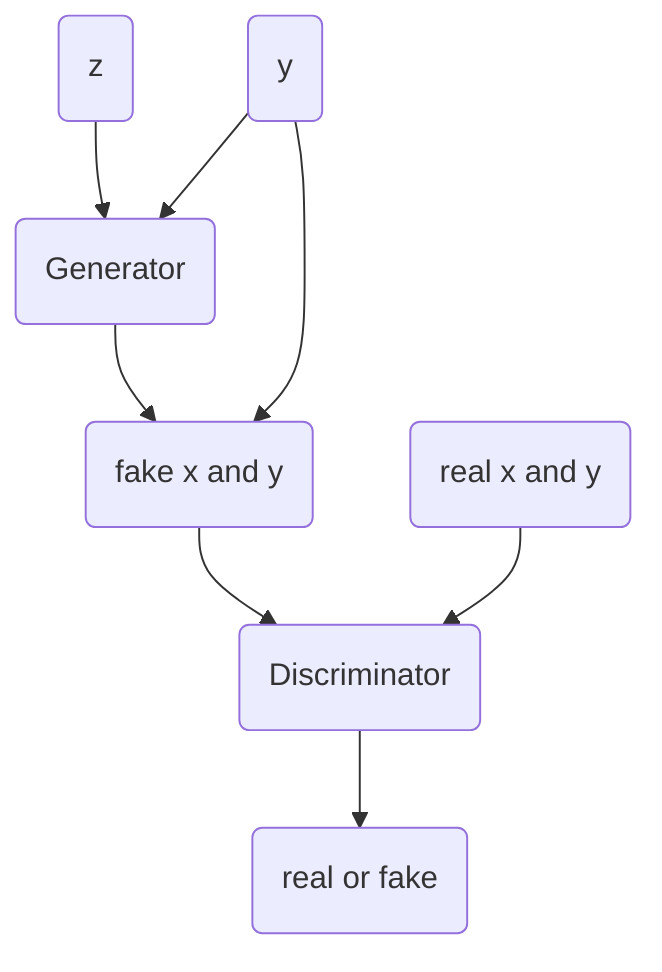
如图，生成器根据数据噪声z和要求y生成对于的x，然后把生成的x加上之前输入生成器的要求y输入判别器，同时输入真实的数据x和标签y。

剩下的基本就和GAN一样了。

简单来说，如果我们把X和Y一起看成一个整体XY，那CGAN就是训练数据与噪声有重叠部分的一个GAN。
#### 2.2.1 漫画图像到真实图像
[《Image-to-Image Translation with Conditional Adversarial Networks
》](https://arxiv.org/pdf/1611.07004.pdf)中，作者利用CGAN完成了一个从漫画图像到真实图像的网络，不过在损失函数中加入了一个正则项。
#### 2.2.2 高分辨率漫画图像到真实图像
[《High-Resolution Image Synthesis and Semantic Manipulation with Conditional GANs》](https://arxiv.org/pdf/1711.11585.pdf)一文中利用改进后的条件生成对抗网络完成了漫画图像到真实图像的高清版神经网络，其最主要的改动是将神经网络进行了多层嵌套设计。

其网络设计如图：
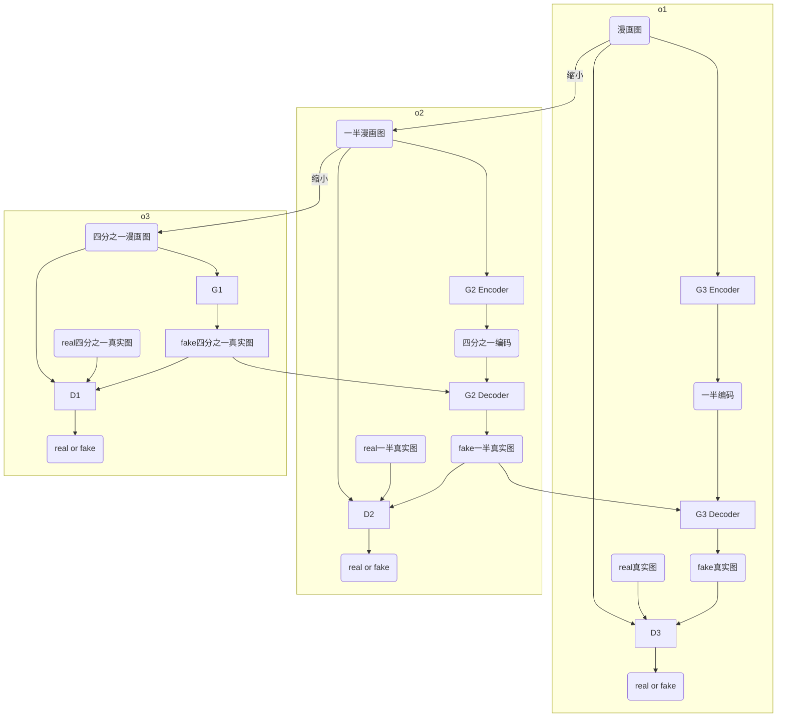
其中，这些网络被分为3对GAN，后面的GAN会利用更小一级的生成器输出，使用叠加的方式。一半和四分之一指的是图像的长度而不是面积，按面积算应该是1：4：16。

其损失函数为：
$\min \limits_G((\max \limits_{D_1,D_2,D_3}\sum \limits_{k=1,2,3}L_{GAN}(G,D_k))+\lambda \sum \limits_{k=1,2,3}L_{FM}(G,D_k))$

其中$L_{FM}(G,D_k)$被定义为：
$L_{FM}(G,D_k)=\mathbb{E}_{(s,x)}\sum \limits_{i=1}^T\frac{1}{N_i}[||D_k^{(i)}(s,x)-D_k^{(i)}(s,G(s))||_1]$

其中T为神经网络层数，$N_i$是每一层的参数个数。也就是说，这个损失函数要求$(s,G(s))$和$(s,x)$在$D_k$的每一层的输出都相同，而不是仅仅比较最后一层的输出。


### 2.3 AC-GAN
Auxiliary Classifier GAN被提出于[《Conditional Image Synthesis with Auxiliary Classifier GANs》](https://arxiv.org/pdf/1610.09585.pdf)。

与CGAN类似，没有太多数学过程，更多的是怎么做。

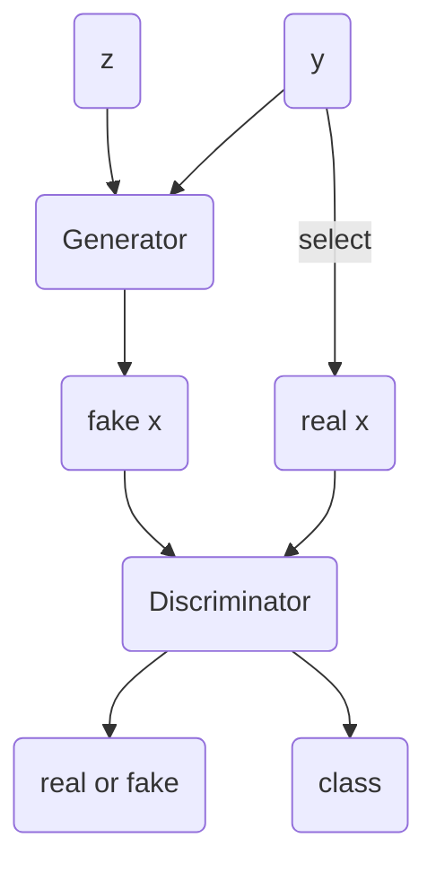
与CGAN不同的是，判别器不仅仅要判断对错还要进行分类。

#### 2.3.1 损失函数
$L_s=E[\log P(S=real)|X_{real}]+E[\log P(S=real)|X_{fake}]$

$L_c=E[\log P(C=c)|X_{real}]+E[\log P(C=c)|X_{fake}]$

生成器G使用$L_c-L_s$进行训练，而判别器D使用$L_s+L_c$进行训练。

### 2.4 CycleGAN

CycleGAN被提出于[《Unpaired Image-to-Image Translation using Cycle-Consistent Adversarial Networks》](https://arxiv.org/pdf/1703.10593.pdf)。

其使用两对GAN $(F,D_x) ,(G,F_y)$组成CycleGAN，F和G互为反函数$D_x,D_y$分别用于鉴别F和G的输出。

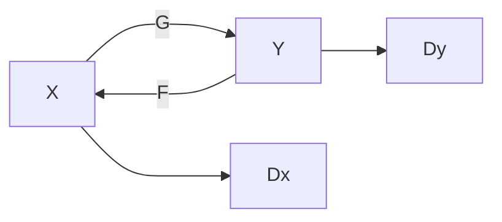

因为是反函数关系，很自然的就有F(G(x))=x,G(F(y))=y，选定一个距离量度来衡量其距离就得到了损失函数。

其损失函数分为GAN部分和cyc部分，GAN部分的损失函数可以很自然的得到。

而cyc损失被定义为：
$$L_{cyc}=\mathbb{E}_{x \sim p_{data}(x)}[||F(G(x))-x||_1]+\mathbb{E}_{y \sim p_{data}(y)}[||G(F(y))-y||_1]$$

使用1范数的原因是使用其他复杂范数无助于提升损失函数的效果，使用最简单的形式可以简便计算。2.2.2中的损失也是因为这个原因。

### 2.5 <span id="fgan">f-GAN</span>
f-GAN被提出于[《f-GAN: Training Generative Neural Samplers using Variational Divergence Minimization》](https://arxiv.org/pdf/1606.00709.pdf)。

f-GAN不是对GAN的改进，而是对GAN的损失函数进行了一般化。

在GAN的损失函数中，其损失函数是与KL散度相关的。

回顾KL散度下形式：
$$KL(P||Q)=\sum \limits_i P(i)\log \frac{P(i)}{Q(i)}$$

其连续形式应该写作：
$$KL(P||Q)=\int q(x)\log \frac{p(x)}{q(x)}$$

将KL散度当中的log函数换成凸函数$f$，记为$f$散度，也叫做Ali-Silvey 距离。
$$D_f(P||Q)=\int q(x)f( \frac{p(x)}{q(x)})$$

$f$还具有$f(1)=0$的性质。

使用variational divergence minimization(VDM)方法对P和Q的$f$散度进行估计。

推导如下：

对于每一个凸下[半连续函数](https://en.wikipedia.org/wiki/Convex_conjugate)$f$都有一个对应的[凸共轭](https://en.wikipedia.org/wiki/Convex_conjugate)函数$f^*$:
$$f^*(t)=\sup \limits_{u\in dom_f}\{ut - f(u)\}$$

$f^*(t)$的求解方法如下：

考虑方程$ut = f(u)$，对u求导得：

$$t=f'(u)$$

反解得到u关于t的表达式：

$$u=g(t)$$

然后将u代回$f^*(t)=ut - f(u)$得：

$$f^*(t)=tg(t)-f(g(t))$$

同时，有性质$f^{**}=f$。


$D_f(P||Q)\\
=\int q(x)f( \frac{p(x)}{q(x)})\\
=\int q(x)\sup \limits_{t\in dom_{f^*}}\{t \frac{p(x)}{q(x)} - f^*(t)\} dx\\
\ge \sup \limits_{T\in \tau}(\int p(x)T(x)dx-\int q(x)f^*(T(x))dx)\\
=\sup \limits_{T\in \tau}(\mathbb{E}_{x\sim P}[T(x)]-\mathbb{E}_{x\sim Q}[f^*(T(x))])$

上面推导的放缩原因我看不懂，暂时先放原文解释：first, because of Jensen’s inequality when swapping the integration and supremum operations. Second, the class of functions $\tau$ may contain only a subset of all possible functions.

sup的含义为取上界，大致相当于max。

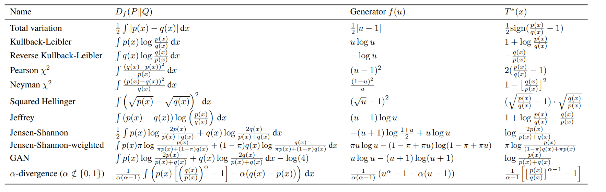

VDM方法把分布Q用生成器逼近，记参数为$\theta$，而T用$\omega$参数化。

则有：

$$F(\theta,\omega)=\mathbb{E}_{x\sim P}[T_{\omega}(x)]-\mathbb{E}_{x\sim Q_{\theta}}[f^*(T_{\omega}(x))]$$

$\theta$和$\omega$的优化目标分别是使函数最小化和最大化，类似GAN的最大最小博弈。

将$T_{\omega}(x)$写成$T_{\omega}(x)=g_f(V_\omega(x))$，其中$V_\omega(x)$是一个值域为实数的没有任何限制的函数，比如参数$\omega$与x的内积。而$g_f$为激活函数。

也就是说，最后还是变成了神经网络。

对应的激活函数和$f$表：

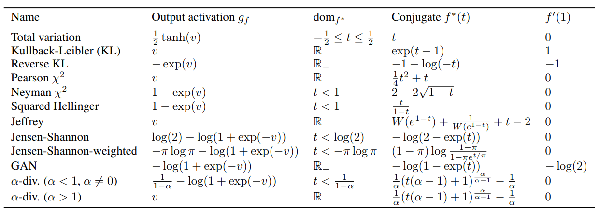

使用的优化方法依然是轮流优化的策略。

下面是关于算法几何收敛于鞍点的证明。

达到鞍点的条件为：
$\bigtriangledown_\theta F(\theta^*,\omega^*)=0,\bigtriangledown_\omega F(\theta^*,\omega^*)=0,\bigtriangledown_\theta^2 F(\theta,\omega) \succeq \delta I,\bigtriangledown_\omega^2 F(\theta,\omega) \preceq -\delta I$

定义$\pi^t=(\theta^t,\omega^t)$

假设$\pi^*=(\theta^*,\omega^*)$是一个鞍点且其邻域满足上述条件，定义$J(\pi)=\frac{1}{2}||\bigtriangledown F(\pi)||_2^2$,在邻域内F足够光滑使得对于恒定的L有$||\bigtriangledown J(\pi')-\bigtriangledown J(\pi)||_2 \le L||\pi'-\pi||_2$，对于使用步长为$\frac{\delta}{L}$的梯度下降算法有：
$$J(\pi^t)\le (1-\frac{\delta^2}{2L})^tJ(\pi^0)$$

其含义为梯度的大小以指数方式下降。

证明：在上述条件的情况下，假定F足够光滑使得
$$J(\pi')\le J(\pi)+<\bigtriangledown J(\pi),\pi'-\pi>+\frac{L}{2}||\pi'-\pi||_2$$

类似于泰勒级数。

$\bigtriangledown J(\pi)=\bigtriangledown ^2F(\pi)\bigtriangledown F(\pi)$

@import "fganFpi.png" {width="500px" height="110px" }

@import "fganFpi2.png" 


其中，最后一步变换使用了鞍点条件。


@import "fganFpi3.png" {width="600px" height="170px" }


### 2.6 WGAN
WGAN是在[《Wasserstein GAN》](https://arxiv.org/pdf/1701.07875.pdf)中提出的，但是实际上作者在他之前的论文[《TOWARDS PRINCIPLED METHODS FOR TRAINING GENERATIVE ADVERSARIAL NETWORKS》](https://arxiv.org/pdf/1701.04862.pdf)里论证了GAN的缺陷，而在后一篇提出了能够解决这些问题的WGAN。
#### 2.6.1 GAN的缺陷

依据GAN的数学过程，GAN的最后胜利者是生成器，而判别器最后会无法分辨真实数据与虚假数据。但是当判别器太过优秀的时候，生成器的训练就会进行不下去。

我个人认为这是生成器和判别器的模型复杂度导致的。

首先，生成器想要训练的好，判别器就必须优秀，因为生成器的梯度更新模式大部分来源于判别器模型的模式。

如果判别器的复杂度不够，那么就会导致生成器不能学到足够的信息，这不是增加生成器复杂度可以解决的，因为判别器是生成器的老师，老师都学的不精，学生怎么可能学的好。

但是，判别器足够优秀的时候，生成器的复杂度就可能不够了，也就是说它的复杂度不足以支持它打败它的老师。

回顾损失函数的JS散度形式：$-\log 4+2JS(p_{g}||p_{data})$

当$p_g和p_{data}$没有重叠部分或者重叠部分可以忽略的时候，其JS散度会等于$\log 2$，这会导致梯度消失，这可能是我在训练中经常遇到梯度消失的原因。

为啥会有没有重叠或重叠部分可以忽略的情况呢？

因为生成器生成的数据其实是把噪声z嵌入到高维空间的结果，也就是说，生成数据实际上是高维数据空间的一个低维流形。

严格的数学上的表达是：当$P_g$与$P_{data}$的支撑集（support）是高维空间中的低维流形（manifold）时，$P_g$与$P_{data}$重叠部分测度（measure）为0的概率为1。

GAN中的噪声基本上维度远远远远远远远远低于生成数据。

因此，在这种情况下，就会导致GAN的训练非常看‘运气’，就跟赌石一样，谁也说不准这一次训练会不会遇到梯度消失。

假设，原数据分布于高维空间中的一个超平面，而噪声嵌入到高维空间后，恰好与这超平面平行了。

当然，这个可能性不高，但是没有重叠部分的情况又不是只有平行的情况。

况且优化算法中为了避免局部最小值的随机算法也会成为梯度消失的‘帮凶’，谁也不知道是不是某一次更新之后，优化算法恰好把原来有点相关的分布变成不相干的了。

另一个就是模式坍缩问题，考虑KL散度：

$KL(p_g||p_{data})\\
=\sum p_g(x)\log\frac{p_g(x)}{p_{data}(x)}\\
=\sum p_g(x)\log\frac{1-D^*(x)}{D^*(x)}\\
=\sum p_g(x)\log (1-D^*(x))-\sum p_g(x)\log D^*(x)\\
=\mathbb{E}_{x \sim p_g} \log [1 - D^*(x)] -  \mathbb{E}_{x \sim p_g} \log D^*(x)$

又有
$\mathbb{E}_{x \sim p_g} \log [1 - D^*(x)] + \mathbb{E}_{x \sim p_{data}} \log D^*(x)=2JS(p_g||p_{data})-\log 4$

$=>\\
-\mathbb{E}_{x \sim p_g} \log D^*(x)\\
=KL(p_g||p_{data})-2JS(p_g||p_{data})+\log 4 +\mathbb{E}_{x \sim p_{data}} \log D^*(x)$

生成器只参与了前两项，这就导致了这个目标的最小化是KL的最小化和JS的最大化，导致自相矛盾。

其次，KL散度其实是不对称的量度，当$p_g(x) \to 0 ,p_{data}(x)\to 1,有p_g(x)\log \frac{p_g(x)}{p_{data}(x)}\to 0$。也就是说，GAN不能生成真实图像的惩罚是很小的。

其次，KL散度其实是不对称的量度，当$p_g(x) \to 1 ,p_{data}(x)\to 0,有p_g(x)\log \frac{p_g(x)}{p_{data}(x)}\to \infty$。也就是说，GAN生成图像不够真的惩罚很大。

所以导致GAN更愿意生成重复的真实图像来避免第二项惩罚，就形成了模式坍缩。

#### 2.6.2 WGAN的改进

在WGAN中引入了[Earth-Mover(EM)距离](#EM距离定义)，也被称为[Wasserstein]()-1 （范数）。

$$W(P_r, P_g) = \inf \limits_{\gamma \sim \Pi (P_r, P_g)} \mathbb{E}_{(x, y) \sim \gamma} [||x - y||]$$

$\gamma \sim \Pi (P_r, P_g)$的含义是$P_r和 P_g$组成的联合分布，$P_r和 P_g$为其边缘分布。这样的分布不止一个，在所有可能的联合分布中找到$\mathbb{E}_{(x, y) \sim \gamma} [||x - y||]$的下界（可理解为最小值），这样一个下界被定义为EM距离。

为什么要引入这个距离呢？上面提到，JS和KL对于没有重叠的分布难以表达其距离，而EM距离没有这个缺点。

考虑$P_1\sim (a,X) , P_2 \sim (b,Y)$,其中X和Y是一维随机变量，服从在c到d上的均匀分布。

[KL散度](#KL定义)：
$KL(P_1||P_2)=\int p_1(x)\log \frac{p_1(x)}{p_2(x)}dx$

显然，当$a\ne b$的时候，$p_2(x)=0$，则KL散度必定趋于无穷，当$a= b$时，两个分布没有差异，其KL散度为0。对于$KL(P_2||P_1)$有相同的结论。

[JS散度](#JS定义)：

$JS(P_1||P_2)=\frac{1}{2}KL(P_1||\frac{P_1+P_2}{2})+\frac{1}{2}KL(P_2||\frac{P_1+P_2}{2})$

对于第一部分，若$a\ne b$，$P_2(x)=0$，$\frac{1}{2}KL(P_1||\frac{P_1+P_2}{2})=\frac{1}{2}\int p_1(x)\log 2dx=\frac{1}{2}\log 2$。

所以有JS散度为$\log 2或者0$。

[Earth-Mover(EM)距离](#EM距离定义)：

$W(P_1,P_2)=\inf |a-b|+|x-y|$

显然，$P(x=y)=1$的时候是取得下界的联合分布。

这就可以看出来差异了，JS散度和KL散度在这两种情况下只能去两个值，而EM距离可以取连续值。梯度下降算法基于求导，而一个不连续的函数怎么求导？

这就是EM距离性能优越的地方，而且其形式也简单，计算快。

但是，这个距离不能直接用来计算距离，因为其需要求解下界联合分布。

作者将EM距离转化为：
$$W(P_r, P_g) = \frac{1}{K} \sup \limits_{||f||_L \leq K} \mathbb{E}_{x \sim P_r} [f(x)] - \mathbb{E}_{x \sim P_g} [f(x)]$$

其中，$||f||_L \leq K$是[Lipschitz连续](#利普希茨连续定义)条件。

上式是EM定义式的对偶形式。

将期望写成离散形式：

$\mathbb{E}_{(x, y) \sim \gamma} [||x - y||]=\sum \limits_X \sum \limits_Y p_\gamma(x,y)||x-y||$

这其实是两个矩阵$P_{i,j}=p_\gamma(x_i,y_j)和Q_{i,j}=||x_i-y_j||$的内积，既然是内积，那元素排列就不影响最后结果，我们把两个矩阵写成向量的形式，就像二维数组变成一维数组那样，记为$\Gamma,D$，并记EM距离为W。

$W=\inf \Gamma^TD=\inf D^T\Gamma$

同理，我们将$P_r,P_g$拼接成向量$b=[p_r(x_1),p_r(x_2),……,p_g(y_1),p_g(y_2),……]^T$。

由边缘分布和联合分布的关系可以得到$A\Gamma=b$。

$W=\min \limits_\Gamma\{D^T\Gamma |A\Gamma=b ,\Gamma>0\}$

令$y^TA\le D^T$，因为$\Gamma \ge 0$有：

$y^TA\Gamma\le D^T\Gamma$

$\max \limits_y \{b^Ty|A^Ty\le D\}\le \min \limits_\Gamma\{D^T\Gamma |A\Gamma=b ,\Gamma>0\}$

这是原问题的弱对偶形式，其强对偶推理较为复杂，这里只给结果，具体证明看[文章](https://kexue.fm/archives/6280)。

$\max \limits_y \{b^Ty|A^Ty\le D\}=\min \limits_\Gamma\{D^T\Gamma |A\Gamma=b ,\Gamma>0\}$

将y写作$[f(x_1),f(x_2),……,g(y_1),g(y_2),……]^T$

则$b^Ty=\sum p_r(\cdot) f(\cdot)+\sum p_g(\cdot)g(\cdot)$

而约束条件$A^Ty\le D$可得$f(x_i)+g(y_j)\le d(x_i,y_j)$(把矩阵A写出来就知道了)。

因为X和Y的取值是相同空间的，所以我们可以自然而然的得到$x_i=y_i$，所以$b^Ty=\sum p_r(\cdot) f(\cdot)+p_g(\cdot)g(\cdot)$

而$f(x)+g(x)\le d(x,x)=0$，所以$b^Ty\le \sum [p_r(x)-p_g(x)]f(x)$

如果有$f(x)-f(y)\le d(x,y)$，那么$f(x)+g(y)\le f(x)-f(y)\le d(x,y)$

故$W=\max \limits_f\{\sum [p_r(x)-p_g(x)]f(x)|f(x)-f(y)\le d(x,y)\}$

由于此处的距离d是1范数，所以约束条件可以描述为$f(x)$是以1为利普希茨常数的利普希茨连续函数。

$$W(P_r, P_g) = \sup \limits_{||f||_L \leq 1} \mathbb{E}_{x \sim P_r} [f(x)] - \mathbb{E}_{x \sim P_g} [f(x)]\\=\frac{1}{K} \sup \limits_{||f||_L \leq K} \mathbb{E}_{x \sim P_r} [f(x)] - \mathbb{E}_{x \sim P_g} [f(x)]$$


由于使用梯度下降算法，我们不需要计算K是多少，因为其结果不过是让梯度整体变大K倍而已。作者采取一种简单的方法：限制神经网络参数的范围，在每次更新完参数后都把超出范围部分的参数切掉。

我们的目标是最小化训练数据分布和生成数据分布的EM距离，等价于上式的最大化。

将$f$参数化为判别器D，记为$f_\omega(\cdot)$。

$\max \limits_\omega \mathbb{E}_{x \sim P_{data}(x)} [f_\omega(x)] - \mathbb{E}_{x \sim P_g(x)} [f_\omega(x)]$

同理生成器用$\theta$参数化：
$\min\limits_\theta \max \limits_{\omega} \mathbb{E}_{x \sim P_{data}(x)} [f_\omega(x)] - \mathbb{E}_{z \sim P_z(z)} [f_\omega(g_\theta(z))]$


作者还给了一个期望的偏导等于偏导的期望的证明，不过我没有搞明白为什么要证明这。

根据损失函数，我们可以得到两个改进，去除$\log$函数，去掉神经网络最后一层的Sigmoid函数，因为这里判别器学习的是一个连续函数，属于回归任务。

同时还有之前的参数约束，将参数截断到$(-c,c)$。

最后还有作者根据实验经验得到的改进：不要使用动量优化算法。

总结起来就是4点：
>1.判别器最后一层去掉sigmoid
>2.生成器和判别器的loss不取log
>3.每次更新判别器的参数之后把它们的绝对值截断到不超过一个固定常数c
>4.不要用基于动量的优化算法（包括momentum和Adam），推荐RMSProp，SGD也行

不过在去掉sigmoid函数后，判别器这个名字就不太合适了，因为其本质是在执行一个回归拟合，所以‘距离网络’这个名字可能更加适合。

算法:
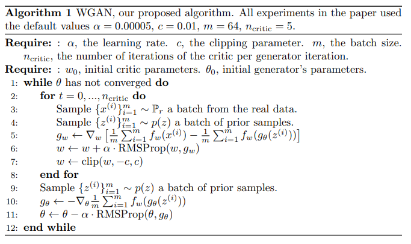


#### 2.6.3 WGAN的训练改进
在WGAN中训练过程中的参数裁剪方法导致了WGAN训练困难、收敛慢等问题，于是作者在之后的论文[《Improved Training of Wasserstein GANs》](https://arxiv.org/pdf/1704.00028.pdf)提出了该井方法。

作者发现使用weight clipping会导致参数集中在裁剪区域两端而不是某种比较均匀的分布。

作者在原有损失的基础上增加了gradient penalty项：
$L(D) = -\mathbb{E}_{x\sim P_r}[D(x)] + \mathbb{E}_{x\sim P_g}[D(x)] + \lambda \mathbb{E}_{x \sim \mathcal{X}} [ || \nabla_x D(x) ||_p - 1 ]^2$

直观上看，这一项希望对x的偏导数在1附近呈现比较均匀的分布。

同时，为了能够合理采样，gradient penalty使用的x是真实数据和生成数据的混合数据，而作者使用是优化器也变成了Adam，说明之前的训练困难就是因为参数裁剪导致的。
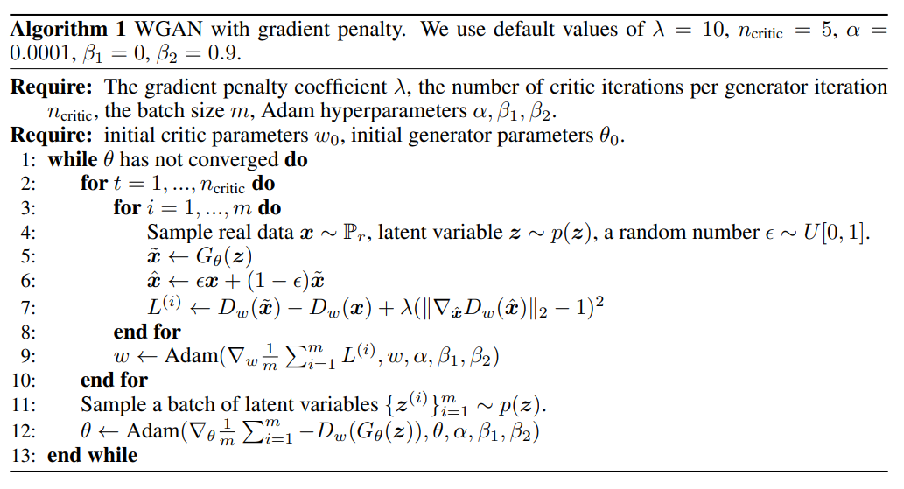


### 2.7 LS-GAN
Loss Sensitive GAN (LS-GAN)提出于[《Loss-Sensitive Generative Adversarial Networks on Lipschitz Densities》](https://arxiv.org/pdf/1701.06264.pdf)。

记函数$L_\theta(x)=L(D(x),real)$，L为某距离函数。

通常来说真实数据会更接近真实，而生成器生成的假数据的距离会更大。大多少呢？可以定义以下关系：

$L_\theta(x) \leq L_\theta(G(z)) - \triangle(x, G(z))$

其中，$\triangle(\cdot,\cdot)$是某相似性量度，一般取为p阶闵可夫斯基距离。

当生成的数据比较接近数据集分布的时候，引入松弛变量使：

$L_\theta(x) - \xi_{x,z} \leq L_\theta(G(z)) - \triangle(x, G(z))$

$\xi_{x,z} \ge 0$

当松弛变量越来越小，就说明生成分布与数据分布越接近。判别器优化目标可以写成：

$\begin{align} \min_\theta \quad &\mathbb{E}_{x\sim p_{data}(x)}L_\theta(x) + \lambda \mathbb{E}_{x\sim p_{data}(x),z\sim p_z(z)} \xi_{x,z} \\ \text{s.t.} \quad & L_\theta(x) - \xi_{x,z} \leq L_\theta(G(z)) - \triangle(x, G(z)), \quad x\sim p_{data}(x), z\sim p_z(z) \\ &\xi_{x,z} \geq 0, \quad x\sim p_{data}(x), z\sim p_z(z) \end{align}$

第一项是让判别器能够把真实数据判定为真，而第二项是缩小两个分布的距离。

将约束条件带入得：

$\min_\theta S(\theta, \phi^*) = \mathbb{E}_{x\sim p_{data}(x)}L_\theta(x) + \lambda \mathbb{E}_{x\sim p_{data}(x),z\sim p_z(z)} (L_\theta(x) - L_\theta(G_{\phi^*}(z)) + \triangle(x, G_{\phi^*}(z)))_+ $

其中的$(\cdot)_+$表示取正值，因为有$\xi_{x,z} \ge 0$的约束，可以使用RELU来代替。

生成器优化目标为：

$\min_\phi T(\theta^*, \phi) = \mathbb{E}_{z\sim p_z(z)} L_{\theta^*}(G_\phi(z))$

#### 2.7.1 GLS-GAN

GLS-GAN 是LS-GAN的推广，在上面的公式中，正部函数只用到了$(a)_+ \geq a, \forall a$两个性质，实际上可以用其他代价函数进行替代。

可用用一广义代价函数来重写判别器的优化目标：

$S_C(\theta, \phi^*) =\mathbb{E}_{x\sim p_{data}(x),z\sim p_z(z)} C(L_\theta(x) - L_\theta(G_{\phi^*}(z)) + \triangle(x, G_{\phi^*}(z)))$

假设广义代价函数C是LeakyReLU函数，即$max(a,va)$。当v=0时，函数退化成ReLU函数，GLS-GAN就退化成了LS-GAN。

当v=1时，$S_{C_1}(\theta, \phi^*) =\mathbb{E}_{x\sim p_{data}(x),z\sim p_z(z)} (L_\theta(x) - L_\theta(G_{\phi^*}(z)) + \triangle(x, G_{\phi^*}(z)))$

可以看到第三项距离量度是一个与判别器D无关的项，D的参数对它没有导数，所以可以忽略这一项。

则这个目标函数就成了WGAN的损失函数。

也就是说，WGAN和LS-GAN都是广义LS-GAN的特例。

### 2.8 LSGANs

这个LSGANs是指最小二乘法GAN，提出于[《Least Squares Generative Adversarial Networks》](https://arxiv.org/pdf/1611.04076.pdf)。

其主要改进也是在损失函数上：

$\min \limits_D L(D) = \mathbb{E}_{x \sim p_{data}} (D(x)-b)^2 + \mathbb{E}_{z \sim p_z} (D(G(z))-a)^2$

$\min \limits_G L(G) = \mathbb{E}_{z \sim p_z} (D(G(z))-c)^2$

有一说一，这种改动稍微学过机器学习的人都能想到。

不过这个改动是有理论依据的。

首先证明其收敛性，与GAN证明思路差不多，先假设有一个全局最优判别器。

先写成积分形式：

$L(D)=\int p_{data}(x)(D(x)-b)^2+p_g(x)(D(x)-a)^2dx$

对于固定的数据集和生成器来说，$p_x(x),p_g(x)$是已知的不需要优化的。

考虑函数$f(x)=c(x-a)^2+d(x-b)^2$

通过简单求导得$x^*=\frac{ac+bd}{c+d}$

故$D^*(x)=\frac{ap_g+bp_{data}}{p_g+p_{data}}$

将这结果带入另外一个目标函数，得：

$L(G) = \mathbb{E}_{x \sim p_g(x)} (\frac{ap_g(x)+bp_{data}(x)}{p_g(x)+p_{data}(x)}-c)^2$

加上常数项$ \mathbb{E}_{x \sim p_{data}} (D(x)-c)^2$，为什么说是常数项呢，因为这里把D固定了，对于已知分布的期望当然是常数了。

$L(G)+C=\int (p_g(x)+p_{data}(x))(\frac{(b-c)(p_g(x)+p_{data}(x))-(b-a)p_g(x)}{p_g(x)+p_{data}(x)})^2\\
=\int \frac{[(b-c)(p_g(x)+p_{data}(x))-(b-a)p_g(x)]^2}{p_g(x)+p_{data}(x)}$

当$b-c=1,b-a=2$时：

$L(G)+C=\chi^2_{Pearson}(p_{data}+p_g||2p_g)$

关于皮尔森$\chi^2$，在各种百科里只能找到是一种检验标准，不过[2.5 f-GAN](#fgan)里有相关定义。

 
### 2.9 SNGAN

SNGAN提出于[《SPECTRAL NORMALIZATION FOR GENERATIVE ADVERSARIAL NETWORKS》](https://arxiv.org/pdf/1802.05957.pdf)。

在之前的WGAN和LS-GAN中都要求函数满足利普希茨连续，并且各自使用自己的办法来保证利普希茨连续。

这篇论文给出了基于矩阵理论的利普希茨连续限制方法。

考虑一n阶方阵A，假设其可以对角化为$A=P^T\varLambda P$，其中P为正交矩阵，也就是说P中的特征向量满足$||x||=1$。

设x为任意单位长度向量，考虑$||Ax||$的最大值。

记A的特征值为$\lambda_1,\lambda_2,...,\lambda_n$，并且满足$\lambda_1 \ge \lambda_2\ge ...\ge \lambda_n$。

则有：$Ax=P^T\varLambda Px=P^T\varLambda\left[ \begin{matrix}P_1 \cdot x\\P_2 \cdot x\\ .\\.\\.\\P_n \cdot x \end{matrix} \right]=P^T\left[ \begin{matrix}\lambda_1 P_1 \cdot x\\\lambda_2 P_2 \cdot x\\ .\\.\\.\\\lambda_n P_n \cdot x \end{matrix} \right]$

由于$P_T$是正交矩阵，$||P^T\alpha||=||\alpha||$。

故$||Ax||=\sum \limits_{i=1}^n \lambda_i^2(P_i\cdot x)^2$

由于P也是正交矩阵，故$\sum \limits_{i=1}^n (P_i\cdot x)^2=||x||^2=1$

显然，当$(P_1\cdot x)^2=1$时，$||Ax||$取得最大值。

此时有$x=\pm P_1$。

记A的最大特征值为$\sigma(A)$，$||Ax||\le \sigma(A) ,s.t. ||x||=1$。

将此结论推广到一般矩阵可得到相似结论，此时$\sigma(A)$代表矩阵A的最大奇异值，即其矩阵二范数。

考虑函数$f(x)=Wx$，W为一般矩阵，对其求一个利普希茨常数。

$\min K=\max \frac{||Wx_1-Wx_2||}{||x_1-x_2||}=\frac{||W\alpha||}{||\alpha||}=||W\frac{\alpha}{||\alpha||}||=\sigma(W)$

记$W'=\frac{W}{\sigma(W)}$，则$f(x)=W'x$为1-Lipshcitz连续函数。

考虑，在标准神经网络层中，$y=a(\omega x + b )=a(WX)$，a为激活函数。

虑a为ReLU函数，则a可以表示为一个对角线元素为1或者0的对角矩阵，则$y=AX$。

由这样的神经网络层组成的神经网络可以表示为$y=(\prod \limits_{i=1}^h A_i) x$

如果我们能够保证每一层的参数矩阵都是符合1-Lipshcitz的，那就可以保证整个神经网络都是符合1-Lipshcitz的。

其中，ReLU激活函数只是让输出的一些分量变成0，会使得输出的向量的大小变小，不会突破1-Lipshcitz条件。

也就是说，每一层1-Lipshcitz连续是神经网络1-Lipshcitz连续的充分不必要条件。

限制方法可以使用$W'=\frac{W}{\sigma(W)}$，这种方法与WGAN的参数裁剪方法思路差不多，却更有说服力。

这种方法被称为Spectrum Norm(谱归一化）。

### 2.10 EBGAN

EBGAN提出于[《ENERGY-BASED GENERATIVE ADVERSARIAL NETWORKS
》](https://arxiv.org/pdf/1609.03126.pdf)。

虽然说是与能量有关，但是从原理上却看不出和能量有什么关联。

其对GAN的改变主要是修改了判别器的网络结构。

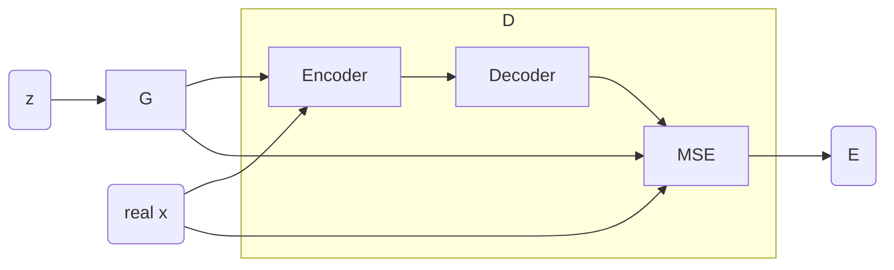

判别器D变成了一个自动编码机，输出的是输入数据与Decoder输出之间的均方差。

对于D来说，优化目标是$L_{D}=D(x)+ReLU(m-D(G(z)))=||Dec(Enc(x))-x||_2+ReLU(m-||Dec(Enc(G(z)))-G(z)||_2)$

生成器的训练目标是

$L_G=||Dec(Enc(G(z)))-G(z)||_2$

### 2.11 BEGAN

BEGAN提出于[《BEGAN: Boundary Equilibrium Generative Adversarial Networks
》](https://arxiv.org/pdf/1703.10717.pdf)。

BEGAN和EBGAN不仅缩写长得像，连网络结构都差不多只不过没有使用均方差而已。

这篇文章创新的点在于设计了算法来估计损失函数中用于平衡两个网络训练的超参数$\lambda$，这个参数在很多损失函数里都能见到，但是通常被简单粗暴的设置为1。

$L_D=L(x)-k_tL(G(z))$

$k_0=0,k_{t+1}=k_t+\lambda_t(\gamma L(x)-L(G(z)))$

$\gamma = \frac{\mathbb{E}|L(G(z))|}{\mathbb{E}|L(x)|}$

其中$\lambda_t$是一个常数参数，作为$k_t$的学习率，并且$k_t$还被限定在[0,1]范围内。

在训练初期$k_t$接近于0，判别器对于排除假数据兴趣不大，先重点学习真实数据以及数据的编码。

而当生成器学习的比较好的时候，k就会增大，直白点就判别器感觉到了来自生成器的威胁，就开始学习如何区分真假数据。


### 2.12 Mode regularized GAN

[《MODE REGULARIZED GENERATIVE ADVERSARIAL NETWORKS》](https://arxiv.org/pdf/1612.02136.pdf)。

这篇论文第一个提出的东西是在生成器之前加一个编码器，使编码器E和生成器G形成一个自动编码器。

编码器将原始数据映射到噪声数据空间，形成一个原始数据的分布，任何输入到生成器再到判别器，同时噪声数据也先如生成器再入判别器。
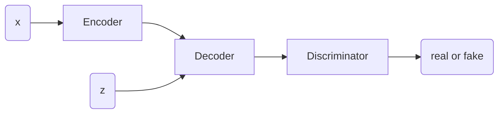

损失函数:
$L_G=-\mathbb{E}_z[\log D(G(z))]+\mathbb{E}_{x\sim p_{data}}[\lambda_1d(x,G(E(x)))+\lambda_2\log D(G(E(x)))]$

$T_E=\mathbb{E}_{x\sim p_{data}}[\lambda_1d(x,G(E(x)))+\lambda_2\log D(G(E(x)))]$

判别器的损失函数保持不变。

第二部分是提出了一个评分机制MODEscore来衡量GAN模型的质量。

$exp(\mathbb{E}_xKL(p(y|x))||p(y))-KL(p^*(y)||p(y)))$

$p(y)$是判别器在训练数据上的输出，$p^*(y)$是数据标签真实分布，$p(y|x)$是一个经过训练的分类器的Softmax输出。

### 2.13 Unrolled GAN

Unrolled GAN 提出于[《UNROLLED GENERATIVE ADVERSARIAL NETWORKS》](https://arxiv.org/pdf/1611.02163.pdf)。

大多数的GAN都是基于当前生成器和判别器状态更新的，而Unrolled GAN则有更加长远的考虑。

这里的生成器会假想未来判别器会如何应对自己而作出即符合当前状况又更加有远见的选择。

考虑判别器参数的迭代：

$\theta_D^0=\theta_D$

$\theta_D^{k+1}=\theta_D^k+\eta \frac{\partial f(\theta_G,\theta_D^k)}{\partial \theta_D^k}$

然后，生成器的迭代会基于当前参数和未来参数进行更新。

$\begin{aligned} \frac{df_k(\theta_{G},\theta_{D})}{d\theta_{G}}=\frac{\partial f(\theta_G,\theta_D^{k}(\theta_G,\theta_D))}{\partial \theta_{G}}+\frac{\partial f(\theta_G,\theta_D^{k}(\theta_G,\theta_D))}{\partial \theta_D^{k}(\theta_G,\theta_D)}\frac{\partial \theta_D^{k}(\theta_G,\theta_D)}{\partial \theta_G} \end{aligned}\\$

这个公式我暂时还没有理解其含义，不过大致思路我已经搞清楚了。

对于判别器来说，训练方法没有变化。

### 2.14 RGANs
[《The relativistic discriminator: a key element missing from standard GAN》](https://arxiv.org/pdf/1807.00734.pdf)。

从论文题目就可以看出，又是说GAN的不是的，不挑一下GAN的刺好像就不能发论文似的。

主要思路是在GAN的判别器训练中，使用的数据集一半来自生成数据，另一半是训练数据。

作者的思路是，将“半真半假”这个信息利用上，即有部分生成数据被当成真实数据就会有一部分训练数据被当成假的。

论文没有用“它是真的”这个概率，而是“一个数据比另一个数据大”的概率。

原本的网络结构是$D(x)=sigmoid(C(x))$，其中$C(x)$代表网络在最后一层激活函数之前的部分。

将这个函数改写成$D(\tilde{x})=sigmoid(C(x_r)-C(x_f))$。

则$L_D=-\mathbb{E}_{(x_r,x_f)\sim (\mathbb{P},\mathbb{Q})}[log(sigmoid(C(x_r)-C(x_f)))]$

$L_G=-\mathbb{E}_{(x_r,x_f)\sim (\mathbb{P},\mathbb{Q})}[log(sigmoid(C(x_f)-C(x_r)))]$

实际上，$log(sigmoid(\cdot))$函数与$\min(0,x)$在图像上差别不大。

所以把-号带入后实际上就是ReLU(-x)函数形式，事实上负号在这里也是可以忽略的。

在更加一般的形式定义下，两个优化目标可以写成：

$L_D=\mathbb{E}_{(x_r,x_f)\sim (\mathbb{P},\mathbb{Q})}[f_1(C(x_r)-C(x_f))]+\mathbb{E}_{(x_r,x_f)\sim (\mathbb{P},\mathbb{Q})}[f_2(C(x_f)-C(x_r))]$

$L_G=\mathbb{E}_{(x_r,x_f)\sim (\mathbb{P},\mathbb{Q})}[g_1(C(x_r)-C(x_f))]+\mathbb{E}_{(x_r,x_f)\sim (\mathbb{P},\mathbb{Q})}[g_2(C(x_f)-C(x_r))]$

特别的，我们定义$f(x)=f_1(x)=f_2(-x)=g_1(-x)=g_2(x)$

$L_D=\mathbb{E}_{(x_r,x_f)\sim (\mathbb{P},\mathbb{Q})}[f(C(x_r)-C(x_f))]$

$L_G=\mathbb{E}_{(x_r,x_f)\sim (\mathbb{P},\mathbb{Q})}[f(C(x_f)-C(x_r))]$

但是这个算法实际上是一个时间复杂度为平方阶的算法，因为$(x_r,x_f)$的组合有$n^2$种，这显然是难以训练的。

所以作者进一步提出了 Relativistic average GANs(RaGANs)。

将一个数据比另外一个数据为真的可能性更高转换成了，一个数据为真的可能性比另外一类可能性平均值高。

$L_D=\mathbb{E}_{x_r\sim \mathbb{P}}[f_1(C(x_r)-\mathbb{E}_{x_f\sim \mathbb{Q}}C(x_f))]+\mathbb{E}_{x_f\sim \mathbb{Q}}[f_2(C(x_f)-\mathbb{E}_{x_e\sim \mathbb{P}}C(x_r))]$

$L_G=\mathbb{E}_{x_r\sim \mathbb{P}}[g_1(C(x_r)-\mathbb{E}_{x_f\sim \mathbb{Q}}C(x_f))]+\mathbb{E}_{x_f\sim \mathbb{Q}}[g_2(C(x_f)-\mathbb{E}_{x_e\sim \mathbb{P}}C(x_r))]$

这样$\mathbb{E}_{x_f\sim \mathbb{Q}}C(x_f)$就只需要进行一次采样。


## 3 模型实现
### 3.1 GAN
转自[【小修改】用pytorch实现GAN——mnist（含有全部注释和网络思想）](https://blog.csdn.net/qinglingLS/article/details/91480550)。我自己也可以写，不过懒，之前写这个写的挺多的，就随便找一个放着。

@import "gan_mnist.py" {class="line-numbers"}

### 3.6.2 [improved wgan training](https://github.com/igul222/improved_wgan_training)

mnist数据集
@import "wgan_mnist.py" {class="line-numbers"}

## 4 训练实验
### 4.1 DCGAN 生成动漫头像实验
参考文章[GAN学习指南：从原理入门到制作生成Demo](https://zhuanlan.zhihu.com/p/24767059)。
#### 4.1.1 收集数据
利用爬虫+多进程收集某网站的动漫图片。

```python
import requests
from bs4 import BeautifulSoup
import os
import traceback
from tqdm import tqdm 
import multiprocessing
def download(url, filename):
    if os.path.exists(filename):
        print('file exists!')
        return
    try:
        r = requests.get(url, stream=True, timeout=60)
        r.raise_for_status()
        with open(filename, 'wb') as f:
            for chunk in r.iter_content(chunk_size=1024):
                if chunk:  # filter out keep-alive new chunks
                    f.write(chunk)
                    f.flush()
        return filename
    except KeyboardInterrupt:
        if os.path.exists(filename):
            os.remove(filename)
        raise KeyboardInterrupt
    except Exception:
        traceback.print_exc()
        if os.path.exists(filename):
            os.remove(filename)
def get_html(url):
    while True:
        try:
            html = requests.get(url,headers=headers).text
            break
        except:
            pass
    return html
if __name__ == '__main__':
    if os.path.exists('imgs') is False:
        os.makedirs('imgs')
    #定义headers
    user_agent = 'Mozilla/5.0 (Macintosh; Intel Mac OS X 10_14_2) AppleWebKit/537.36 (KHTML, like Gecko) Chrome/72.0.3626.119 Safari/537.36'
    headers = {'User-Agent': user_agent}

    start = 1
    end = 12000
    #定义线程池
    pool = multiprocessing.Pool(processes=4)
    for i in tqdm(range(start, end + 1)):
        url = 'http://konachan.net/post?page=%d&tags=' % i 
        html = get_html(url)
        soup = BeautifulSoup(html, 'html.parser')
        for img in soup.find_all('img', class_="preview"):
            target_url = img['src']
            filename = 'imgs/'+target_url.split('/')[-1]
            pool.apply(download,(target_url,filename))
    pool.close()
    pool.join()
```

#### 4.1.2 处理数据
利用cv2提取图片中的头像。

处理程序使用开源项目[lbpcascade_animeface](https://github.com/nagadomi/lbpcascade_animeface)。

#### 4.1.3 训练
使用了Pytorch官网的DCGAN代码进行训练。

本来是使用tensorflow的代码的，但是很多都是1.x版本的代码，好不容易找到一份2.0的代码，经过调试后已经可以在本机的cpu上运行了，但是到云端却发现显存不足。

我的笔记本电脑上运行的时候也不过才占用3-4GB的内存，而我训练用的主机是1080Ti，有11GB内存。

按照有些网上的教程调整了，但是没用，只能换回Pytorch。

config.py:
```python
# 数据集根目录
dataroot = "./anime/"

#模型保存目录
modeldir= './model/'
G_path=modeldir+'G.pkl'
D_path=modeldir+'D.pkl'

#结果保存目录
result_dir='./results/'

# 数据加载器能够使用的进程数量
workers = 2

# 训练时的批大小
batch_size = 128

# 训练图片的大小，所有的图片给都将改变到该大小
# 转换器使用的大小.
image_size = 64

# 训练图片的通道数，彩色图片是3
nc = 3

# 本征向量z的大小(生成器的输入大小)
nz = 100

# 生成器中特征图大小
ngf = 64

# 判别器中特征图大小
ndf = 64

# 训练次数
num_epochs = 5

# 优化器学习率
lr = 0.0002

# Adam优化器的Beta1超参
beta1 = 0.5

# 可利用的GPU数量，使用0将运行在CPU模式。
ngpu = 0

```

nets.py:
```python
import torch.nn as nn
from config import *


class Generator(nn.Module):
    def __init__(self, ngpu):
        super(Generator, self).__init__()
        self.ngpu = ngpu
        self.main = nn.Sequential(
            # 输入是 Z, 对Z进行卷积
            nn.ConvTranspose2d( nz, ngf * 8, 4, 1, 0, bias=False),
            nn.BatchNorm2d(ngf * 8),
            nn.ReLU(True),
            # 输入特征图大小. (ngf*8) x 4 x 4
            nn.ConvTranspose2d(ngf * 8, ngf * 4, 4, 2, 1, bias=False),
            nn.BatchNorm2d(ngf * 4),
            nn.ReLU(True),
            # 输入特征图大小. (ngf*4) x 8 x 8
            nn.ConvTranspose2d( ngf * 4, ngf * 2, 4, 2, 1, bias=False),
            nn.BatchNorm2d(ngf * 2),
            nn.ReLU(True),
            # 输入特征图大小. (ngf*2) x 16 x 16
            nn.ConvTranspose2d( ngf * 2, ngf, 4, 2, 1, bias=False),
            nn.BatchNorm2d(ngf),
            nn.ReLU(True),
            # 输入特征图大小. (ngf) x 32 x 32
            nn.ConvTranspose2d( ngf, nc, 4, 2, 1, bias=False),
            nn.Tanh()
            # 输入特征图大小. (nc) x 64 x 64
        )

    def forward(self, input):
        return self.main(input)


class Discriminator(nn.Module):
    def __init__(self, ngpu):
        super(Discriminator, self).__init__()
        self.ngpu = ngpu
        self.main = nn.Sequential(
            # 输入大小 (nc) x 64 x 64
            nn.Conv2d(nc, ndf, 4, 2, 1, bias=False),
            nn.LeakyReLU(0.2, inplace=True),
            # state size. (ndf) x 32 x 32
            nn.Conv2d(ndf, ndf * 2, 4, 2, 1, bias=False),
            nn.BatchNorm2d(ndf * 2),
            nn.LeakyReLU(0.2, inplace=True),
            # 输入大小. (ndf*2) x 16 x 16
            nn.Conv2d(ndf * 2, ndf * 4, 4, 2, 1, bias=False),
            nn.BatchNorm2d(ndf * 4),
            nn.LeakyReLU(0.2, inplace=True),
            # 输入大小. (ndf*4) x 8 x 8
            nn.Conv2d(ndf * 4, ndf * 8, 4, 2, 1, bias=False),
            nn.BatchNorm2d(ndf * 8),
            nn.LeakyReLU(0.2, inplace=True),
            # 输入大小. (ndf*8) x 4 x 4
            nn.Conv2d(ndf * 8, 1, 4, 1, 0, bias=False),
            nn.Sigmoid()
        )

    def forward(self, input):
        return self.main(input)

```

dcgan.py:
```python
from __future__ import print_function
#%matplotlib inline
import argparse
import os
import random
import torch
import torch.nn as nn
import torch.nn.parallel
import torch.backends.cudnn as cudnn
import torch.optim as optim
import torch.utils.data
import torchvision.datasets as dset
import torchvision.transforms as transforms
import torchvision.utils as vutils
import numpy as np
import matplotlib.pyplot as plt
import matplotlib.animation as animation
from multiprocessing import Process, freeze_support
from nets import Generator ,Discriminator
from config import *
# 为了可重复性设置随机种子
#manualSeed = 999
manualSeed = random.randint(1, 10000) # 如果你想有一个不同的结果使用这行代码
random.seed(manualSeed)
torch.manual_seed(manualSeed)


# 我们能够使用我们创建的数据集图片文件夹了
# 创建数据集
dataset = dset.ImageFolder(root=os.path.join(dataroot),
                           transform=transforms.Compose([
                               transforms.Resize(image_size),
                               transforms.CenterCrop(image_size),
                               transforms.ToTensor(),
                               transforms.Normalize((0.5, 0.5, 0.5), (0.5, 0.5, 0.5)),
                           ]))
# 创建数据加载器
dataloader = torch.utils.data.DataLoader(dataset, batch_size=batch_size,
                                         shuffle=True, num_workers=workers)

# 决定我们在哪个设备上运行
device = torch.device("cuda:0" if (torch.cuda.is_available() and ngpu > 0) else "cpu")

def weights_init(m):
    classname = m.__class__.__name__
    if classname.find('Conv') != -1:
        nn.init.normal_(m.weight.data, 0.0, 0.02)
    elif classname.find('BatchNorm') != -1:
        nn.init.normal_(m.weight.data, 1.0, 0.02)
        nn.init.constant_(m.bias.data, 0)

if __name__ == '__main__':
    freeze_support()

    # 创建生成器
    netG = Generator(ngpu).to(device)
    if os.path.exists(G_path):
        #从保存数据中恢复
        netG.load_state_dict(torch.load(G_path)) 
    else:
        # 使用权重初始化函数 weights_init 去随机初始化所有权重
        netG.apply(weights_init)

    # 创建判别器
    netD = Discriminator(ngpu).to(device)
    if os.path.exists(D_path):
        #从保存数据中恢复
        netD.load_state_dict(torch.load(D_path)) 
    else:
        # 使用权重初始化函数 weights_init 去随机初始化所有权重
        netD.apply(weights_init)

    # 初始化 BCE损失函数
    criterion = nn.BCELoss()

    # 创建一个批次的本征向量用于可视化生成器训练的过程。
    fixed_noise = torch.randn(64, nz, 1, 1, device=device)

    # 建立一个在训练中使用的真实和假的标记
    real_label = 1
    fake_label = 0

    # 为G和D都设置Adam优化器
    optimizerD = optim.Adam(netD.parameters(), lr=lr, betas=(beta1, 0.999))
    optimizerG = optim.Adam(netG.parameters(), lr=lr, betas=(beta1, 0.999))


    img_list = []
    G_losses = []
    D_losses = []
    iters = 0

    print("Starting Training Loop...")
    # 每个epoh
    for epoch in range(num_epochs):
        # 数据加载器中的每个批次
        for i, data in enumerate(dataloader, 0):

            ############################
            # (1) 更新 D 网络: 最大化 log(D(x)) + log(1 - D(G(z)))
            ###########################
            ## 使用所有真实样本批次训练
            netD.zero_grad()
            # 格式化批
            real_cpu = data[0].to(device)
            b_size = real_cpu.size(0)
            label = torch.full((b_size,), real_label, device=device)
            # 通过D向前传递真实批次
            output = netD(real_cpu).view(-1)
            # 对所有真实样本批次计算损失
            errD_real = criterion(output, label)
            # 计算后向传递中D的梯度
            errD_real.backward()
            D_x = output.mean().item()

            ## 使用所有假样本批次训练
            # 生成本征向量批次
            noise = torch.randn(b_size, nz, 1, 1, device=device)
            # 使用生成器G生成假图片
            fake = netG(noise)
            label.fill_(fake_label)
            # 使用判别器分类所有的假批次样本
            output = netD(fake.detach()).view(-1)
            # 计算判别器D的损失对所有的假样本批次
            errD_fake = criterion(output, label)
            # 对这个批次计算梯度
            errD_fake.backward()
            D_G_z1 = output.mean().item()
            # 把所有真样本和假样本批次的梯度加起来
            errD = errD_real + errD_fake
            # 更新判别器D
            optimizerD.step()

            ############################
            # (2) 更新 G 网络: 最大化 log(D(G(z)))
            ###########################
            netG.zero_grad()
            label.fill_(real_label)  # 假样本的标签对于生成器成本是真的
            # 因为我们之更新了D，通过D执行所有假样本批次的正向传递
            output = netD(fake).view(-1)
            # 基于这个输出计算G的损失
            errG = criterion(output, label)
            # 为生成器计算梯度
            errG.backward()
            D_G_z2 = output.mean().item()
            # 更新生成器G
            optimizerG.step()

            # 输出训练状态
            if i % 50 == 0:
                print('[%d/%d][%d/%d]\tLoss_D: %.4f\tLoss_G: %.4f\tD(x): %.4f\tD(G(z)): %.4f / %.4f'
                    % (epoch, num_epochs, i, len(dataloader),
                        errD.item(), errG.item(), D_x, D_G_z1, D_G_z2))

            # 为以后画损失图，保存损失
            G_losses.append(errG.item())
            D_losses.append(errD.item())

            # 检查生成器generator做了什么，通过保存的fixed_noise通过G的输出
            if (iters % 500 == 0) or ((epoch == num_epochs-1) and (i == len(dataloader)-1)):
                with torch.no_grad():
                    fake = netG(fixed_noise).detach().cpu()
                img_list.append(vutils.make_grid(fake, padding=2, normalize=True))
                plt.figure(figsize=(15,15))
                plt.axis("off")
                plt.title("Fake Images")
                plt.imshow(np.transpose(img_list[-1],(1,2,0)))
                plt.savefig(result_dir+'Fake_%d.png'%(epoch))

            iters += 1

    torch.save(netD.state_dict(),D_path)
    torch.save(netG.state_dict(),G_path)

    plt.figure(figsize=(10,5))
    plt.title("Generator and Discriminator Loss During Training")
    plt.plot(G_losses,label="G")
    plt.plot(D_losses,label="D")
    plt.xlabel("iterations")
    plt.ylabel("Loss")
    plt.legend()
    plt.savefig('loss.png')

```

第一轮训练损失：
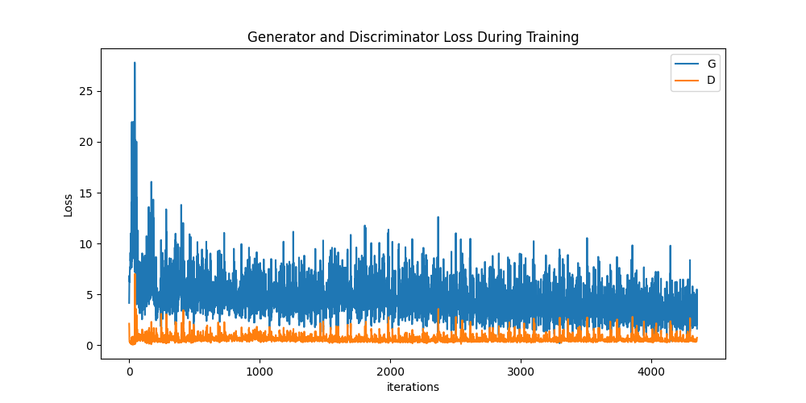

第二轮生成的假图片：
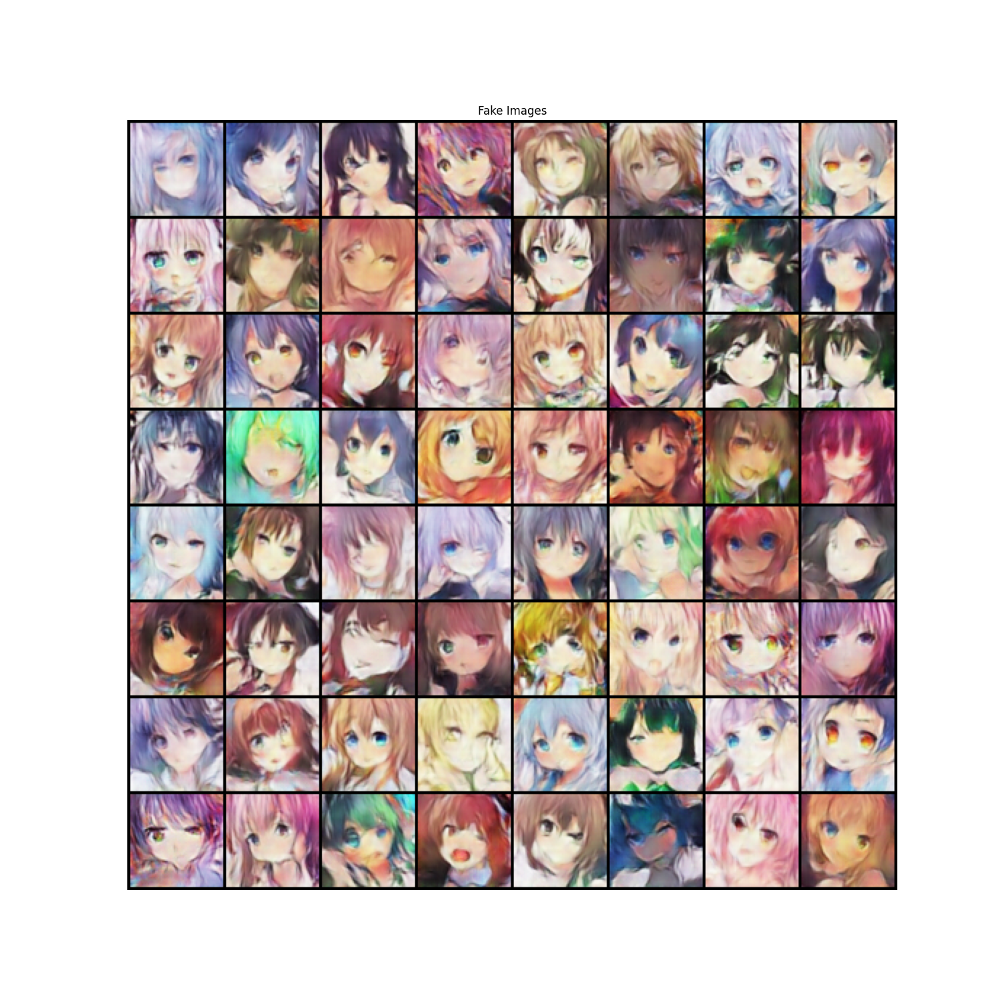

可以看到，这个时候已经比较像了，只不过有些细节的地方并不够精细，存在模糊的情况。

但是在后续的训练中，判别器强度远远超过了生成器，大多数情况下D(x)都超过0.8而D(G(z))却不到0.01。判别器被训练的太好了，而生成器打不过判别器。

第六轮生成的图片：
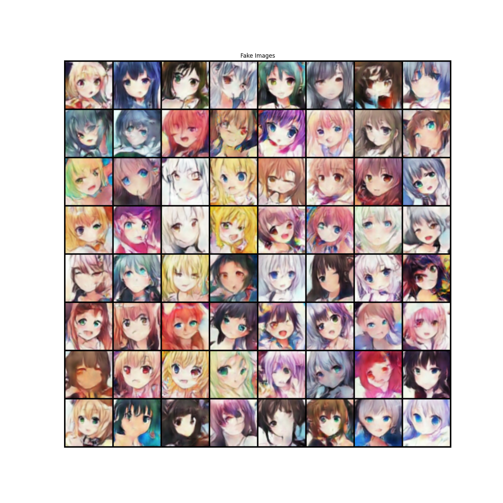

其很多细节方面比第二轮的情况好，但是却多了不应该出现的东西。

后面尝试增大生成器规模与学习率，虽然开始时生成器占据优势，但是训练了两百次后结果与前面相似。

#### 4.1.4 使用WGAN

尝试将GAN结构更改成WGAN结构，但是在云上训练了很多次，大多数时候产生的图像都是乱码的，只有少数几次能够从图像中看出一点影子。

于是我重新读了WGAN关于实验的部分，发现最后一层删除不是直接把Sigmoid函数去掉，而是用了ReLU函数作为激活函数，而且不能使用BN层。

于是我添加了LeakyReLU函数作为激活函数，这次终于能够向着预定的目标去了。

之前也是我没有仔细阅读导致的。

与正常的神经网络训练的损失不同，WGAN的损失特别大，几千几万都是正常的事情。

但是WGAN作为训练来说，训练的非常慢，我使用了比之前大10倍的学习率，但是其生成图片的视觉效果却远远低于前者。

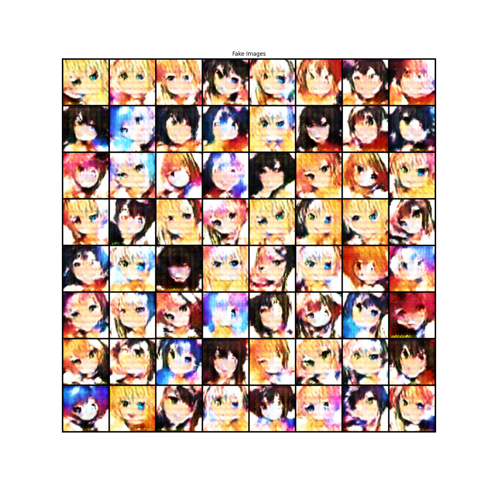

效果不算好，图像不够丰富，图片整体偏白。

之后我又把LeakyReLU函数换成了ReLU函数，结果完全没办法训练，第一个循环生成器的损失就变成了0，梯度直接消失。

同时，如果使用tanh函数或者Sigmoid函数也会导致梯度消失。


## 5. 参考文章
上面所引用到的文章以及：

[《f-GAN》](https://zhuanlan.zhihu.com/p/37769313)

[《令人拍案叫绝的Wasserstein GAN》](https://zhuanlan.zhihu.com/p/25071913)

[《从Wasserstein距离、对偶理论到WGAN》](https://kexue.fm/archives/6280)

[《LSGAN——最小二乘GAN》](https://zhuanlan.zhihu.com/p/25768099)

[《广义LS-GAN（GLS-GAN) :现在 LS-GAN和WGAN都是这个超模型的特例了》](https://zhuanlan.zhihu.com/p/25580027)

[《GAN的优化（四）：奇异值与SNGAN》](https://zhuanlan.zhihu.com/p/75891909)

[《GAN生成论文《The relativistic discriminator: a key element missing from standard GAN》》](https://blog.csdn.net/Najlepszy/article/details/104235846)
