# 0 数学基础
## 0.1 图的表示
### 0.1.1 图的邻接矩阵

对于一个简单图来说，图节点的连接状况可以用一个矩阵$A$来表示，其中每一个元素表示第$i$个节点和第$j$个节点共有的边的权值，如果没有规定权值用1代替，如果没有公共边则元素值为0.

特别的，一个无向图的邻接矩阵是一个对称矩阵。

### 0.1.2 图的关联矩阵

对于一个简单有向图来说，其关联矩阵M定义为：

$$M_{i,j}=\begin{cases}1 &,v_i为e_j的起点 \\
                       -1 &,v_i为e_j的终点\\
                       0 &,其他情况       \\
                        \end{cases}$$

而对于无向图而言，其因为没有起点和终点之分，所以其定义为：

$$M_{i,j}=\begin{cases}1 &,v_i为e_j的端点 \\
                       0 &,其他情况       \\
                        \end{cases}$$

关联矩阵的性质：
- 1 $MM^T$的所有元素的代数余子式均相等
- 2 $MM^T=B-A$,$B$是无向图$G$的顶点度的对角矩阵，$A$是无向图$G$的邻接矩阵，$M$是$G$对应的任意有向图的关联矩阵。当然，$G$的边没有规定权值或者是权值为1。

### 0.1.3 拉普拉斯矩阵及其正则化

拉普拉斯矩阵，定义为$L=D-A$,与[上面](#012-图的关联矩阵)里相似，只不过这里的图可以有权值。

如果把关联矩阵的定义改成用边的权值来定义，得到矩阵$M'$，则有$L=M'M^T=MM'^T$

或者是用边权值的算术平方根来定义，得到$L=M'M'^T$

因此，拉普拉斯矩阵具有半正定的性质。

拉普拉斯矩阵的正则化为$L'=D^{-\frac{1}{2}}LD^{-\frac{1}{2}}=I-D^{-\frac{1}{2}}AD^{-\frac{1}{2}}$

$L'$的元素可以表示为$L_{i,j}=\begin{cases}1 &,i=j , deg(v_i)>0\\-\frac{1}{\sqrt{deg(v_i)deg(v_j)}} &,i\neq j , e_{i,j}\neq 0\\0 &,其他\end{cases}$

显然正则化后的拉普拉斯相当于做了一个标准化，而且半正定性质没有变。


# 1 图神经网络简介

图神经网络，这个图不是指神经网络的结构是图，而是说这类神经网络处理的是图相关的问题。

图的数据不像图片那样规整，所以需要针对性地设计网络结构。

我们可以把图神经网络划分为五大类别，分别是：图卷积网络（Graph Convolution Networks，GCN）、 图注意力网络（Graph Attention Networks）、图自编码器（ Graph Autoencoders）、图生成网络（ Graph Generative Networks） 和图时空网络（Graph Spatial-temporal Networks）。

## 1.1 图卷积神经网络

图卷积神经网络与卷积神经网络相似，将滤波器与输入数据进行卷积操作。

大致思路与CNN一样，有两种使用思路，第一种是只使用图卷积层，图数据经过卷积之后还是一个相同结构的图，多个卷积层和激活函数交替叠加就构成了图卷积网络。

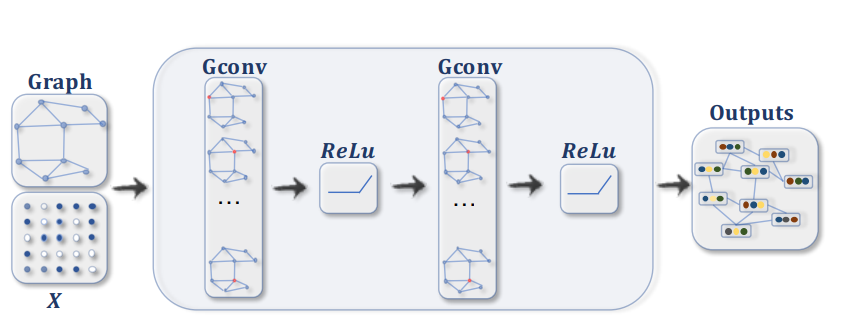

另一种思路就是把图卷积当作特征提取器来使用，就像这样：

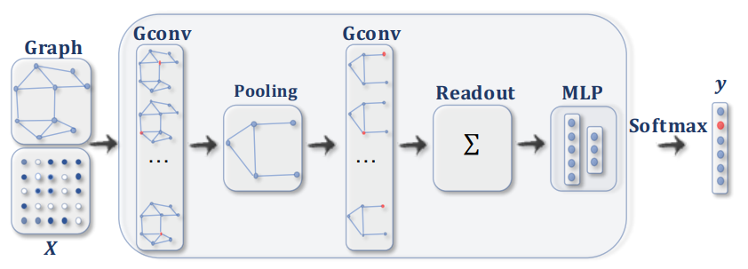

图卷积可以说是目前主流的图数据处理技术，就像处理图像会使用conv2d、处理序列数据会用self-attention一样。

## 1.2 图任务

图数据的任务可以从图的层次来归类，分别是顶点、边、图。

### 1.2.1 顶点层次的任务

任务无非是分类和回归，也就是说要让机器标明某一个节点的类别或者预测属性值。

图中节点的数据可能含有的信息不太充足，如果单独拿出来让机器进行分类，机器可能做的很差，因为信息很可能隐藏在图的结构里以及其关联的节点当中。

节点任务的做法通常是利用非池化的图网络将原图变成预测图，每个节点的数据是分类概率或预测值等目标数据。

- 节点分类

分类任务是最基础的图任务，比如说文献引用图（树）中论文的分类问题，以及社交网络用户标签的预测。

- 节点预测
  
预测也简单，预测节点的某一属性的值，比如说调查跟你玩的好的同学的分数，预测你这次考试的分数。

### 1.2.2 边层次的任务

边的任务依然是分类和回归任务，也就是标明边的类别和预测边相关的属性。

边任务通常是先用GNN将原图转化为特征图，如何将需要预测的两个节点的特征输入到另一个比较普通的网络当中进行预测。

因为，图最容易想到的就是社交网络，我们用社交网络来说明这两类任务。

- 边分类

在社交网络中，人与人之间的联系可以进行分类，比如业务往来、兴趣同好、同学、师生、同事、朋友、恋人、仇人……

- 预测边是否存在

QQ里加好友的时候弹出的可能认识的人就属于这种任务，在线上社交工具里没有联系但是在现实中两人可能认识，预测边是否存在就是预测在现实中是不是认识的。

还有在推荐系统中，拿网购平台举例子，用户和商品之间有感兴趣的联系，显然这个图是一个二部图，推荐系统要做的就是预测用户是否会对这一商品感兴趣。


- 预测边权重

上面的用户-商品图更进一步就是预测用户对商品感兴趣的程度、愿意购买的程度等。

### 1.2.3 图层次的任务

图层次的任务是将整个图当做对象进行处理。

比较典型是有蛋白质结构图、分子结构图等，比如说可以根据蛋白质结构图判断蛋白质是否对人体有害等。

常见的是图的分类。

这类任务的做法是利用GNN和图池化技术将图嵌入（embdding）到指定特征空间，如何利用普通网络进行预测。


# 2 图神经网络算法
## 2.1 基于谱的图卷积运算

看到这个名字我们就知道，这个算法肯定跟SVD、矩阵对角化有关。

首先，我们使用[拉普拉斯矩阵](#013-拉普拉斯矩阵及其正则化)来表示一个图，然后我们对拉普拉斯矩阵进行标准化。

得到$L=I-D^{-\frac{1}{2}}AD^{-\frac{1}{2}}$

由于拉普拉斯矩阵的半正定性质，其是一个实对称矩阵，所以拉普拉斯矩阵必定可以对角化。

$$L=U\Lambda U^T$$

其中矩阵$U$是n阶正交矩阵。

把图中节点的值串起来形成一个向量$x$。

那么矩阵$L$表示了图的结构，而$x$表示了图的状态。

我们定义$F(x)=U^Tx$为傅里叶变换函数，而$F^{-1}(x)=Ux$为逆傅里叶变换。

这样，我们可以借助傅里叶变换来定义卷积操作

$$x\otimes g=F^{-1}(F(x)\odot F(g))$$

其中的$g$是滤波器，也可以叫卷积核，其中的$\odot$是元素乘法。

如果把向量$U^Tg$拓展成对角阵$G$，则有$x\otimes g=UGU^Tx$

这样，我们就可以像应用在图像的卷积层那样定义多个待学习的卷积核，经过卷积得到多个卷积特征图。

所以，对于固定结构的图，只需要设置一次图结构就行，但是对于异构图来说，每次的输入必须是同时输入顶点数据和图结构数据。

一个显而易见的问题就是，拉普拉斯矩阵是关于顶点数量平方阶的大小，对于顶点数量非常多的图来说，处理这些数据的效率会比较低。

### 2.1.1 GCN

GCN是[《Semi-supervised classification with graph convolutional networks》](paper/1609.02907.pdf)一文。

其重要的贡献是提出了卷积运算的近似运算。

由于论文当中的数学推导使用了太多的假设，所以这里仅给出最后的结果。

$$H^{l+1}=\sigma (\tilde{D}^{-\frac{1}{2}}\tilde{A}\tilde{D}^{-\frac{1}{2}}H^lW^l) $$

其中$H^l$是神经网络第$l$层的输入，而$\tilde{A}=A+I$,$A$是邻接矩阵，$\tilde{D}$是$\tilde{A}$的行（列）和向量拓展成的对角矩阵，$W^l$是第$l$层神经网络的学习参数。

当然，除了假设太强之外还有就是我看不懂，比如使用切比雪夫多项式的截断展开式来近似$g_\theta$，我找原论文看了，没看懂QAQ。

可以看到，GCN运算当中也需要邻接矩阵，邻接矩阵关于节点数量是平方阶的，所以对运算量的要求很大。但是要注意的是，比较大的图的邻接矩阵脚本都是稀疏矩阵，在实现的时候使用稀疏矩阵相关的算法可以极大减缓这一要求，事实上在GCN的运行过程当中对显存的需求不是特别高。

### 2.1.2 GCN2

GCN2是在GCN的基础上结合另外几篇论文提出的理论做出的改进版本。

首先看看GCN2的前向传播模式：

$$H^{(l+1)}=\sigma(((1-\alpha_l)\tilde{P}H^{(l)}+\alpha_lH^{(0)})((1-\beta_l)I_n+\beta_lW^{(l)}))$$

看起来很复杂是不是，但是这个公式实际上很简单。

$\tilde{P}$就是GCN当中的$\tilde{D}^{-\frac{1}{2}}\tilde{A}\tilde{D}^{-\frac{1}{2}}$。激活函数的输入是两个矩阵的乘积，第一个矩阵是输入数据与这一层的数据的线性组合，而另一个矩阵是单位矩阵与权重矩阵的线性组合。

为什么要这样做呢？

答案就是防止过拟合，GCN2实际上参考了残差网络的设计，只不过做的更彻底，每一层都含有输入的信息，这样就能减缓因为网络过深引起的过拟合现象。还有在权重矩阵上加单位矩阵也是一样的，单位矩阵会使矩阵保持原样，超参数$\beta_l$越小，这层神经网络层对数据做的改动就越小。

总而言之，这样一个复杂公式的目的就是为了缓解过拟合问题。


## 2.2 基于空间的卷积运算

基于空间的卷积运算是模仿二维卷积的行为，在conv2d当中，我们常常使用3x3的的卷积核，也就是对一个像素点和它周围的8个像素点做加权求和。

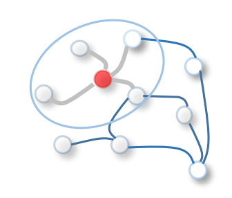

但是，一个节点的相邻节点的数量是不固定的，所以加权基本上是不太好运算的。最简单的方法当然是直接相加或者求平均值。

当然，以这样的算法是难以进行GPU加速的，所以需要设计一下数据的格式。

同样使用邻接矩阵来实现，求和的数学表达式是$Z=Ax$，求平均值的数学表达式是$Z=D^{-1}Ax$

如果对邻接矩阵进行幂乘还可以计算不同距离为2、3、4……的节点的聚合值。

比如在[Diffusion Convolutional Neural Network ](paper/1511.02136.pdf)当中定义了运算:

$$H^{(k)}=f(W^{(k)}\odot P^k X)$$

其中，$P=D^{-1}A$。

更进一步的，[Diffusion Graph Convolution](https://arxiv.org/pdf/1707.01926.pdf)当中把不同距离的节点聚合信息叠加在一起。

常用的的聚合方式有：

- 均值聚合：对相邻节点的特征作为邻接特征
- 最大、最小聚合：去相邻节点特征的最大值或最小值
- 标准差聚合：取相邻节点的标准差
- 求和聚合：取相邻节点的特征的和

### 2.2.1 使用多种聚合方式

在[《Principal Neighbourhood Aggregation for Graph Nets》](https://arxiv.org/pdf/2004.05718.pdf)当中提出了一种同时使用多种聚合方式。

既然不同的聚合方式能够捕捉图当中不同的特征，那我能不能都用？

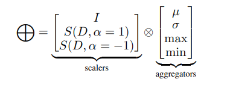

其中：
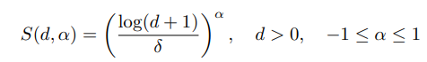
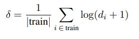

这样就能同时使用四种聚合方法，代价就是增加一些运算量而已，反正是机器算的。

## 2.3 图注意力网络

注意力机制天生就有衡量数据之间关系的能力，所以不需要事先给定图的结构，模型也可以自己在数据集里学习到其中的关系。

所以图注意力网络不像之前的模型那样假设图有相同的结构。

图注意力网络里的注意力卷积做的事情类似于self-attention 做的工作。

$$H^l_v=\sigma (\sum \limits_{u} \alpha_{uv}^lW^lH^{l-1}_u)$$

$\alpha$表示的是注意力函数。

注意力的生成方式有两种，一种是将两个向量拼接然后通过一个神经元得到再经过Softmax，另外一个就是做内积运算再过Softmax。

原始的GAT里使用的是第一种方法，这两种方法各有千秋。

同时，可以用mask机制控制节点只与其相连的节点做attention。

通常认为注意力机制也是一种卷积。

其优点很明显，自动学习节点之间关联的程度，比如说一个社交网络，人与人之间的交际有强弱之分，这种强弱是无法用衡量的，把这些东西交给机器自己学习是一个不错的策略。


### 2.3.1 Transformer GNN

我们完全可以用Self-Attention来处理图数据，这样的想法在[《Masked Label Prediction: Unified Message Passing Model for Semi-Supervised Classification》](https://arxiv.org/pdf/2009.03509.pdf)当中得了实现。

在图神经网络当中使用Self-Attention是完全可行的，但是并不是完全照搬过来使用。

图神经网络可以看作是一个序列数据加上一个结构数据，Self-Attention只具备处理序列的能力，但是不能处理结构数据。

在这篇文章里，在Self-Attention加上了对邻接表的操作，除了原有的Q，K，V运算，还增加了对边的运算：

$$e_{ij}=W_ee_{ij}+b_e$$

然后呢，在计算注意力的时候使用key与$e_{ij}$的和代替原来的key进行运算。

$$\alpha_{ij}=\frac{<q_i,k_j+e_{ij}>}{\sum \limits_{u\in \mathcal{N}(i)}<q_i,k_u+e_{iu}>}$$

其中$<q,k>=e^{\frac{q^Tk}{\sqrt{d}}}$

然后Self-Attention组成Multi-head Self-Attention进而组成类似于Transformer的结构。

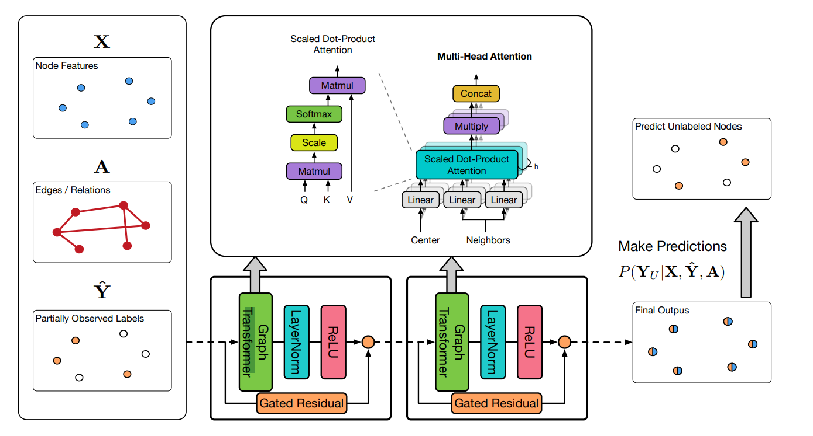

同时，作者还使用了门控残差网络来防止过拟合:

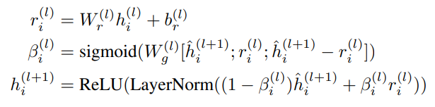

除了模型方面的技术之外，这篇文章还将部分已知节点的标签嵌入到与节点相同的数据空间，将标签与节点数据相加后再输入神经网络，这也很符合实际情况，我们可以通过其他办法调查出部分节点的标签再进行推理。

那这样我们自然而然就想到了，在训练时只告诉机器一部分的标签，让机器猜剩下的节点的标签。这样就达到了类似于自监督学习的方式，就像是NLP的预训练模型那样。


## 2.4 图自动编码器
图自动编码器与传统自动编码器一样。只不过把数据换成了图数据而已。

图自动编码器有上面作用呢？

当然是编码，自动编码器是一种典型的自监督模型，在许多任务里都是将训练好的自动编码器的Encoder用于数据嵌入。

在图任务里也是如此，因为在实际应用是时候，节点上不可能是简单的数字，而是更加复杂的东西。

比如在商品推荐系统里，里面的商品需要经过编码，就如同NLP任务里那样，为了减小内存占用，需要对商品编码（one-hot）进行嵌入（embedding）。

### 2.4.1 Graph AutoEncoder

GAE做的事情很简单，与其他自动编码器一样，GAE由编码器和解码器组成。

编码器是一个两层的GCN网络，得到的输出是一个向量或矩阵。

解码器非常简单，把得到的向量/矩阵与其转置相乘得到一个矩阵，这个矩阵再通过激活函数就行了。

损失函数是解码器输出与邻接矩阵的交叉熵损失。

对，做的事情就这么简单，完全没有理会图顶点的数据，只关注图的结构。

### 2.4.2 变分图自动编码器

VGAE与GAE相似。

VGAE的编码器是两个GCN的网络，其中一个的输出代表期望，另外一个代表方差。

也就是说，VGAE的输出是两个向量，这两个d维的向量组成了d个高斯分布，然后我们在这d个高斯分布上采样得到d维向量$Z$作为解码器的输入。

矩阵的做法相同。

但是，采样得到的$Z$在代码上是与VGAE的输出没有关系的，也就是说没办法求导。因此，根据高斯分布与标准正态分布的关系：

$$\frac{X-\mu}{\sigma}\sim N(0,1)$$

所以使用$\mu + x\sigma$来代替直接进行采样，其中$x$服从标准正态分布。

VGAE的解码器与GAE的解码器相同。

VGAE的损失函数由两部分构成，第一部分是GAE的损失函数，交叉熵损失，第二项是Z的分布与标准正态分布的KL散度，也就是$\mu,\sigma$与$0,1$的距离。

## 2.5 图生成网络

图生成网络就是生成图的生成网络，和生成对抗网络在其他领域的应用一样，其作用就是学习生成各种各样的图数据。

### 2.5.1 MolGAN

[MolGAN](https://arxiv.org/pdf/1805.11973.pdf)是一种特殊设计的GAN网络，用于生成分子结构图。

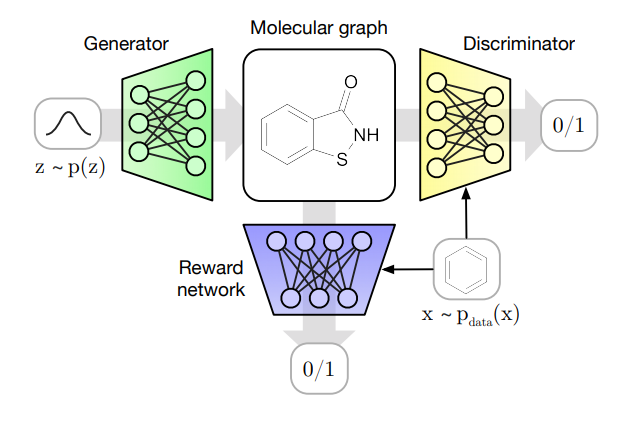

MolGAN不仅利用GAN框架来训练生成网络，还利用强化学习的机制来控制生成的方向。

其中判别器和奖励网络使用相同的结构（但是不共享参数）。

生成器生成图的具体过程：

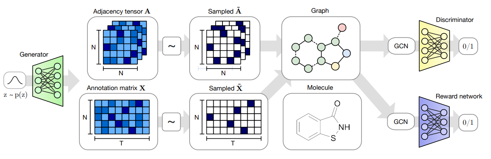

先由网络从噪声数据$z$中生成图邻接矩阵$A$和顶点说明矩阵$X$，其中矩阵$X$是由one-hot向量组成的，标明顶点上是哪一种分子。

生成的图送入判别器和奖励网络，目标自然是越真越好、分数越高越好。

判别器自然和往常一样，你生成器说这很好我非说不好。

奖励网络的训练与其他两个网络无关，用已有的标记数据进行训练。

同时，注意到邻接矩阵和说明矩阵都是从生成器的输出当中sample出来的，也就是说对生成器的训练需要使用policy gradient方法来进行更新。

顺带一提，GCPN -- [《Graph Convolutional Policy Network for Goal-Directed Molecular Graph Generation》](https://arxiv.org/pdf/1806.02473.pdf)也是用强化学习方法来生成图（分子）的。

## 2.6 时空图卷积网络

ST-GCN来自香港中文大学发表的论文[《Spatial Temporal Graph Convolution Networks for Skeleton Based Action Recognition》](https://arxiv.org/pdf/1801.07455.pdf)。

至于论文里的工作从题目就能看出来，基于骨骼的动作识别。

文章中，将人体的骨骼和关节看作是一张图，关节就是图节点，骨骼就是边。

这些骨骼关节图来自于对视频中图像的提取，也就是说这里的图是其他学习算法的产物。

人的骨骼结构基本是一致的，也就是说骨骼关节图是连接结构不变但是关节信息会变的图。

这里需要处理的图是图序列，因为视频中人的动作是变化的，生成的图也是动态改变的。

那么模型需要做的就是对图序列进行处理，因为图前后是有关联的，需要对序列进行整体的学习，并且通过图序列来判断视频中的人到底在干什么。

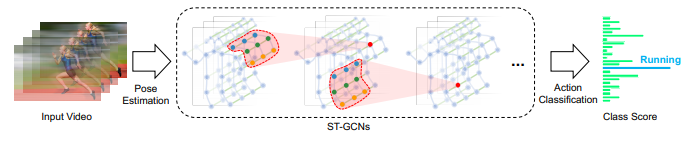

时空卷积的时是在图序列方向进行卷积，而空是指在节点连接方向进行卷积，所以就有了时空卷积这个高大上的名字。

对于一个批次的训练数据来说，其中包含了多个视频，因为机器需要看完整个视频来进行判断。

每个视频由许多帧组成，每个帧就是一个画面。

每个画面当中又可能包含不止一个人，也就对应复数个骨骼图。

然后图才是我们熟悉的图的表示，其连接顺序一般相同，真正比较有意义的数据是关节点的数据，包含坐标等信息。

虽然在原论文当中作者列了许多公式来说明如何进行时空卷积，但用白话来说其实很容易理解。

其实就是对节点周围的节点做卷积，这个周围不仅是空间上的还有时间上的。空间上的距离就是图节点之间的距离，一般是相邻节点。时间上的的距离就是前后几帧。

再直白一点就是先做图卷积，然后在时间方向做一维卷积。

当然，在实际上做的时候并不会这么简单，但是其原理就是如此。

## 2.7 图同构网络

图同构网络（GIN）来自于论文[《HOW POWERFUL ARE GRAPH NEURAL NETWORKS?》](paper/1810.00826.pdf)。

作者在文章当中比较了GNN与Weisfeiler-Lehman同构测试算法。

那么什么是图同构测试呢？简单来说就是一个计算两个图相似性的算法，它能够将不同构造的图区分开。

对于一个在图层次的任务，图网络最终必定要把图表示成一个embedding，而作者用于比较的就是区分相似图的性能。

作者证明了WL同构测试是GNN区分性能的上界，既然以及找到了GNN的区分性能上界，那么就应该思考如何达到这个上界。

作者将图神经网络的处理步骤整理成了一个框架，其中包括：

- Aggregate:聚合一阶邻域特征，描述将节点信息特征提取出来的方法
- Combine:把邻居节点聚合的特征和当前节点特征合并来更新当前节点，主要是描述合并的方法比如相加
- Readout:对于图层次的任务，将图结构与节点信息嵌入的方法
  
如何构建达到WL算法的GNN呢？

首先，一个强大的GNN不会将两个不同的邻域映射到相同的表示，这意味着它的聚合模式必须是单射的。

作者提出这样的函数$g(c,X)=\phi((1+\epsilon)f(c)+\sum\limits_{x\in X}f(x))$能够保证函数是单射的。

那么，函数$f,\phi$就交给多层感知机进行拟合了，当然这里不是两个函数各建立一个多层感知机，而是多层感知机同时学习两个函数，注意是多层，单层的不行。

所以有了模型:

$$h_v^{(k)}=MLP^{(k)}((1+\epsilon^{(k)})h_v^{(k-1)}+\sum\limits_{u\in \mathcal{N}(u)}h_u^{(k-1)})$$

对于图层次的任务，在Readout部分也应该保持单射，作者提出了这样一个算法。

每层输出的节点特征进行相加得到特征向量，然后把每一层的相加得到的特征向量进行拼接，最终得到的向量作为整张图的特征表示。

同时，作者还展示了mean和max函数为什么分不开图结构，这是原文的图片：

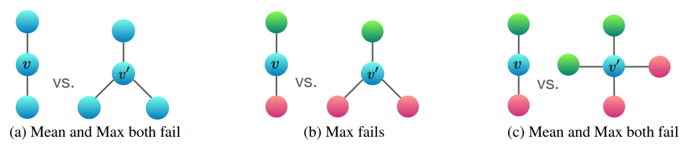

对于Aggregate来说

- sum：学习全部的标签以及数量，可以学习精确的结构信息
- mean：学习标签的比例（比如两个图标签比例相同，但是节点有倍数关系），偏向学习分布信息
- max：学习最大标签，忽略多样，偏向学习有代表性的元素信息，将复杂集合简单化

## 2.8 EdgeDrop技术

[《DROPEDGE: TOWARDS DEEP GRAPH CONVOLUTIONAL NETWORKS ON NODE CLASSIFICATION》](https://openreview.net/pdf?id=Hkx1qkrKPr)当中提出了基于图的Drop技术。

所谓的EdgeDrop就是在聚合邻居节点信息的时候随机地丢掉一定比例的边连接，类似于DNN当中的Dropout技术。

EdgeDrop有两种使用方式：

- 1 全局使用同一子图：这种方式类似于图像增强技术，使用子图能产生更多的训练数据
- 2 逐层EdgeDrop：这样能够为图带来更加丰富的变形

这样的技术在聚合邻居节点的时候会按比例将邻接矩阵（原始）的值置为0。

在DNN当中的Dropout技术在非训练的时候需要对权重乘概率$p$，而EdgeDrop并不需要这样做。

为什么呢？

可以试想一下，对于使用均值聚合、最大最小聚合、标准差聚合，去掉一定比例的连接边并不会改变这些聚合值的均值。

而像是GCN的技术，因为其邻接矩阵实际上是经过标准化的，所以边连接增加的时候每一个相邻节点的权重实际上是变小的，整体聚合值并不会有太大影响。

因此EdgeDrop实际上是一种无偏的图增强技术，所以在非训练的时候不需要额外的步骤，这一点在实验中也得到了印证。

## 2.9 图池化

就像CNN当中的池化那样，GNN的池化也是缩小数据规模集中特征的一种方法，但是目前的图池化技术没有统一的规范，存在各种各样的方法。

图池化的一个难点就是，定义池化规则。

图在池化之后应该是更小的图，因为如果仅仅减少节点特征或边特征的维度是没有意义的，那就不是池化。

### 2.9.1 Self-Attention Graph Pooling

Self-Attention Graph Pooling 来自于文章[《Self-Attention Graph Pooling》](https://arxiv.org/pdf/1904.08082.pdf)

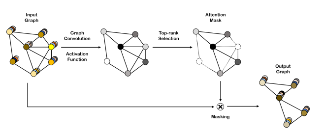

简单来说，这种方法利用注意力机制来对图中的节点的重要性进行排序，然后保留重要的几个节点，被抛弃的节点与它们连接的边被一同删除。因为图的节点是数量是不固定的，固定保留几个是不合适的，所以我们自然而然的会使用保留一定比例的节点。

### 2.9.2 DIFFPOOL

这个方法来自[《Hierarchical Graph Representation Learning with Differentiable Pooling》](https://arxiv.org/pdf/1806.08804.pdf)

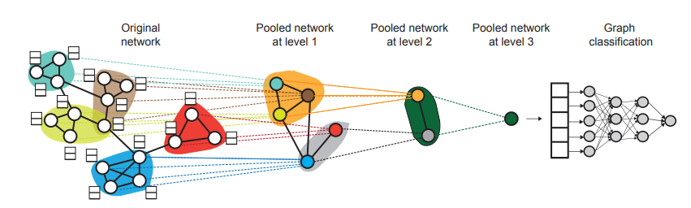

如图，这种池化的方法是将节点进行分块，然后将每一个区域的节点合成为一个超级节点，就像是在CNN里的池化层那样。

而如何划分这些节点是DIFFPOOL方法的关键，那么如何划分这些节点呢？答案是聚类，在图节点上运行聚类算法就能将节点进行划分。

聚类之后的节点划分里的节点我们相信他们的距离比较近，因此可以合成为超级节点。

## 2.10 平滑残差强化网络

在[《COMBINING LABEL PROPAGATION AND SIMPLE MODELS OUT-PERFORMS GRAPH NEURAL NETWORKS》](https://arxiv.org/pdf/2010.13993.pdf)当中提出了一种类似残差提升树的算法。

首先我们假设我们有一个基于多层感知机的分类模型对节点进行分类（不进行边运算）。

那么类似于残差提升树，我们将label与预测的残差作为新的label对网络进行训练，并且使用标签传播算法对残差进行平滑。

$$\hat{E}=\argmin\limits_{W\in \mathbb{R}^{n\times c}}tr(W^T(I-S)W)+\mu ||W-E||_F^2$$

其中的$I-S$是经过[正则化的拉普拉斯矩阵](#013-拉普拉斯矩阵及其正则化)，第一项是的结果是相邻节点的类别误差的乘积的加权平均数的相反数，其出发点是一个节点被分类错误，那其相邻节点被分类错误的可能性就会增加。而后一项是希望尽可能拟合残差。

上面的式子可以写成:

$$F=\sum\limits_{i=1}^c w_i^T(I-S)w_i+\mu \sum \limits_{i=1}^c\sum\limits_{j=1}^n (w_{ij}-e_{ij})^2$$

对第一项求导可得$\frac{\partial F_1}{\partial w_i}=2(I-S)w_i$

对第二项求导可得$\frac{\partial F_2}{\partial w_{ij}}=2\mu (w_{ij}-e_{ij})$

综合考虑可以得到$\frac{\partial F}{\partial W}=2[(I-S)W+\mu (W-E)]$

利用梯度下降方法，可以得到更优的$W'=W-\lambda [(I-S)W+\mu (W-E)]=[1-\lambda (1+\mu)]W+\lambda SW + \lambda\mu E$

我们令$\lambda=\frac{1}{1+\mu}$，则上述式子就变成了:$W'=(1-\lambda)E+\lambda SW$

所以我们有迭代式$E^{(t)}=(1-\alpha)E+\alpha E^{(t-1)}$

经过数次迭代得到的残差就是新的网络要学习的目标。

## 2.11 图标准化

图标准化就是应用在图处理上的标准化技术。

### 2.11.1  PAIRNORM

PAIRNORM 技术来自于[《PAIRNORM: TACKLING OVERSMOOTHING IN GNNS》](https://arxiv.org/pdf/1909.12223.pdf)。

PAIRNORM对于某个优化目标：
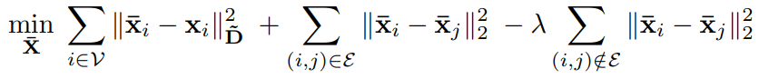
寄希望于卷积前后的某个值不变。
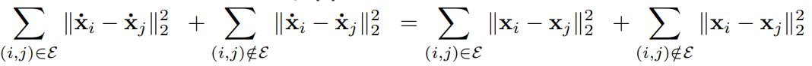
进一步变形得到。
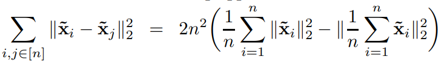

我们把左式自变量看作是服从均匀分布的随机变量之差，则左式=$n^2 D(X-Y)=2n^2D(x)=2n^2(EX^2-E^2X)$

接下来，我们对其进行中心化，这样有$EX=0$，上式=$2n^2EX^2$

通过乘上系数，我们可以很容易使用放缩系数$\sqrt{\frac{E\dot{X}^2}{EX^2}}$使第二个公式成立。


## 2.12 PAN Conv

PANConv是[《Path Integral Based Convolution and Pooling for Graph Neural Networks》](https://arxiv.org/pdf/2006.16811.pdf)提出的卷积方法。

这个卷积方法的出发点是我见过最离谱的，方法推导的出发点是费曼路径积分。

什么是费曼路径积分呢？简单来说就是，我一个粒子现在在A位置，现在需要计算出粒子在B出现的概率。这个概率被作者解释成A的信息对B的信息的贡献。

然后把费曼路径积分类比到图数据里，原本的积分自然就变成了求和，变化前后的公式长这样：

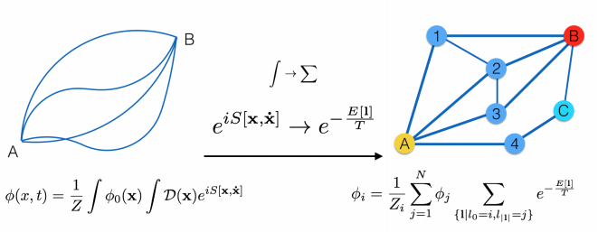

其中的$\phi_i$表示在第i个节点观察到的信息，$Z_i$是归一化系数，图上的**1**是路径，大括号里表示的是从第i个节点到第j个节点的路径，路径长度为|**1**|，E[**1**]是虚拟能量函数，由路径决定。

接下来对这个公式进行简化，首先是对相同距离的节点我们设置相同的权重。

考虑距离为n的节点的整体权重：

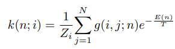

其中$g(i,j;n)$表示$i,j$两个节点之间长度为$n$的路径的数量。

然后使用路径数量作为节点加权的权重：

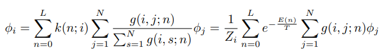

其中$L$是一个人为规定的最大距离。

而归一化系数定义为：

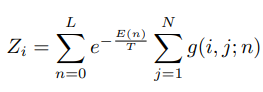

这样让节点数据维持在原有的数据空间。

而长度为$n$的路径的数量其实可以通过邻接矩阵的$n$次幂来得到，所以我们得到一个转移矩阵：

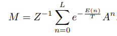

其中的$Z$是由$Z_i$组成的对角方阵。

仿造GCN卷积的做法，用转移矩阵$M$代替归一化邻接矩阵，我们可以得到PAN卷积的函数：

$$H=MXW$$

最后，因为作者发现对M进行对称归一化的效果会更好，于是更变成了与GCN相似的形式：

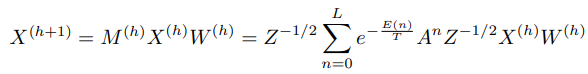

其中，当$n=0$时，矩阵$A^0=I$，也就对应GCN当中的$I$。

那问题来了，$e^\frac{E[n]}{T}$到底是上面东西？

结果论文后面给出了一个冷冰冰的单词：learnable！！！！！

好在作者给了一个方便的值：$\frac{1}{k!}$


## 其他
## .1 Embdding 正交化

技术来自[《Improving Molecular Graph Neural Network Explainability with Orthonormalization and Induced Sparsity》](https://arxiv.org/pdf/2105.04854.pdf)。

其实就是embdding的批量正交化，方法很简单，使用正则项：

$$\lambda ||HH^T-I||_2$$

$I$是batch_size阶的单位矩阵。

这样做的目的是让embdding尽可能相互独立

## .2 基尼正则化

技术来自[《Improving Molecular Graph Neural Network Explainability with Orthonormalization and Induced Sparsity》](https://arxiv.org/pdf/2105.04854.pdf)。

使用正则项$\frac{1}{m}\sum\limits_{i=1}^m\sum\limits_{j=1}^n \sum\limits_{j'=1}^n\frac{|w_{ij}-w_{ij'}|}{(2n^2-n)\bar{w}}$来对最后一层的权重参数进行正则化。

可以看出，基尼正则项实际上与标准差类似，通过最小化基尼正则项实际上效果是让权重参数变得“平均”，作者希望预测的时候尽可能考虑所有输入的特征而不是任由某些参数“独断专行”。

##  .3 过度平滑问题

[《Deeper Insights into Graph Convolutional Networks for Semi-Supervised Learning》](https://arxiv.org/pdf/1801.07606.pdf)当中指出，对图的重复卷积操作（主要指GCN）会导致一种过度平滑问题。

这里的过度平滑不是过拟合而是另外一种问题。作者说明（图）卷积操作实际上是一种拉普拉斯平滑，经过证明，过多的应用图卷积操作会导致所有节点的特征趋于一致以至于无法被区分。

其实也很好理解，在多次应用图卷积后，某一个节点包含的节点信息就越多，而且这样的信息是延路径增加的，也就是说是接近指数阶的，当范围扩大到整张图的时候就会开始“内卷”。

用实验验证一下：

```python
x=[1,2,3,4,5]
for i in range(50):
    y=[0,0,0,0,0]
    y[0]=(x[0]+x[1])/2
    y[1]=(x[0]+x[1]+x[2])/3
    y[2]=(x[1]+x[2]+x[3])/3
    y[3]=(x[2]+x[3]+x[4])/3
    y[4]=(x[3]+x[4])/2
    x=y
    print(x)
```
输出
```
[1.5, 2.0, 3.0, 4.0, 4.5]
[1.75, 2.1666666666666665, 3.0, 3.8333333333333335, 4.25]
[1.9583333333333333, 2.3055555555555554, 3.0, 3.6944444444444446, 4.041666666666667]
[2.131944444444444, 2.4212962962962963, 3.0, 3.5787037037037037, 3.868055555555556]
[2.2766203703703702, 2.517746913580247, 3.0, 3.482253086419753, 3.7233796296296298]
[2.3971836419753085, 2.598122427983539, 3.0, 3.401877572016461, 3.6028163580246915]
[2.4976530349794235, 2.6651020233196157, 3.0, 3.3348979766803843, 3.5023469650205765]
[2.5813775291495196, 2.7209183527663465, 3.0, 3.2790816472336535, 3.4186224708504804]
[2.651147940957933, 2.7674319606386217, 3.0, 3.2325680393613774, 3.348852059042067]
[2.7092899507982775, 2.806193300532185, 2.9999999999999996, 3.193806699467815, 3.2907100492017225]
[2.757741625665231, 2.838494417110154, 3.0, 3.161505582889846, 3.242258374334769]
[2.798118021387692, 2.8654120142584616, 3.0, 3.1345879857415384, 3.201881978612308]
[2.831765017823077, 2.887843345215385, 3.0, 3.112156654784615, 3.168234982176923]
[2.859804181519231, 2.9065361210128207, 3.0, 3.0934638789871793, 3.140195818480769]
[2.883170151266026, 2.922113434177351, 3.0, 3.07788656582265, 3.116829848733974]
[2.9026417927216883, 2.9350945284811254, 3.0000000000000004, 3.0649054715188746, 3.0973582072783117]
[2.9188681606014066, 2.9459121070676044, 3.0, 3.0540878929323956, 3.0811318393985934]
[2.9323901338345055, 2.954926755889671, 3.0, 3.045073244110329, 3.0676098661654945]
[2.943658444862088, 2.9624389632413917, 3.0, 3.0375610367586074, 3.056341555137912]
[2.95304870405174, 2.9686991360344934, 2.9999999999999996, 3.0313008639655066, 3.0469512959482596]
[2.9608739200431167, 2.9739159466954113, 3.0, 3.0260840533045887, 3.0391260799568833]
[2.967394933369264, 2.9782632889128426, 3.0, 3.0217367110871574, 3.032605066630736]
[2.9728291111410536, 2.9818860740940356, 3.0, 3.018113925905965, 3.0271708888589464]
[2.977357592617545, 2.98490506174503, 3.0, 3.0150949382549705, 3.0226424073824556]
[2.9811313271812874, 2.987420884787525, 3.0, 3.0125791152124752, 3.018868672818713]
[2.9842761059844065, 2.989517403989604, 3.0, 3.010482596010396, 3.0157238940155944]
[2.986896754987005, 2.99126450332467, 3.0, 3.0087354966753304, 3.013103245012995]
[2.9890806291558376, 2.992720419437225, 3.0, 3.007279580562775, 3.010919370844163]
[2.9909005242965314, 2.993933682864354, 3.0, 3.006066317135646, 3.0090994757034686]
[2.9924171035804426, 2.994944735720295, 3.0, 3.005055264279705, 3.0075828964195574]
[2.9936809196503686, 2.9957872797669123, 3.0, 3.004212720233087, 3.0063190803496314]
[2.9947340997086407, 2.9964893998057605, 2.9999999999999996, 3.0035106001942395, 3.0052659002913593]
[2.9956117497572006, 2.9970744998381336, 3.0, 3.0029255001618664, 3.0043882502427994]
[2.996343124797667, 2.9975620831984444, 3.0, 3.0024379168015556, 3.003656875202333]
[2.9969526039980554, 2.99796840266537, 3.0, 3.00203159733463, 3.0030473960019446]
[2.9974605033317125, 2.9983070022211415, 3.0, 3.0016929977788585, 3.0025394966682875]
[2.997883752776427, 2.998589168517618, 3.0, 3.001410831482382, 3.002116247223573]
[2.998236460647022, 2.998824307098015, 3.0, 3.0011756929019846, 3.001763539352978]
[2.9985303838725184, 2.999020255915012, 3.0, 3.000979744084988, 3.001469616127481]
[2.998775319893765, 2.999183546595843, 3.0, 3.000816453404157, 3.0012246801062346]
[2.998979433244804, 2.9993196221632026, 3.0, 3.0006803778367974, 3.0010205667551957]
[2.9991495277040032, 2.9994330184693356, 3.0, 3.0005669815306644, 3.0008504722959968]
[2.999291273086669, 2.999527515391113, 3.0, 3.000472484608887, 3.000708726913331]
[2.9994093942388913, 2.9996062628259277, 3.0, 3.0003937371740723, 3.0005906057611087]
[2.9995078285324093, 2.9996718856882727, 3.0, 3.0003281143117264, 3.0004921714675907]
[2.999589857110341, 2.999726571406894, 2.9999999999999996, 3.0002734285931054, 3.000410142889659]
[2.9996582142586177, 2.999772142839078, 3.0, 3.000227857160921, 3.000341785741382]
[2.999715178548848, 2.9998101190325652, 2.9999999999999996, 3.0001898809674343, 3.0002848214511513]
[2.9997626487907065, 2.9998417658604706, 3.0, 3.0001582341395285, 3.000237351209293]
[2.9998022073255886, 2.999868138217059, 2.9999999999999996, 3.0001318617829402, 3.0001977926744106]
```
可以看到一个简单的图经过多次卷积会趋近于3，足以说明问题。


# 3 实验

实验主要使用[OGB](https://github.com/snap-stanford/ogb)数据集。

使用的工具包主要是PyTorch和[PyG](https://github.com/rusty1s/pytorch_geometric)。

OGB和PyG都是需要安装的Python库，安装方法见项目GitHub。

## 3.1 arxiv网络节点分类

因为在OGB项目里有示例，就直接拿来用了。

@import "./code/GCN_arxiv.py"

arxiv数据的节点数据是paper的标题和摘要的128维嵌入数据，target是40类的分类标签。

网络模型也很简单，默认是3层GCN卷积层，隐藏维度是256。

我做的是网络规模对准确率的影响，通过改变网络模型得到训练一轮（500次）的准确率。

|网络类型|层数|隐藏层规模|训练集准确率(%)|测试集准确率(%)|
|---|---|---|---|---|
|GCN|2|256|77.36|71.22|
|SAGE|2|256|79.15|70.77|
|GCN|2|512|78.85|71.62|
|GCN|2|128|75.17|70.97|
|GCN|2|64|72.74|69.95|
|GCN|2|32|70.64|68.66|
|GCN|3|256|78.63|71.89|
|GCN|4|256|78.92|71.99|

通过这些数据可以发现，更改网络规模对训练集上的准确率影响较大，但是在测试集上的准确率却没有太大的区别，基本上是在71%上下有1%的浮动。而在网络方面，SAGE在训练集上的表现比GCN好一点，但是在测试集上差别不大，这点在OGB项目论文里也是这样的。

# 参考文献

除了以上提到的文献还有以下这些文献，以及维基百科上的一些文献。

[《图神经网络（Graph Neural Networks，GNN）综述》](https://zhuanlan.zhihu.com/p/75307407?from_voters_page=true)

[《A Comprehensive Survey on Graph Neural Networks》](paper/1901.00596.pdf)

[《拉普拉斯矩阵与正则化》](https://blog.csdn.net/weixin_42973678/article/details/107190663)

[《【其实贼简单】拉普拉斯算子和拉普拉斯矩阵》](https://zhuanlan.zhihu.com/p/67336297/)

[《基于空间的卷积图神经网络》](https://zhuanlan.zhihu.com/p/356655822)

[《图自编码器的起源和应用》](https://zhuanlan.zhihu.com/p/114914664)

[《How Powerful are Graph Neural Networks？ GIN 图同构网络 ICLR 2019 论文详解》](https://blog.csdn.net/yyl424525/article/details/102841352)

[《》]()

[《》]()

