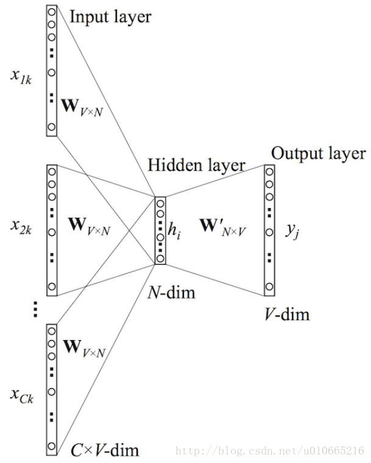
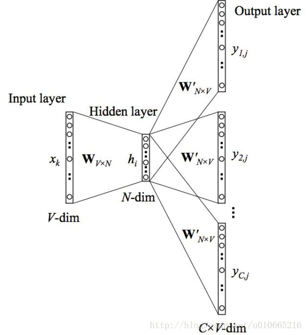
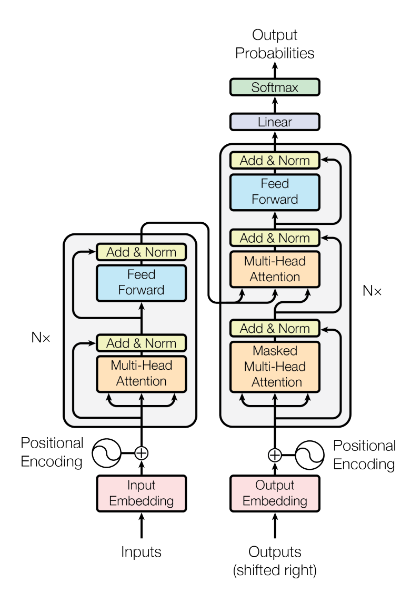

# 1 NLP基础
Natuarl Language Processing（NLP） 即自然语言处理，是机器学习里一个重要的邻域。

NLP主要研究处理序列数据，序列数据的主要特征是程度不确定。因为文字的长度是不确定的，输入的可能是简短的一句话也可能是一篇文章。

## 1.1 NLP处理过程
### 1.1.1 原始语料
原始语料就是通过各种方法收集的文字数据，比如使用爬虫收集贴吧发言、文章、小说、新闻、网页。

原始语料里的数据会非常混乱，没有统一的结构。

### 1.1.2 清洗
清洗就是清除原始语料中的无用信息、不好的数据。

比如删除像是$#%@ 这样的特殊字符，将不同语言的标点符号进行统一（将中文引号转换成英文引号）。

还有就是将一些很短的或者是太长的句子去掉。

### 1.1.3 分词
根据对出现的语句的统计经过，对词汇进行加工。

对英语来说，一个词根可以有各种各样的形态，但是对于机器来说哪怕差一个字母都是不同的词汇，这样会让词汇集的大小非常大。

如果将英文单词分成更小的单位，这样的分词对于人类来说毫无意义，但是对于机器来说这可以让词汇集大小大大减小。

### 1.1.4 标准化
将数据标准化，比如转换成数字向量，将句子统一到同一长度等等。

### 1.1.5 特征提取
特征提取主要的提取是缩小特征的维度，因为词汇的表示通常是one-hot向量，这样的数据表示非常浪费计算资源。

通常会将特征缩短到词汇数量的平方根数量级。

## 1.2 词汇表示方法
### 1.2.1 One-Hot
One-Hot表示是是最常用的表示方法，将词汇在字典中的顺序转成one-hot向量来表示这个词汇。
**缺点：**
- 不同词的向量表示互相正交，无法衡量不同词之间的关系
- 该编码只能反映某个词是否在句中出现，无法衡量不同词的重要程度
- 使用One-Hot 对文本进行编码后得到的是高维稀疏矩阵，会浪费计算和存储资源（在实际运算中是在送入模型之前才转成One-Hot向量，所以一般只会浪费运算资源）
### 1.2.2 Bag Of Word
词袋（Bag Of Word），使用词汇在句子中出现的次数来表示一个句子。

比如说‘I can can a can .’，可以表示为[1,3,1]。

**优点：** 
- 长度固定，极大减少了句子表示占用的存储空间。

**缺点：** 
- 不包含词汇的顺序信息，相同表示的两个句子可能实际上含义天差地别。

### 1.2.3 Word2Vec
基于传统方法的词汇表示会有一个缺点，那就是机器不知道词汇之间的关联。

比如说词汇‘假设’和‘如果’的意思很相近，但是上面的表达方法都无法表现这件事。

word2vec是一种考虑上下文对词汇含义影响的技术。

比如说有两个句子：‘我喜欢吃苹果’和‘我喜欢吃香蕉’，那么苹果和香蕉应该具有相似的含义，转换成数据向量后就应该是两个向量的距离比较近。

word2vec使用神经网络来将one-hot向量编码成低维的向量，通常使用含有一个隐藏层（即两层）的神经网络，通过一定算法优化后取其中隐藏层输出作为vec编码。
**优点：**
- 考虑到词语的上下文，学习到了语义和语法的信息
- 得到的词向量维度小，节省存储和计算资源
- 通用性强，可以应用到各种NLP 任务中

**缺点：**
-  词和向量是一对一的关系，无法解决多义词的问题
- word2vec是一种静态的模型，虽然通用性强，但无法真的特定的任务做动态优化

#### 1.2.3.1 CBOW

word2vec常用的算法之一，其中心思想是输入词汇的上下文，让神经网络输出这个词汇。



如图，输入是多个单词的one-hot向量，输出是一个单词的one-hot向量，某个单词乘的参数矩阵是相同的，也就相当于一批单词通过Linear层后在维度0上求和再通过剩下的网络结构（因为输入都是one-hot向量，所以把单词叠加起来再送入神经网络也是一样的结果，也就相当于输入的是上下文的词袋表示）。

将单个单词的隐藏层输出作为该单词的表示向量。

#### 1.2.3.2 skip-gram

skip-gram算法的逻辑与CBOW相反，它期望输入一个单词，而神经网络的输出是这个单词可能出现的上下文。



虽然图中的输出的多个输出，但是事实上，这些输出因为使用的参数相同，这些输出是完全相同的，图中这样画是方便理解。

在输出的时候，最后一层是Softmax运算，所以输出的向量的元素的大小关系表示的是索引对应的单词出现的概率的大小关系，可以设定一个上下文窗口大小C，每次取元素值最大的C个索引对应的单词作为输出。

而训练用的上下文也同样可以用词袋模型表示或者使用上下文单词的统计学数据，方便进行训练。

### 1.2.4 共现矩阵（Co-Occurrence Matrix）

共现矩阵是两个词汇在指定上下文窗口下同时出现的次数作为词向量，每个单词的表示里都包含该单词与其他单词共现的次数。

相比于One-Hot

**优点：**
- 考虑了上下文
**缺点：**
- 与One-Hot相同的存储空间占用问题

### 1.2.5 GloVe

GloVe第一步是根据语料得到一个共现矩阵，只不过这个共现矩阵与上面的有点不同，上面的共现矩阵是有一起出现的情况就加1，而这里做的是加上两个词距离的倒数。

第二步是构建词向量与共现矩阵的关系，表示为：

$$w_{i}^{T}\tilde{w}_{j} + b_i + \tilde{b_j} = \log(X_{ij})$$

其中$w_{i}$和$\tilde{w}_{j}$ 是我们想要求解的词向量。

然后把上面的公式写成均方差损失函数来train一个神经网络来得到词向量就完成了，损失函数为：

$$J = \sum_{i,j=1}^{V} f(X_{ij})(w_{i}^{T}\tilde{w_{j}} + b_i + \tilde{b_j} – \log(X_{ij}) )^2 $$

其中$f(X_{ij})$是权重函数，表达式为：

```math
f(x)=\begin{equation}

\begin{cases}

(x/x_{max})^{\alpha}  & \text{if} \ x < x_{max} \\

1 & \text{otherwise}

\end{cases}

\end{equation} 

```

至于优缺点和Word2Vec一样。

### 1.2.6 word embedding
word embedding，词嵌入不是某一种算法，而是一类将高维的词汇表示变成低维词汇表示方法的概念。

上面的GloVe、Word2Vec都属于word embedding。

## 1.3 分词
在英语中，词汇量过于巨大，词汇有不同的形态，这是英语的困难。

所以分词所做的事情（一部分）就是将不同形态的单词还原为原型，或者是提取词干（词根）。

而在中文里，字符得到粒度太小，并且有些词语的含义和其中的字的含义没有关系，比如说一些舶来词和一些品牌名词，像‘支付宝’这样的词汇与付还有些关联，但是像是‘阿里巴巴’这样的品牌词汇或者是人名就会与实际字的含义无关，所以单个方块字并不是合适的粒度，而词汇显然是一个更好的粒度。

不同于英语，中文的字全部都是连在一起的，而英语有空格来分割单词，这是中文分词的第一个困难。

对于机器来说，学会如何正确分割句子成分就如同我们学会如何分割完全没有标点符号的古文那样困难。

第二个困难就是一个句子可能有不同的分法，特别是在中文里那些带有歧义句子。

例如「兵乓球拍卖完了」就有2种分词方式表达了2种不同的含义：

- 乒乓球 \ 拍卖 \ 完了
- 乒乓 \ 球拍 \ 卖完 \ 了

很显然，对于中文母语者来说，乒乓球价值不高，就算是运动员使用过的乒乓球也不可能用‘完了’这样的描述，所以说第二种分法是更加合理的，但是机器不知道啊，这些对于它来说就是一串数字，这是中文分词的第二个困难。

中文的第三个困难就是，粒度的问题，中文里两个字的词语占了多数，但是三个字、四个字的词语也不少，如何确定词语的粒度就成了问题。

中文分词的第四个难点就是在于不断增加的网络流行语，很多时候我们在发表意见的时候可能会玩各种形式的梗，也有很多新造词汇，比如说‘两开花’、‘中美合拍’、‘虽迟但到’、‘鸡你太美’。


### 1.3.1 基于统计的分词（中文）

基于统计的分词其中的思想很简单，如果字符‘苹’和‘果’一起出现的次数越多，那么‘苹果’是一个词汇的概率就越大。

常用模型有N 元文法模型（N-gram）、隐马尔可夫模型（Hiden Markov Model，HMM）、最大熵模型（ME）、条件随机场模型（Conditional Random Fields，CRF）。

**优点：** 适用性强，根据当前语料来进行分词

**缺点：** 运算代价大，计算速度慢

### 1.3.2 基于词典的分词

没什么好说的，就是便看句子一边查字典，用匹配算法来进行分词。

其优缺点与基于统计的分词相反，所以实际应用中经常将两者结合。

### 1.3.3 基于深度学习的分词

基于深度学习的分词就是利用LSTM、GRU等神经网络模型完成分词任务。

优缺点和统计分词相似，但是准确率更高。

## 1.4 NLP任务

### 1.4.1 分词（Word Segmentation/Tokenization）

没什么好说的，前面已经说过了。

### 1.4.2 新词发现（New Words Identification）

对于新出现的词汇进行识别。

### 1.4.3 形态分析 (Morphological Analysis)

主要是针对像英语这样的语言，因为单词有各种各样的变形。分析词根、前缀、后缀这些成分。

### 1.4.4 词性标注（Part-Of-Speech Tagging）

词性标注就是对具体句子中词在句子中充当的角色。

在英文里面句子：I can can a can. 的3个can都是不同的词性，在中文里就更加复杂了。

如果是机器能够完成词性标注任务，我们可以说机器学到了人类语言的一些语法。

### 1.4.5 拼写校正 (Spelling Correction)

对英语来说就是找到错误的单词拼写，然后改正。对中文来说就是改正错别字。

### 1.4.6 语言模型 (Language Modeling)

语言模型的应用非常广泛，简而言之就是让机器完整的学会一门或多门语言。

### 1.4.7 组块分析 (Chunking)

就是将句子当中应当放在一起理解的词放在一起进行分块，比如说“北京大学”的“北京”和“大学”都是有意义的词语，但是很显然这里需要把他们放在一起理解。再比如英文里的让万千学生苦恼的短语。

### 1.4.8 成分句法分析 (Constituency Parsing)

简而言之就是将句子变成一棵语法树。

### 1.4.9 依存句法分析(Dependency Parsing)

分析词之间的依赖关系，并给出一棵由词语依存关系构成的依存句法树。

### 1.4.10 语种识别 (Language Identification)

就是告诉人们一段文字是属于什么语言的。可以被归类在文本分类里。

### 1.4.11 句子边界检测 (Sentence Boundary Detection)

给没有明显句子边界的文本加边界，简而言之就是把文字的句号逗号这些去掉，然后让机器把句号逗号找回来。

### 1.4.12 词汇/句子/段落的向量化表示 (Word/Sentence/Paragraph Vector)

也没什么好说的，前面都讲了。

### 1.4.13 词义消歧 (Word Sense Disambiguation)

同一个词在不同的上下文环境里的意思可能是不一样的，词义消歧就是理解其具体含义。

### 1.4.14 语义角色标注(Semantic Role Labeling)

角色语义分析是基于理解文本内容的分析，需要机器理解“谁”、“什么”、“哪里”、“怎么样”等内容。

### 1.4.15 抽象语义表示分析（Abstract Meaning Representation Parsing)

抽象语义表示分析要求将文字抽象成一张图来表示各个部分之间的关系。

### 1.4.16 文本分类（ Text Classification）

和其他的分类任务一样，只不过输入的是一段文字，比如识别文本的感情是正面的还是负面的，或者某一篇文章属于“八卦”、“游戏”还是“政治”，这样的任务不是很复杂，因为很多使用的词汇就能告诉机器这篇文章在写些什么。

### 1.4.17 命名实体识别（Named Entity Recognition）

从文本中识别出那些是实体的名称，比如说：北京大学是中国最顶级的学校之一。其中北京大学和中国都是某个实体的名称，机器要做的就是告诉人们，北京大学和中国是实体名称或者说告诉大家北京大学是一所学校而中国是一个国家。

### 1.4.18 关系抽取（Relationship Extraction)

判断文本中实体之间的关系。

### 1.4.19 术语抽取（Terminology/Giossary Extraction)

和命名实体识别差不多，识别专业术语。

### 1.4.20 事件抽取（Event Extraction)

从文本当中提取出结构化的事件。

### 1.4.21 实体消歧（Entity Disambiguation)

属于词义消歧的一部分，在实际语言环境当中，因为领域的不同，同一个名称有不同的实体，比如说在编程里和在数学里的“函数”一词就是不同实体的名称。又比如在游戏里和现实里“金币”一词是不同的东西。这样的例子在实际语言表达的时候非常常见。

### 1.4.22 实体对齐 (Entity Alignment)

与实体消歧相反，实体对齐的目标是找出同一个实体的不同名称，比如说“计算机”、“电脑”和“computer”是一个东西。

在不同领域里，同一个东西的叫法也可能不同。

### 1.4.23 共指消解（Coreference Resolution)

确定不同实体的等价描述，包括代词消解和名词消解。在文章里用代词代指已经说过的事物是一件稀松平常的事情，比如说用“他”这样的代词，或是“前者”这样的名词，甚至是修辞手法里的借代。而机器要做的事情就是找到这些代指的字词所对应的物体。

### 1.4.24 情感分析（Sentiment Analysis)

很简单，一般被归类在文本分类里。主要是分析情感的正面负面、积极消极。

### 1.4.25 机器翻译 (Machine Translation)

字面意思，进行语言之间的翻译。

### 1.4.26 文本摘要 (Text summarization/Simplication)

字面意思，读一段文章，写下文章内容的摘要。

### 1.4.27 问答系统 (Question-Answering Systerm)

能够根据问题作出答案的学习。

### 1.4.28 对话系统 (Dialogue Systerm)

字面意思，能够跟人进行对话。

### 1.4.29 阅读理解 (Reading Comprehension)

与问答系统不同，机器在接受提问之前先读相关内容的文章，而问答系统的知识在学习的时候就学好了。

### 1.4.30 自动文章分级 (Automatic Essay Grading)

给定一篇文章，对文章的质量进行打分或分级。


# 2 高级模型
## 2.1 Transformer
Transformer 提出于[《Attention Is All You Need》](https://arxiv.org/pdf/1706.03762.pdf)。

上才艺：



这就是Transformer的结构，总体上由一个Encoder和一个Decoder组成。

先看Encoder里做了什么事情呢？

输入首先送入Multi-head Self-Attention。

Add and Norm做的事情是是把Multi-head Self-Attention层的输出和输入相加，然后再对这个结果进行标准化，这里的标准化技术使用的是Layer Norm的技术，Layer Norm做的事情是在一维向量层次上进行标准化，也就是说将向量中的所有元素看作是同一个变量的不同观测值。

这个结果再送入Feed Forward也就是普通神经网络，然后再做一次Add and Norm得到输出。

从送入Multi-head Self-Attention到得到输出这4个层做的事情记为一个block，而Encoder是由很多个这样的block叠加而成的。

那Decoder做了什么事情呢？

我们知道Self-Attention做的事情是计算关联性然后作为权重进行相加得到输出的，但是根据一般的Decoder步骤，我们需要将开始标志送入Decoder得到第一个输出，然后将这个输出送到decoder里得到第二个输出，直到满足一定条件。

而Masked Multi-head Self-Attention就是对于没有产生的部分不计算关联性。


详细的是这样的：输入第一个向量跟自己计算相关性，输出也是由第一个向量完全决定，得到第一个输出。然后第一个输出当成输入序列的第二个向量输入到Masked Self-Attention里，用第二个输入向量的Query向量和第一第二个输入的Key向量计算相关性并得到输出。以此类推，第二个输出当成第三个输入，它的Query向量只和前三个向量的Key计算相关性得到第三个输出……

这里说的输出是整个Decoder的输出。

具体操作是怎样的呢？实际上是在计算完关联性后将后面的关联性都设置为负无穷，这样经过softmax后其结果就是0。

Masked Multi-head Self-Attention的输出经过Add and Norm之后用于Multi-head Self-Attention
向量，而Encoder的输出用于计算Key和Value。

接下来的步骤和Encodr的Block的过程一样。

同样的，这些步骤只不过是一个block，整个Decoder是由多个这样的block叠加起来的。

除了Encoder和Decoder之外还有positional encodings、Enbedding和最后的输出全连接层。

这里解释一下positional encodings，原文说positional encodings包含句子的位置信息，其维度和Enbedding code相同，与Enbedding code相加后输入Encoder和Decoder。

但是我没有理解为什么要这样做。

## 2.2 其他模型

其他模型包括GRU、LSTM、RNN，这些都是之前NLP任务中使用的网络架构，但是现在以及基本被Transformer模型代替。

# 3 预训练模型

预训练模型（Pre-trained Models）的思想是：先用一些和目标任务不一样的任务对模型进行训练，使模型学习到一部分知识，接着再通过在模型上增加少量模型并且用目标任务进行微调（fine-tune）训练得到最终的模型。

就像是学生学习那样，在大学之前什么都学，学习到逻辑思考能力、学习能力、分析能力、基础知识等，然后在大学向着某一个专业方向进行学习。大学以前的学习就像是预训练，而大学以后的学习是后面的微调。

为什么要使用预训练模型呢？

因为NLP任务的带标记的训练资料很少，但是不带标记的语料却很多。

通过使用这些无标记的语料对模型进行预训练，得到一个不错的模型，之后的微调就是将预训练的模型当作特征提取网络，后面的网络结构其实是根据这些特征进行训练的。也就是说，预训练的模型是当作Encoder来用的。
## 3.1 CoVe 和 ELMo
CoVe 和 ELMo 都是使用LSTM的模型。

CoVe 通过训练机器翻译模型得到一个LSTM 的编码器作为预训练模型。

ELMo 使用的是双层双向LSTM，训练一个根据上下文预测单词的模型，然后模型的某一部分被当作Encoder。

## 3.2 GPT
Generative Pre-training 大名鼎鼎的GPT系列的模型。

GPT的模型结构其实就是Transformer的Decoder。

那GPT是怎么训练的呢？

GPT让模型做的事情是预测，就是根据前文预测下一个最有可能出现的单词。

这样的任务显然是有大量的训练资料的，随便写个爬虫就能找到一大堆。

然后呢？就没了？

是的，没了，不讲具体实现的细节的话GPT做的事情就是这么简单。

## 3.3 Bert

bert 和GPT很相似，它使用的是Transformer的Encoder结构。

它做的事情也跟GPT差不多，它做的事情就是把一些句子里的一些单词遮住，希望模型能输出句子被破坏之前的样子。还有就是输入两个句子是否是相连的句子。

## 3.4 self-supervised learning

self-supervised learning是虽然用的是无标签数据，看上去是无监督学习，但是在实际使用的时候由机器生成了target，无监督学习的不正统，所以叫做自监督学习。

大部分的预训练的任务都是self-supervised learning的任务。

## 3.5 其他预训练模型

UniLM (2019)
Transformer-XL (2019)
XLNet (2019)
MASS (2019)
BART (2019)
RoBERTa (2019)
T5 (2019)
ERNIE (Baidu, 2019)
State-of-Art

## 4 具体的成果
### 4.1 QA问题
### 4.1.1 基于答案抽取的阅读理解

QA问题对于对于机器来说略显复杂，因为机器不仅仅要学会读和理解一种语言，它还得学会作答。

而基于答案抽取的阅读理解省略了作答这个步骤，也就是说机器不需要自己想一个答案。

基于Answer Extraction的方法假定问题的答案一定可以用原文的一部分来回答，对于某个对应文章的问题的答案其实就是这段文章里的几个连续单词或者短语。

而机器要做的就是读一段文字和对应的问题，然后输出答案的在原文中的起始位置和结束位置就行了，其给出的答案就是根据起始位置和结束位置在文本中截取的片段。这种方法叫Span Extraction。

在bert里的做法是，将从bert预训练模型输出的向量系列跟参数向量做内积，然后经过softmax得到起始位置，相同的操作得到结束位置。也就是说在Bert模型的基础上多加了两个向量而已。

### 4.1.2 完形填空

完形填空题目就如同英语题里的完形填空，从几个预设的单词里选择最合适的一个填入。

在Bert的预训练方法里面本来就使用相似的方法进行预训练的，所以我们很容易想到，把选项和文章一起通过Bert然后让空格位置的输出跟选项单词做类似Attention的操作。

原文的空格可能会比较密集，所以选项可能不止一组。

### 4.1.3 阅读理解选择题

就像是英语题里的文章选择题，数据应当包含原文、问题、候选答案。

还是基于预训练模型来做这个任务，我们只需要把这些数据一股脑通过Bert，因为我们用一些符号分割这些数据。

我们可以把这些分隔符的输出做Attention操作，就能从选项中得到最匹配的选项。


## 4.2 问答系统

问答系统指的是聊天机器人那样的可以与人类对话的系统，这里指的是基于文字的聊天机器人。

但是这样的聊天机器人与我们想象中电影里那样的机器人却有很大差别。

目前主流使用的聊天机器人问答系统是FQA，主流的智能音箱、智能助手都是使用FQA。

这种算法并没有多少智能，FQA主要是基于检索，又专家设计好标准问题和一些标准答案，然后再训练一个用于匹配问题的模型就行了。实际工作的时候只需要根据问题再FQA语料库中匹配问题如何根据问题挑选答案进行回答就行了。

虽然这种方法看起来确实很简单，但是它确实好用，而且这项技术已经遍布了我们的手机端应用在网购平台、公众号服务、业务查询等各个方面，实际遇到的问题大部分都是重复的，比如说产品可能会出现的各种各样的问题，很多人都会遇到，而如果还是客服一个一个的解答会很耗费人力的，应用FQA技术，虽然用起来的时候那些聊天机器人看起来不太聪明的亚子，但是它其实已经能够解答大部分问题了。

## 4.3 句对分析

这个任务是说，给定两个句子，判断这两个句子是不是相邻的句子，或者更进一步是不是一个句子的下一句。

这样的任务很显然是一个二分类问题，而且这样的任务属于自监督学习。

用Bert来做的话就是，将句子拼接成：[CLS]+句子1+[SPE]+句子2 作为模型的输入，然后把CLS对应的输出接上二分类网络进行训练就做完了。

# 参考文章
[《[深度学习] 自然语言处理 --- NLP入门指南》](https://blog.csdn.net/zwqjoy/article/details/103546648)
[《GloVe详解》](http://www.fanyeong.com/2018/02/19/glove-in-detail/)
[《轻松理解CBOW模型》](https://blog.csdn.net/u010665216/article/details/78724856)
[《轻松理解skip-gram模型》](https://blog.csdn.net/u010665216/article/details/78721354)
[《​一文看懂NLP里的分词（中英文分词区别+3 大难点+3 种典型方法）》](https://zhuanlan.zhihu.com/p/77281678)
[《预训练自然语言模型 (Pre-trained Models for NLP)》](https://leovan.me/cn/2020/03/pre-trained-model-for-nlp/#bart-2019-lewis2019bart)