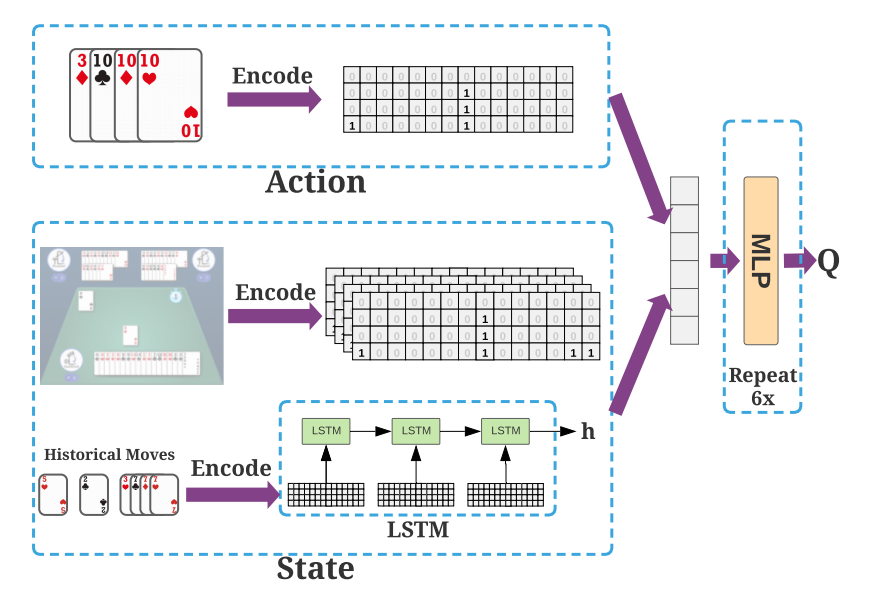

# 1 强化学习描述
强化学习，Reinforcement Learning (RL)是模型在跟环境进行交互的过程中进行学习。

强化学习也可以叫做激励学习，与传统深度学习惩罚驱动的学习不同，强化学习的第一动力是奖励（虽然在实现的时候也是惩罚驱动的）。

强化学习的模型与传统模型没有什么区别，强化学习的输入是当前的环境状态（Environment）或者全部的历史环境状态，输出是基于环境的决策。

举个例子，让一个强化学习模型做下围棋这件事情，当然，想到机器下围棋就会想到阿法狗。

我们将棋盘的状态信息输入到模型里面，这件事是相当容易的，因为围棋棋盘实际上就是一个二维矩阵，每一个元素代表棋盘上一个可以落点的位置，每个位置有黑子、白子、空白三种状态，我们可以用（-1，0，1）来表示。

输入的是一个二维矩阵，输出的是某一项决策。

就像是我们在分类任务里做的那样，我们输出一个决策数量维度的向量，每一个元素是作出这个决策的概率。

所以这样的一个强化学习模型看上去像是一个分类器模型。

除了模型，深度学习里最重要的其实是损失函数，或者说是目标函数。

这也是强化学习困难的地方。

为什么呢？

强化学习其实是根据决策在环境中的反馈来调节自身的，目标函数应该是最大化决策获得的奖励。

问题在于，深度学习使用的梯度下降算法要求目标函数必须是关于模型的输出可导的函数，但是给予的奖励是无法用模型的输出来计算的。

拿上面的例子来说，模型的决策0.99概率下在位置A和0.9概率下在位置A实际上并且都实际上下在A上，那么这两个决策获得的奖励实际上没有什么不同。

所以目标函数没办法直接对模型进行指导。

## 1.1 数学描述

在进行强化学习之前我们需要建立强化学习模型的数学描述，因为上面的决策什么的其实相当笼统。

第一步是对环境进行数学化，我们用状态来表示不同时刻的环境，时刻$t$的环境状态描述表示为$s^t$。

至于如何环境描述其实非常简单，就像是上面的棋盘变二维矩阵那样，环境状态信息实际上相当好描述，实在不行把所有描述数字化后堆在一起，让机器自己学。

基于输入的状态，机器会输出采取每一个决策的概率。

决策表示为$a^t$，表示t时刻实际上采取的行动。

决策$a^t$和状态$s^t$结合得到下一个时刻的状态$s^{t+1}$，同时通过某些机制我们可以获得对$a^t$的分数$r^t$。

我们的目标函数可以表达为$\max \limits_\theta \sum \limits_{t=1}^Tr^t$

## 1.2 注意点

强化学习模型输出的决策概率应该是真正的概率，也就是说尽管行动p的概率最高，但是只要行动q的概率不是0，那么就有可能在实际采取行动的时候采取行动q。

为什么呢？

这个解释是很直觉的，一个行动如果你做都没有做过，你就不会知道这个行动到底是好还是不好。

比如下五子棋，如果你每一次都把棋子放在棋盘角落，即使是后续你下的很好，但如果一开始你把棋子放在中间的区域，你的胜率就有可能大幅增加。

所以，我们要让机器尝试足够多的行动，才能让模型得到全局的最优解。

# 2 强化学习算法
## 2.1 policy gradient

我们虽然没办法写出奖励关于输出的具体函数，但是我们依然有部分进行梯度下降。

根据我们写出来的目标函数$\max \limits_\theta R_\theta =\sum \limits_{t=1}^Tr^t$

但是，我们实际采取的行动是一个概率性的问题，也就是说，虽然模型的参数相同，但是每一次模型与环境的交互结果都可能是不一样的。

也就是说，整体奖励$R_\theta$实际上是一个随机变量，很直觉地，如果我们让整体奖励的期望变得很大，那么一次的交互获得的整体奖励也不会太差。

就像是人打游戏有状态好和不好的时候，但是我们衡量其水平是综合考虑他的历史战绩的。

所以我们得到新的目标函数$\max \limits_\theta E(R_\theta)=\int P(R_\theta = x)R_\theta dx$

假设，一次交互中的状态、行动和奖励表示为：

$$\tau = {s^1,a^1,r^1,s^2,a^2,r^2,...,s^T,a^T,t^T}$$

那么，目标函数可以表达为$\max \limits_\theta E(R_\theta)=\sum \limits_{\tau } R(\tau)P(\tau | \theta)$

在这个目标函数下，我们是可以对模型参数$\theta$求导的。

对目标函数求偏导可以得到偏导

$$\begin{align}
\frac{\partial E(R_\theta)}{\partial \theta}&=\sum \limits_{\tau }R(\tau)\frac{\partial  P(\tau | \theta)}{\partial \theta} \\ &=\sum \limits_{\tau }R(\tau)P(\tau | \theta)\frac{1}{P(\tau | \theta)}\frac{\partial  P(\tau | \theta)}{\partial \theta} \\ &=\sum \limits_{\tau }R(\tau)P(\tau | \theta)\frac{\partial \log  P(\tau | \theta)}{\partial \theta}\\ &=E(R(\tau)\frac{\partial \log  P(\tau | \theta)}{\partial \theta})\\ & \approx \frac{1}{N}\sum \limits_{n=1}^N R(\tau^n)\frac{\partial \log  P(\tau^n | \theta)}{\partial \theta} \\ &=\frac{1}{N}\sum \limits_{n=1}^N R(\tau^n)\frac{\partial \log [P(s_1) \prod \limits_{t \, of \, \tau} P(a^t|s^t,\theta) ] }{\partial \theta}\\ &=\frac{1}{N}\sum \limits_{n=1}^N R(\tau^n)\sum \limits_{t \, of \, \tau}  \frac{\partial  \log P(a^t|s^t,\theta)   }{\partial \theta}
\end{align}$$

所以说，我们的目标函数实际上是$\max \frac{1}{N}\sum \limits_{n=1}^N R(\tau^n)\sum \limits_{t \, of \, \tau} \log P(a^t|s^t,\theta)$

这个目标与原目标是一致的，因为取对数不改变单调性。

其中$R(\tau^n)$ 是每一次交互的整体奖励，$P(a^t|s^t,\theta)$是每一步决策的概率。

该怎么去理解这个目标函数呢？

在取了对数后，目标函数的$\log P(a^t|s^t,\theta)$小于零，其最大值是0。

这个时候，$P(a^t|s^t,\theta)$会接近1，也就是说如果奖励是正的，那么就会告诉机器在$\tau^n$中做出的决策很好，机器在再次作出相同决策的时候对这个决策的信心就会增强，也就是与上一次相同的行动会有更大的被选中的概率。

而当奖励是负数的时候，就会降低过程中采取的行动的概率。

综合起来看，如果模型在偶然间一次交互得到了一次高分交互，那么模型会尽可能记住这次的交互，未来会有更大几率复现这次交互，相反，低分的交互会被遗忘，未来做出相同交互的可能性会减小。而高分交互也不是一成不变的，可能在某一次的交互中，模型发现更改一些步骤就会得到更高的分数，那么新的交互又会逐渐代替旧的高分交互。

用进化论来比喻这个过程真的是再适合不过了，某一次的交互作出的决策就像是某个基因序列，而一次交互就是一个生物个体。而那些高分的交互会更容易“活下来”，也就是高分的基因序列有更大的种群数量，更高的族群数量意味着基因突变的可能性也更大，所谓基因突变就是交互中采取其他行动的情况。在大的族群数量中，能更快的观察到基因突变，也就是进化速度更快，但是我们做的交互是固定次数的，一个种群的扩大意味着其他种群的数量减少，也就是低分基因被遗忘。

奖励都是正的，结果也是一样的，奖励大的更新步长自然就大，因为输出是一串概率，所以对于更新步长小的就相当于几率下降。

当然，这样做在实际操作上是有问题的，因为在变成概率的时候通常使用的是Softmax运算，如果奖励都是正的，那么Softmax之前的结果会一直变大，容易导致溢出，所以我们一个给奖励一个baseline，不到baseline的就是不好的交互。

比如说，每次都给N次交互奖励减去这N个奖励的平均值，再考虑到如果奖励分数太大会导致更新步长太大，可以把每一次的奖励数值都进行标准化。

很显然，我们没办法保证这样的更新一定是向着最优解前进的，因为交互的每一步行动不一定对最后分数的贡献不一定是积极的。

但是，只要我们进行足够多次数的交互，机器就会学到那些行动是有积极贡献的，哪些是消极贡献的。

还有一点就是为什么要取对数，因为每一次输出的概率里面，可能实际上行动p会带来更大的收益，但是其概率小，而另一个行动q的概率大，但是收益小，但是因为是用采样的方法，概率大的行动因为样本多，其贡献就会大于p，但是在取了对数后，会缩小概率大的行动的指导意见而放大概率小的行动的指导意见，相当于对采样带来的不公平现象进行平衡。

## 2.2 off-policy 的 policy gradient

on-policy:与环境交互的和学习的模型是同一个

off-policy:与环境交互的和学习的模型不是同一个

on-policy就是使用一个模型，不断重复交互-》训练-》交互这样的过程。

而off-policy就是有两个模型，其中一个负责与环境进行交互，而另外一个根据交互的结果进行进行训练。

从on-policy到off-policy就像是从单线程到双线程那样。

但是，很显然两个模型不能差太多，要不然很容易训练不起来。

最简单的，把模型某个时间点的副本当作交互模型就行了。

我们假设，有一个学习模型和一个交互模型，其参数分别为$\theta$和$\theta'$

我们只需要训练学习模型，至于交互模型怎么更新这里不考虑。

也就是说我们写出学习模型的目标函数就行了。

on-policy的目标函数为：$\max \limits_\theta E_{\tau \sim p_\theta (\tau)}[R(\tau)]$

但是因为交互模型是另外一个，所以没有办法通过采样来估计上述式子，但是我们可以通过演算得到其估计。

$$\begin{align}
\max \limits_\theta L &= E_{\tau \sim p_\theta (\tau)}[R(\tau)]\\
& = \int p_\theta (\tau)R(\tau) d\tau \\
& = \int p_{\theta'}(\tau)\frac{p_\theta(\tau)}{p_{\theta'(\tau)}}R(\tau) d\tau\\
& = E_{\tau \sim p_{\theta'} (\tau)}[\frac{p_\theta(\tau)}{p_{\theta'(\tau)}}R(\tau)]\\ 
& \approx \frac{1}{N}\sum\limits_{n=1}^{N}\frac{p_\theta(\tau^n)}{p_{\theta'(\tau^n)}}R(\tau^n)
\end{align}$$

将目标函数写成另外一种形式$J(\theta)=E_{(s^t,a^t)\sim \pi_\theta}[A^\theta(s^t,a^t)]$

$$\begin{align}
\nabla ER(\tau)&=E(R(\tau)\nabla \log P(\tau|\theta))\\
               &=\sum\limits_\tau R(\tau)P(\tau|\theta)\nabla \log P(\tau|\theta))\\
               &=\sum\limits_\tau [R(\tau)P(\tau|\theta)\sum\limits_{(a^t,s^t)\in \tau} \nabla \log P(a^t|s^t,\theta)]\\
               &=\sum\limits_{(a^t,s^t)}[\nabla \log P(a^t|s^t,\theta)\sum\limits_\tau R(\tau)P(\tau|\theta)g((a^t,s^t),\tau)]\\
               &=\sum\limits_{(a^t,s^t)}[\nabla \log P(a^t|s^t,\theta)E( R(\tau)g((a^t,s^t),\tau))]\\
               &=E_{(a^t,s^t)\sim P(a^t,s^t|\theta)}[\nabla \log P(a^t|s^t,\theta)\frac{E( R(\tau)g((a^t,s^t),\tau))}{P(a^t,s^t|\theta)}]
\end{align}$$

其中$g((a^t,s^t),\tau))$表示$(a^t,s^t)$在$\tau$中出现的次数，我们把$\frac{E( R(\tau)g((a^t,s^t),\tau))}{P(a^t,s^t|\theta)}$记为$A^\theta(s^t,a^t)$

我们可以用采样的方法估计$A^\theta(s^t,a^t)$

$$A^\theta(s^t,a^t)=\frac{\frac{1}{N}\sum\limits_{n=1}^NR(\tau)g((a^t,s^t),\tau)}{\frac{\sum\limits_{n=1}^Ng((a^t,s^t),\tau)}{\sum\limits_{n=1}^Ng(*,\tau)}}$$

化简一下可以得出$A^\theta(s^t,a^t)$是动作-状态$(s^t,a^t)$对应的全局奖励的均值再乘交互$\tau$的平均长度

这个梯度对应的目标函数是$J(\theta)=E_{(s^t,a^t)\sim \pi_\theta}[A^\theta(s^t,a^t)]$

推算一下就知道其实不对，但是都是这样写的，我也搞不懂。

正确的应该是：$J(\theta)=\frac{1}{N}\sum \limits_{n=1}^N\log P(a^t|s^t,\theta)A^\theta(s^t,a^t)$
$$\begin{align}
J(\theta)&=E_{(s^t,a^t)\sim \pi_{\theta'}}[\frac{p_\theta(s^t,a^t)}{p_{\theta'}(s^t,a^t)} A^{\theta}(s^t,a^t)]\\ 
& =E_{(s^t,a^t)\sim \pi_{\theta'}}[\frac{p_\theta(a^t|s^t)p_\theta(s^t)}{p_{\theta'}(a^t|s^t)p_{\theta'}(s^t)} A^{\theta}(s^t,a^t)]\\
& \approx E_{(s^t,a^t)\sim \pi_{\theta'}}[\frac{p_\theta(a^t|s^t)}{p_{\theta'}(a^t|s^t)} A^{\theta'}(s^t,a^t)]
\end{align}$$

把那两项丢掉的原因是，算不出来而且我们相信两个模型参数差不多的情况下，结果也差不多。

这个结果与用$J(\theta)=\frac{1}{N}\sum \limits_{n=1}^N\log P(a^t|s^t,\theta)A^\theta(s^t,a^t)$推导的结果是一致的，真的很神奇。

在PPO中，目标函数为$J^{\theta'}_{PPO}(\theta)=E_{(s^t,a^t)\sim \pi_{\theta'}}[\frac{p_\theta(a^t|s^t)}{p_{\theta'}(a^t|s^t)} A^{\theta'}(s^t,a^t)]-\beta KL(\theta ,\theta)$

而在TRPO，使用$KL(\theta ,\theta)<\epsilon$，而不是作为正则项。

上面的KL散度是指模型输出的距离。

## 2.3 Q-Learning

Q-Learning 的目标不是直接作出决策，而是试图评价一个决策好还是不好，好还是不好是表现在在采取行动后直到交互结束预期能够得到的分数。

Q函数的形式有两种：
- 输入是环境状态，输出是每一个行动的预期分数，只适用于离散行动决策
- 输入是环境状态和打算采取的行动，输出是预期的分数。
  
因为第二种情况比较全面，所以接下来的Q函数都写做：$Q^\pi(s,a)$

其中的$\pi$是指决策者，也就是Q函数其实是基于某个决策模型的分数估计函数。

其含义是，对于当前的状态s，采取行动a，然后剩下的交互全都交给$\pi$来做，从当前状态到交互结束能够获得的分数。

咀个栗子，$Q^\pi(s,a)=5$就代表着，先对环境采取动作a取得1分奖励，然后剩下的过程决策交给$\pi$，剩下的过程中获取4分奖励，这两部分奖励加起来是5，而如果换一个决策者$\pi'$，这个决策者可能比较厉害，然后它在后续可以获得10分，那么$Q^{\pi'}(s,a)=11$，或者这个决策a不够好，换成$a'$可能有$Q^\pi(s,a')=8$。

Q函数有下面的关系：

$$Q^\pi(s^t,a)=r^{s^t,a}+Q^\pi(s^{t+1},\pi(s^{t+1}))$$

Q函数可以用一个表来记录。

更新公式为$Q^{\pi'}(s^t,a^t)=(1-\alpha)Q^{\pi}(s^t,a^t)+\alpha (r+\gamma \max\limits_aQ^{\pi}(s^{t+1},a^t))$

### 2.3.1 DQN
Deep Q Network 即利用深度神经网络来拟合Q函数。

很显然的DQN比表格好，因为表格要求行动必须是离散的。

根据Q函数的关系式，我们很容易写出损失函数：$|r^{s^t,a}+Q^\pi(s^{t+1},\pi(s^{t+1}))-Q^\pi(s^t,a)|^2$

损失函数里有两个Q项，但是在实际操作的时候我们应该把$Q^\pi(s^{t+1},\pi(s^{t+1}))$的参数固定住，也就是不求导，或者是作为Q的复制网络参与运算。

这里的$\pi$可以基于贪心策略，每次走预计分数最高的行动，这样就不用另外训练一个决策者。

最后得到的DQN神经网络，基于这个网络使用贪心策略得到的决策就是DQN的决策。

### 2.3.2 Double DQN

Double DQN 根据Double DQN的作者研究，DQN会出现高估奖励的情况。

很明显，因为Q函数是一个个奖励堆叠上去的，而且因为训练的时候都是取最大的奖励的行动的，所以奖励很容易被高估。

而Double DQN使用2个DQN来进行训练，一个负责估计奖励，另外一个负责选择行动。

在实际操作上，Double DQN仅仅是把上面$|r^{s^t,a}+Q^\pi(s^{t+1},\pi(s^{t+1}))-Q^\pi(s^t,a)|^2$第二项下一步的决策交给更新的Q来做，而不是由固定住的那个Q。其他没有什么不同，经过一定次数的训练将训练后的参数复制给固定的Q，然后固定住的Q不参加训练。

### 2.3.3 Noise Net

DQN也存在因为没做过某些行动，导致不知道怎么评估某个行动的情况，可能某个情况下另外一个决策更好，但是因为没有做过所以不知道有更好的决策。

所以，Noise Net在获得决策上添加了一个规则：以$\epsilon$的概率将取得的使Q函数值最大的行动变成随机的某一个行动。

$\epsilon$会逐渐减小，这也很好理解，前面模型还没有这么进行学习，模型给出的决策建议基本上可以说是毫无意义，跟随便乱做没有什么区别，而后面模型的指导越来越准确的时候，如果还有很多胡乱决策就会导致训练低效，所以$\epsilon$要适当减小。

不过，噪声实际上是加在神经网络的参数上的。

## 2.4 DouZero

DouZero是国内快手团队发表的斗地主强化学习算法，论文为[《DouZero: Mastering DouDizhu with Self-Play Deep Reinforcement Learning》](https://arxiv.org/pdf/2106.06135.pdf)。

斗地主作为国民级别的卡牌游戏，虽然简单易上手但是想要玩好却不是这么容易，斗地主甚至有职业联赛，这足以说明其难度。

在一般规则下，斗地主的动作空间非常大，达到了$10^4$的数量级，强化学习目前对于动作空间小的游戏有比较好的效果，要知道围棋的动作空间也才几百。

DouZero的算法属于DQN，因为斗地主的玩家有三个而且各自扮演不同的角色，所以DouZero中使用了3个DQN来学习三种角色：地主、地主上家、地主下家的行为模式。

扑克牌中有15种牌，所以手牌、出牌都可以表示为一个15x4的矩阵，虽然在其Github的代码中使用的54的向量来表示。



如图，将出牌历史送入LSTM当中，取最后一次输出然后与动作、三人的手牌状态拼接在一起组成输入全连接层当中得到评估分数。

虽然斗地主的动作空间很大，但是在实际的对弈过程当中，每个人出牌的选择实际上很小。例如:上家出了三带一的牌，可以出牌的选择实际上只有不出、出更大的三带一、炸弹，这样的选择最大不超过20。只有在地主首次出牌以及炸弹后出牌和前面两人不出的情况下动作空间才比较大一点，但依然收到手牌的限制。而且游戏进行到后面的动作空间会比开始时小很多。

所以说，斗地主的动作空间大是在用one-hot向量来表示这些动作的时候，但是我们用牌矩阵/向量的时候就很小了。

同时在训练过程中的采样，使用了以一定概率选择随机动作来增加原样本多样性。

# 4 实验
## 1 PolicyGradient

对于policygradient，pytorch提供了根据网络输出的概率产生行动的函数，所以使用起来很容易，同时要定义损失函数也很容易。

而且，其流程也相当固定，所以我写了一个对于离散决策的PolicyGradient问题的框架。

@import "code/PolicyGradient_Base.py" {class="line-numbers"}

### 1.1 小车平衡杆
@import "images/1.png" 

这个游戏很简单，通过左右移动来使棍子保持向上的姿态。

环境也很简单，小车位置、速度、小棍方向、角速度一共4个值。

所以定义一个简单网络就行了。

```python
from torch import nn
from PolicyGradient_Base import PolicyGradientLearner
class PolicyNet(nn.Module):
    def __init__(self):
        super().__init__()
        self.nn=nn.Sequential(
            nn.Linear(4,16),
            nn.ReLU(),
            nn.Linear(16,16),
            nn.ReLU(),
            nn.Linear(16,2),
            nn.Softmax()
        )
    def forward(self,input):
        return self.nn(input)
args={epochs:50,batch_size:8,game='CartPole-v1',lr=1e-3}
learner=PolicyGradientLearner(args,PolicyNet)
learner.train()#训练
learner.save_model('CartPole-v1.pkl')
learner.display()
```


# 参考


