[TOC]
# 0 数学基础

# 1 目标检测技术
目标检测技术是一种应用非常广泛的技术，其目标是在图像或视频当中找到特定物体或对所有物体进行标注。

其应用包括指纹识别、人脸识别、飞行物识别、车牌号识别、无人驾驶、医疗等。

目标检测技术的基本思路是选取一些候选框交给机器学习算法进行判断，而不是让机器直接告诉你物体在哪里。

这样子虽然看似会让机器做许多无用功，但是这很直接的减小了网络的模型与计算量。

目标检测技术有两个目标，第一个是定位，第二个是识别。

识别技术目前已经相当成熟，所以目标检测技术的更多的内容是如何进行高效的定位。

图像中的物体可能有多个，而不是像识别那样一个萝卜一个坑。

另一方面，该如何界定物体的范围也是需要考虑的。

最简单的思路就是将图片分割成不同区域，不同大小的图像，然后一股脑地交给分类模型，选取其中分类器分数最高的那部分。

不过这种方法想想就知道效率会很低。

## 1.1 Selective Search 方法

按照上面说的，如果将图片分割成不同区域不同大小的图像，这个数量级是相当大的，同时还要有对应的分类器。

Selective Search方法是一种性能比较好的图像分割方法。

第一步是先将原始图像分割成非常小的块。

第二步是对图像块进行合并，每次合并最相似的两块作为新的块。

然后重复步骤2直到合并的只剩下一个块，也就是原始图像。

- 分割原始图像
  分割原始的图像使用的是[Efficient Graph-Based Image Segmentation](http://cs.brown.edu/~pff/papers/seg-ijcv.pdf)当中提出的分割算法，这种方法本身就已经能较好地分割物体区域了。
  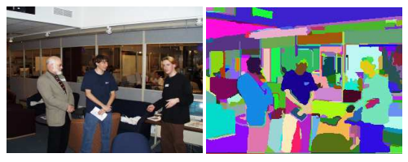

- 相似度计算
  相似度有四个指标，分别是
  1 颜色相似，这部分用直方图来运算
  2 纹理相似，这里用的是图像的梯度直方图
  3 大小指标，合并后的块的面积尽可能小
  4 形状指标，合并后的块尽可能规则，也就是在其外框当中占的面积比例尽可能大或者说外框尽可能小。

- 其他
  在计算过程中，不是每一次都计算所有相似度的，而是在第一次算好后，后面每次只是把已经被合并的块的相关相似度删除，然后添加上新块的相邻相似度。

  另外，在计算过程中需要保存合并历史，这样做是为了后面进行识别。

## 1.2 YOLO
YOLO(You Only Look Once)是主流的目标检测解决方案，如今最新的YOLO版本是YOLO v4。
### 1.2.1  YOLO v1 

YOLO不使用候选框，或者说是不使用简单手法生成的候选框，其候选框的由模型生成的。

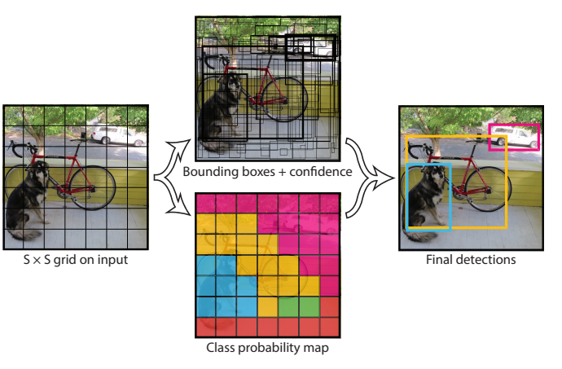

第一步是先将原始图像分割，如上图。

对于每一个小块，都假设物体的中心点就落在这个小块的里面。

模型需要做两件事情，第一件是生成$B$个候选框，候选框的数据包括中心点$(x,y)$和尺寸$(w,h)$还有一个置信度一共五个数据。

要做的第二件事情就是预测这个小块的类别，用$C$维的one-hot向量表示。

因此，模型是输出规模是$S^2(5B+C)$

关于候选框，也就是Bounding box，在实际操作中应该使用$(0,1)$对坐标进行映射，也用$(0,1)$映射尺寸，所以模型的实际输出应该是$\frac{x}{w_g},\frac{y}{h_g},\frac{w}{w_{img}},\frac{y}{y_{img}}$，这样做也刚好能够配合激活函数。

至于置信度，使用的是IOU（交并比）指标，记预测框与实际框的范围为$A,B$，这是两个平面区域，IOU就是两个图形的交集面积乘以并集面积:

$$IOU(A,B)=\frac{S(A\cap B)}{S(A\cup B)}$$

这个指标说明了了个区域的重叠性，当完全不重合的时候就是0，完全一样的时候就是1。

显而易见，当块位于物体中间的时候，其交并比的值通常会更大。这样就能淘汰位于边界的块。

置信度就$=Pr(Object)IOU^{truth}_{pred}$

当块里面没有物体时，就把$Pr(Object)$设置为0，有的时候就是1。

这样训练的时候没有物体的块的预测框就不会参与梯度下降。

模型的损失函数为：

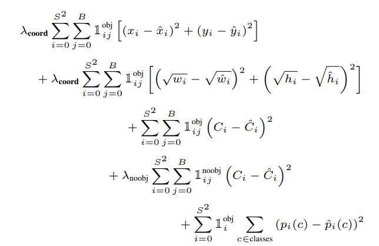

第一行和第二行是$x,y,w,h$的损失，第三行和第四行的是置信度是损失，注意上面说的置信度是置信度标准值，模型还得生成一个置信度，第五行就是一个分类损失函数。

第二行取损失的原因是让其对小物体更加敏感。

置信度损失加权的原因是很多块当中并没有物体，这样很容易让模型直接输出0。

### 1.2.2 YOLO v2

YOLO v2相比第一个版本改进了以下几点。

- 使用BN层，并且不使用Dropout，没啥好说的
- 使用先验框，使用聚类算法从数据集当中找到几个合适的$(w,h)$，在预测时根据先验框为基础进行预测
  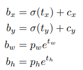
   $c_x,c_y$是单元格在整张图上的坐标，$b_w,b_h$依然是框的尺寸。
- 取消全连接层，取消全连接层后输入数据的大小限制就消失了，模型可以在多个尺度下进行训练
- 联合训练，物体识别的训练数据的分类数量非常少，而图片分类的类别多达上完种。
  通过交替在不同数据集上进行训练，让模型在有能力框选物体的时候还有良好的分类效果。
  在物体识别的训练数据上就按照原来的方法做，在图片分类数据集上的时候就只计算分类的损失。

### 1.2.3 YOLO v3

YOLO v3 在YOLO v2的基础上做了一些改进，不过并没有什么特别惊艳的超新，只能说是中规中矩。

在网络结构上的改进就不多谈了，主要是方法上改进。

这个版本的方法对不同尺寸的物体的识别做出了改进，首先网络的输出不再是一个，而是三个输出。

什么意思呢？

前两个版本的网络输出是一个$(S,S,D)$的三维数组，而现在是三个数组$(S_1,S_1,D),(S_2,S_2,D),(S_3,S_3,D)$

相比于v2的输出是$13\times 13$的规模，v3新增了$26\times 26,52\times 52$，同时每一个输出都有对应的三个先验框，就像v2中的那样。

将图像分成$52\times 52$显然是对应于小物体的检测，其对应的先验框的尺寸也比较小。

$13\times 13$就检测较大的物体，先验框的尺寸也比较大。

但是并不是使用了三个独立的网络，毕竟特征提取部分是可以共用的，整个网络就像一个三叉戟。这样计算资源需求并不会增加多少。

同时上面所说的9个先验框也是通过聚类产生的。

### 1.2.4 YOLO v4

v4 的主要工作是用各种手段对模型进行调优，比如数据增强、正则化等手段。

说白了就是不断尝试，把所有的方法都试一试，然后排列组合一下。

## 1.3 SSD

SSD（Single Shot MultiBox Detector）在性能上比YOLO（v1）更胜一筹，也是一次性输出多个框的算法。

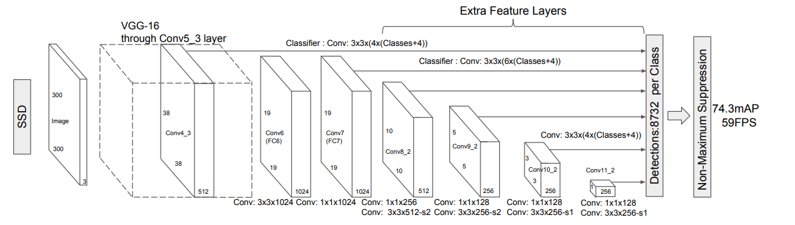

如上图，SSD的主要特点就是能够进行多尺度检测，前面的比较大的特征图代表对小物体的检测，后面的小尺寸的特征图负责检测大物体。

同时，每一个尺寸都有预设的先验框。

SSD提出时间先于YOLO v2，因此多尺度检测和先验框都是创新的点。

SSD的损失函数由两部分构成，第一部分是定位损失

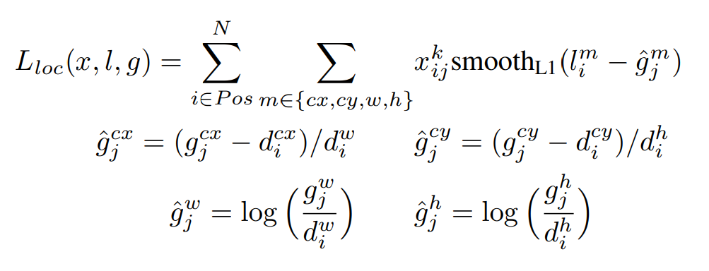

其中$N$是预测框的数量，$x_{ij}^k$是第$i$个预测框与第$j$个实际框关于第$k$类的匹配情况，高于一定阈值的为1否则为0。$d$是预测框对应的先验框。$g$是实际框，后面四个式子的操作是将实际框的坐标转换到模型的输出值域上。

L1平滑的定义为:
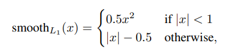

第二部分是置信损失：

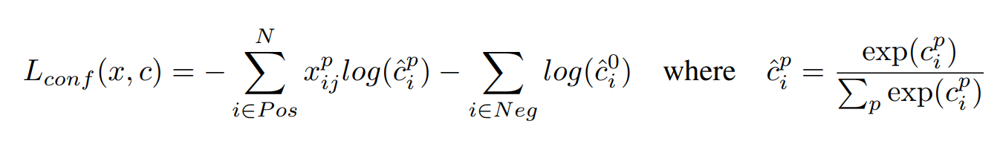

其中第0类代表背景，因为再SSD当中背景也被当做物体的一类，后一项使用了抽样的方法，与实际框匹配的为正样本，而匹配不上的就是匹配背景为负样本，进行抽样是为了使正负样本平衡。

## 1.4 非极大值抑制

非极大值抑制算法是应用于目标检测的去重复阶段的算法。

假设某一个算法给出了$n$个预测框框以及其评分。

执行下面的步骤：

- 1 对$n$个预测框用评分从小到大排序
- 2 用评分最大的预测框与其他预测框计算交并比
- 3 删除其他预测框中与最大评分交并比大于一定阈值的预测框
- 4 输出评分最大的预测框并从集合中删除
- 5 重复2，3，4直到集合为空集

以上步骤中输出的预测框就是最后标注在图片当中的预测框。

可以看到，非极大值抑制算法的作用就是去除重复的预测框。

至于评分，这是由前面的算法得出的，比如在YOLO中，评分为置信度与分类信心的乘积。

# 2 人体姿态识别技术

人体姿态识别是专门针对于人体动作的识别技术，人体姿态检测在许多方面特别是在安全监控、体育运动、游戏娱乐领域有应用。

与人脸识别不同的是，人体姿态识别的主要关注点是在人体总体的姿态上，也就是说具体是什么样子的不重要，重要的是其形状。也就是说，人体姿态识别对分辨率的依赖不大。

关于人体的识别有如下几个方面

- 有没有人
- 谁
- 在哪
- 在干什么
  
前三项分别由目标检测和人脸识别负责检测，而关于‘在干什么’就是人体姿态识别的领域。

显然，在有目标检测的成果后，人体姿态识别的研究就变得简单了，因为通过目标检测分离出的人体图片相当干净。

## 2.1 人体骨骼关键点检测

人的姿态是由骨骼形态决定的，因为人有高矮胖瘦身上可能还有各种各样的设备，但是人体的骨骼却是大同小异。

人体骨骼关键点检测技术的输出是一系列人体骨骼信息，包括是哪块骨骼（关节）、位置等信息。

有了人体骨骼的信息，人体的姿态也就基本搞清楚了。

人体的骨骼检测的结果大概是这个样子的：

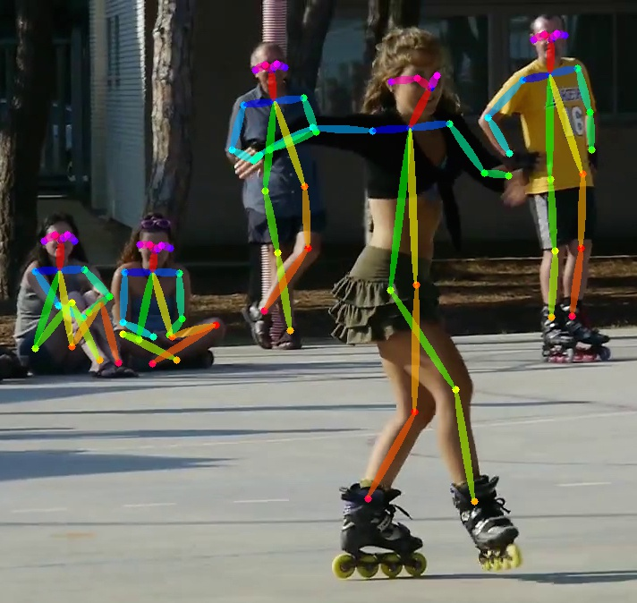

图中的那些圆点才是机器输出的信息，而那些线条是后面连接上去的。

这些点就是所谓的关键点。

人体骨骼分析并不需要做人体定位识别这样的工作，交给目标识别技术就行了，所以只需要关注如何分析人体关键点。

像这样的方法被称为自上而下的模式。

除此之外还有自下而上的方式，那就是对整张图上所有可能的关键点都进行标注，如何通过算法把关键点再合成为人。

这两种方式有什么不一样吗？

有！

对于自上而下的方式，目标识别技术在找出$n$个目标人像后，需要运行$n$次分析骨骼的神经网络。也就是说，其时间复杂度为$O(n)$。

而自下而上的方式是一次性找出所有的关键点，因此只需要运行一次。

那人体关键点的信息是如何表示的呢？

Coordinate和Heatmap两种表达。

Coordinate是直接给出关键点的坐标，而Heatmap是一张概率图，每一个像素点都是属于某一个关键点的类别向量。

Heatmap的方法要远优于Coordinate。

### 2.1.1 单人姿态估计

单人姿态估计需要先对数据集进行处理，保证数据集很干净，而且人物占据图像的主要内容。通常会用物体目标检测先找到人体，然后进行裁剪和放缩。

基本结构也不复杂，因为这是一个回归问题。模型的输出是一张概率图，规模可以和原图像一样，也可以是分块后的大小。

区别大的就是网络结构设计。

看一个例子。

 Convolutional Pose Machines
  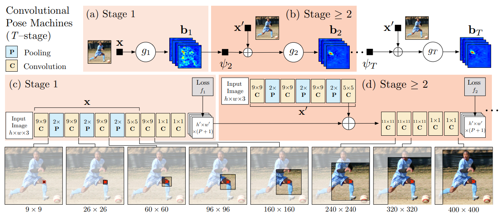
 Convolutional Pose Machines的想法是多尺度的进行检测。网络分为不同大小的一系列检测网络，说不清楚，看图吧。

### 2.1.2 多人姿态估计

目前主流的都是在做多人2D估计和3D估计，因为单人姿态估计已经做的比较成熟了。

多人状态估计前面说过有两种方式：自上而下和自下而上。

先看比较简单的自上而下。

自上而下就是先用目标检测的手段把人像部分从图中扣出来，然后经过一定的处理就变成了比较成熟的单人姿态估计。

所以算法的运行时间与图片中的人数是正相关的。

- RMPE
  RMPE算法是[AlphaPose](https://github.com/MVIG-SJTU/AlphaPose)使用的算法。
  RMPE的想法是先通过空间变换网络(STN)将人物抠出来变成居中的占主要内容的图像，然后交给单人姿态估计(SPPE)得到关键点，然后把关键点通过逆向空间变换网络(SDTN)映射到原图像。

  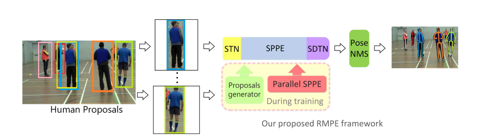

  并行SPPE是指，将SPPE网络固定住，然后通过强化学习训练STN的一种方法。

  至于姿态非极大值抑制是针对于姿态的去重算法。

  所以，论文里定义了姿态之间的距离：
  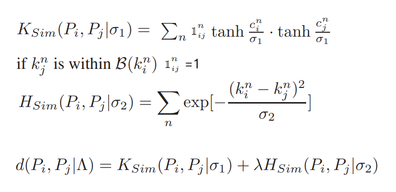

  第一行的距离中$c_i^n$是指第$i$个姿态的第$n$个关键点的置信度，$k_i^n$是第$i$个姿态的第$n$个关键点的位置，$B(k_i^n)$是以$k_i^n$的矩形范围（邻域），尺寸为图像的十分之一。这个距离统计了关键点匹配的数量。

  第二行的距离，可以看出对应的两个节点之间的欧式距离越大，其相似距离就越小。

  总之，这里的距离其实是相似度的含义，了个姿态越接近其值就越大。

  有了相似度的定义后，我们就可以使用非极大值抑制算法去除重复的姿态了。

- OpenPose

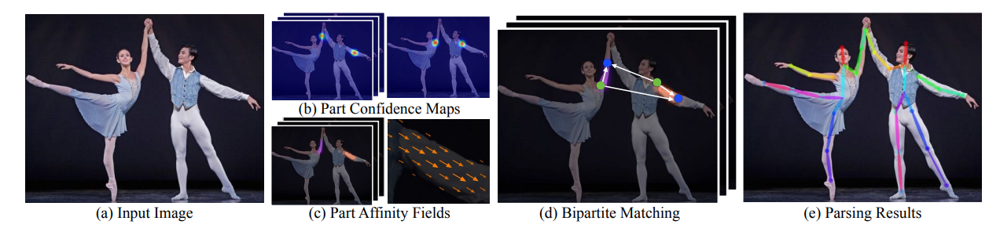

OpenPose使用的是自下而上的方式来分析人体姿态。

首先，模型会生成部位置信图，也就是上图中的b。

假设输入的图片的规格为$\mathbb{R}^{w\times h\times 3}$，那么部位置信图的规格为$\mathbb{R}^{w\times h\times J}$其中$J$是关键点的种类数。

其次，模型还会生成部位关联图（图中c）。

部位关联图的规格为$\mathbb{R}^{w\times h\times 2}$，图中每一个元素是一个向量，表明了关联的方向。

具体的过程如下：

- 1 将原始图像输入卷积神经网络（VGG-19的前10层）得到特征图$F$
- 2 用$T_p$个卷积神经网络$\phi$生成部位关联图$L_1=\phi^1(F),L_t=\phi^t(F,L_{t-1})$
- 3 用$T_c$个卷积神经网络$\rho$生成部位置信图$S_1=\rho^1(F,L_{T_p}),S_t=\rho^t(F,L_{T_p},S_{t-1})$
  
其中，$T_p$是肢体的数量，$T_c$是关键点的数量。

用下面的损失进行约束：

@import "image/2.1_e.png" {width=400}

其中$L_c^*$是真实部位关联图，$S_j^*$是真实关键点图，$W(p)$在真实数据中没有标注的时候是0否则是1。

假设现在通过置信图确定了一些关键点，如果图中只有一个人那显然是很好处理的，所以需要解决的是多人的情况。

考虑这种情景：我们通过置信图找到了4个关键点，两个A部位的，两个B部位的，而且A和B应该是相连的。那么可能的组合就是$2!$个，如果有$n$组就会有$n!$个组合。因此需要找到一个方法选出正确的组合。

定义一个在部位亲和场上的积分，设两个点为$x_1$和$x_2$

$E=\int_0^1 \frac{x_2-x_1}{\parallel x_2-x_1\parallel}L(p(u))du$

也就是沿着线段$x_1x_2$对‘线段方向向量与部位亲和场向量的内积’做曲线积分，在实际操作中，因为是离散数据，所以用抽样来代替。

因为部位亲和场表征的是肢体的方向，所以当这个值的的绝对值大的时候就认为这两个关键点属于同一个人的可能性越大。

因此，我们需要做的就是找到一个分配方法，使得这样的积分的绝对值的和最大。

一个很容易想到的方案就是利用贪心算法找到这个解。

先找到积分绝对值最大的一对，然后在剩下的关键点里找最大的，直到无法再配对。

虽然说在神经网络的运行方面是只进行了一次运行，但是其在后面的关键点匹配问题上的运算依然是随认识增加的，而且还是以阶乘的方式增加的。

然而时间复杂度并不能说明所有，因为通常图像当中的人数不会趋于无穷大，即使是监控图像在大多数情况下人数也不多，而且对于小图像的运算肯定会比大图像快。所以在时间上，自上而下的方式也不是不能接受。

# 3 图片分类
## 3.1 STN

STN(空间变换网络)。

借助于矩阵运算，可以完成像素点的变换。

$$\left(\begin{array}{}
  x'\\
  y'\\
  1
\end{array}\right)=\left(\begin{array}{}
  \theta_1&\theta_2&dx\\
  \theta_3&\theta_4&dy\\
  0&0&1
\end{array}\right)\left(\begin{array}{}
  x\\y\\1
\end{array}\right)$$

也就是说，完成像素点的空间变换只需要6个参数。

STN的思想就是利用神经网络来生成6个参数作为空间变换方法。

假设原图像的大小为$w,h$，目标图像大小为$w',h'$。

我们希望有一个变换能够将原图像中我们期望检测的物体与背景尽可能分离出来，也就是说尽可能让物体尺寸、位置等尽可能符合检测网络的要求，这样的变换是一定存在的，同时也一定会有一个逆变换，能够完成逆向的操作。

这个逆向空间变换就是网络要学习的目标。

对于在目标图像的像素点$(x',y')$在经过空间变换后可以找到它在原图像上的坐标$(x,y)$，然后只要取对应的像素点复制到$(x',y')$就大功告成了。

接下来就是重点了，经过空间变换的坐标是不可能有零有整的，这个坐标以趋近于1的概率是小数，因此确定对应坐标的方法或者说策略就很重要了。

一般来说，在图像处理会采用最接近像素点代替和线性插值的方法，但是在这里最近像素点是不可取的，因为没办法求导，或者说是难以优化。所以一般会采用双线性插值方法来采样。

对于原图像当中的坐标$(x,y)$来说，它在四个像素点的包围当中：$(\lfloor x \rfloor , \lfloor y \rfloor),(\lfloor x \rfloor ,\lceil y\rceil) ,(\lceil x\rceil ,\lfloor y\rfloor),(\lceil x \rceil ,\lceil y \rceil)$

则$p_{(x,y)}=p_{(\lfloor x \rfloor , \lfloor y \rfloor)}[1-(x-\lfloor x \rfloor)][1-(y-\lfloor y \rfloor)]+p_{(\lfloor x \rfloor ,\lceil y\rceil)}[1-(x-\lfloor x \rfloor)][1-(\lceil y \rceil -y)]+p_{(\lceil x\rceil ,\lfloor y\rfloor)}[1-(\lceil x \rceil -x)][1-(y-\lfloor y \rfloor)]+p_{(\lceil x \rceil ,\lceil y \rceil)}[1-(\lceil x \rceil -x)][1-(\lceil y \rceil -y))]$

这样，$p_{x,y},p_{x',y'}$是关于$x,y$的函数，$x,y$是关于那6个参数的函数，因此生成参数的网络就可以使用梯度进行优化了。

而最终的损失函数其实是对目标图像进行检测的结果相关的，但是因为目标检测的图像的每一个数据点已经不是无源数据了，所以梯度是可以传播到参数生成网络的。

所以STN实际上是一个有两个或以上神经网络的复合模型。

# 其他
## 图像数据增强方法
常见的图像增强方法有
- 图像扰动
- 改变亮度、对比对、饱和度、色调
- 加噪声
- 随机缩放
- 随机裁剪（random crop）
- 翻转
- 旋转
- 随机擦除（random erase）
- Cutout
  将图像中的随机区域置零，也就是去除这部分的图像
- MixUp
  将两张图像按照比例混合
- CutMix
  将图像中随机区域置换成其他图像的相当的区域    