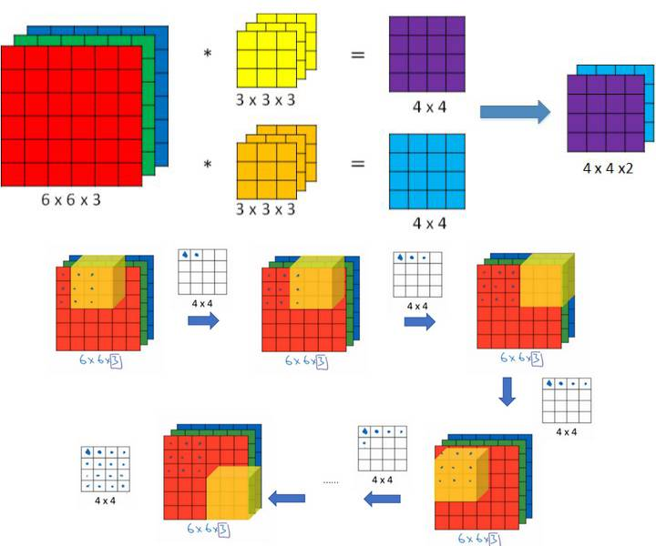
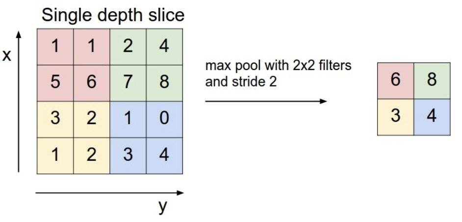
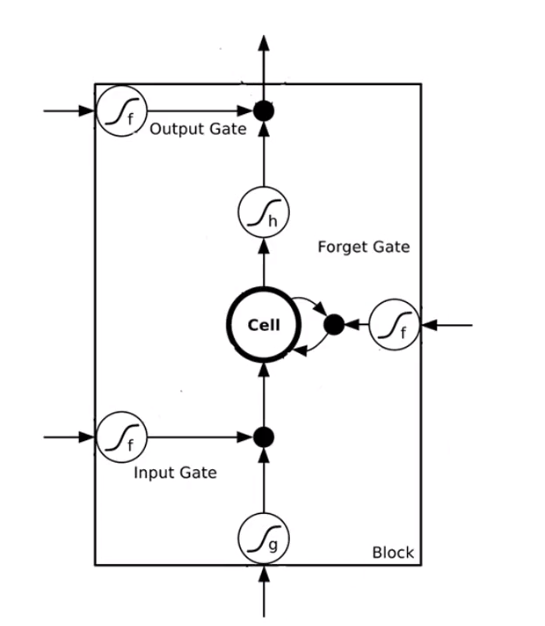
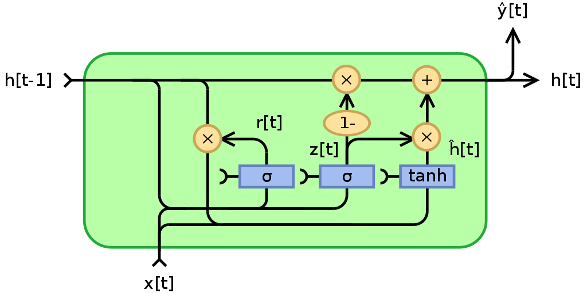
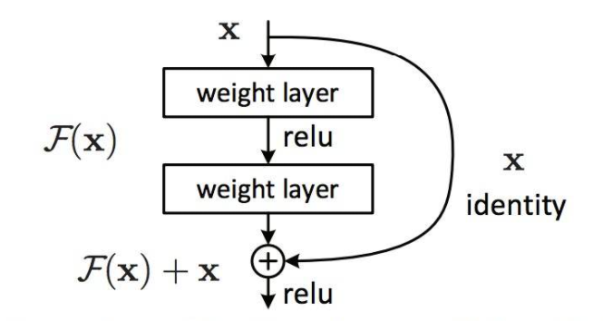

# 0. 数学基础

# 1. 全连接层
全连接层FullyConnected(FC) Layer 是神经网络中最基础的网络结构。

### 1.1 神经元
神经元是构成全连接层的基础，其是一个多元函数。

假定输入为向量$x \in R^n$，输出为一个数字$y$。

那么神经元可表达为$y=a(w^Tx+b)$

其中$a(\cdot)$为一个实函数，因为被称为激活函数，$w$是一个与$x$长度相同的向量，$b$为实数。

### 1.2 全连接层
全连接层就是由多个神经元组成的结构。

其输入依然是$x \in R^n$，而输出为$y \in R^m$，$m$为神经元的数量，$y$向量中的每一个元素都是对应神经元的函数值。

记函数$A([x_1,x_2,...,x_n]^T)=[a(x_1),a(x_2),...,a(x_n)]^T$

则全连接层可以表达为$y=A(Wx+b),W=[w_1,w_2,...,w_m]^T,b=[b_1,b_2,...,b_m]^T$

### 1.3 多层感知机
由多个全连接层叠加起来的模型被称为多层感知机。

多层感知机可以表达为:$y=A^k(W^k(A^{k-1}(W^{k-1}(...)+b^{k-1}))+b^k)$

### 1.4 常用激活函数

|函数名称|表达式|
|---|---|
|Sigmoid|$a(z)=\frac{1}{1+e^{-z}}$
|tanh|$a(z)=\frac{e^z-e^{-z}}{e^z+e^{-z}}$|
|ReLU|$a(z)=max(z,0)$|
|LeakyReLU|$a(z)=max(z,0)+min(0,\alpha z)$|

# 2. 卷积层
卷积层是专门为了处理图像问题而设计的网络结构。

最经典的卷积层是二维卷积。

二维卷积的输入是一个[c,H,W]的三维张量。

二维卷积层内有多个卷积核，一般是[c,k,k]的三维张量。

卷积运算过程是一个重循环，可以表达为：
```
For i = 0 , i + k <= H :
    For j =0 , j + k <= W :
        子数组=输入[0:c,i:i+k,j:j+k]
        结果[i][j]=内积(子数组,卷积核)
```
加上对多个卷积核进行运算就是一个三重循环。



上图为卷积运算的示意图。

卷积层的运算结果通常被称为卷积特征图。

卷积层后通常也会跟上激活函数。

## 2.1 池化层
池化技术通常与卷积技术是绑定在一起的。

其作用是对卷积特征图的数据量进行压缩，一个很直觉的原因为什么要进行数据压缩就是：一个特征图元素与他周围的特征图元素包含的信息有很多相同的部分。

池化层最主要的两种设计分别是:最大池化、平均池化

特征图也是一个三维的张量，可以看成是一个元素为二维数组的数组，池化就是将二维数组分割成一小块一小块的，然后每一个小块只保留最大值或平均值。

通常情况下是将二维数组分割成（2x2）大小的小块。



# 3. Self-Attention
自注意力层是一种非常新的网络结构。

Self-Attention 的输入是一个二维的张量，或者说是元素为向量的数组，假定为$A\in R^{n\cdot m}$。

首先是计算每一个向量与其他向量的关联性$f(a^i,a^j)$。

最流行的算法是先给$a^i$乘矩阵$W^q$，给$a^j$乘矩阵$W^k$得到$q^i=W^qa^i,k^j=W^ka^j$

然后取两个向量的内积作为结果$\alpha_{i,j}=(q^i)^Tk^j$

$a_i$和所有向量（包括自己）算关联性得到向量$\alpha_i$，接着对$\alpha_i$做Softmax运算得到$\hat{\alpha}_i$

然后是对所有的向量乘上矩阵$W^v$，得到$W^va_1,...,W^va_m$

接下来计算$b^i=\sum\limits_{j=1}^m\alpha_{i,j}W^va_j$

很直觉的，一个向量的与$a_i$关联性越高，$b^i$中包含的的来自它的信息就越多（权重越大）。

这最后的m个向量$b_i$就是Self-Attention层的输出。

上面的步骤虽然看起来复杂，但是实际上实际操作起来很简单。

首先准备3个矩阵$W^q,W^k,W^v$,分别与矩阵$A$相乘得到$Q,K,V$,接下来计算$Q^TK$,然后对这个矩阵的所有列向量(横的竖的都可以，只影响最后的运算表达式而已)做Softmax运算，然后再左乘矩阵$V$就得到了矩阵$B$。

总结起来就是$B=W^vASoftmax(A^TW^{qT}W^kA)$ 其中Softmax对列向量做运算。

### 3.1 Multi-head Self-Attention

Multi-head Self-Attention的考虑是向量之间的相关性可能有不同的方面。

做法实际上很简单，并列多个Self-Attention，对一个输入矩阵得到多个输出矩阵$B^1,...B^k$,然后将这k个矩阵拼接起来乘上一个矩阵$W^o$就得到了最后的结果。

## 4. RNN
RNN 的输入是一个向量序列，当然也可以是更高维的张量。

RNN的输出分为两部分，第一部分是像正常网络那样吃一个输入吐一个输出，第二部分是下一个时刻的信息或者说是当前的信息。

RNN的输入也是分为两个部分，正常的输入和上一个时刻的状态信息。


来自上一个时刻的信息$S_{t-1}$乘上矩阵$W$再加上输入的$x_t$乘上矩阵$U$的和作为神经网络的输入得到当前状态$S_t=f(Ux_t+WS_{t-1})$

然后当前状态作为输入送入神经网络得到输出$o_t=g(S_t)$

RNN 与一般的神经网络再结构上不同的也仅仅是多了一个矩阵$W$
### 4.1 LSTM
LSTM（Long Short-Term Memory）是一种更加常用的CNN架构。



这是来自李宏毅老师的ppt的图片。

相比于RNN，除了有保存上一步信息的cell，还多出来三个门：输入门（阀）、遗忘门、输出门。

输入门：决定当前输入的向量是否有效。

假设当前输入的的是向量序列$x$,进行到时刻$t$的输入为$x_t$,则Input Gate的输出为$i_t=\sigma_g(W_ix_t+U_ih_{t-1}+b_i)$

其中，$\sigma_g$使用sigmoid函数，也就是说输出是0~1之间的数值，表示的是输入门的打开程度，$h_{t-1}$是上一个时刻的隐藏状态。

遗忘门：决定保存在cell里的隐藏状态是否被遗忘。

遗忘门的输出为$f_t=\sigma_g(W_fx_t+U_fh_{t-1}+b_f)$

与输入门相似，不过其值表达的含义并不是遗忘的程度，而是记住的程度，所以叫记忆门会更加合适。

输出门：决定当前时刻是否输出数据。

输出门的表达式为$o_t=\sigma_g(W_ox_t+U_oh_{t-1}+b_o)$

与前两个门类似，其值表示输出的有效程度。

三个门的输出并不是一个实数，而是一个向量，输入门和遗忘门的维度为h，输出门的维度不作规定。

而真正的输入为$g(x_t)$，其输出维度与前两个个门的输出维度以及隐藏状态的维度相同。

当输入门的值都接近0时，表示当前输入$g(x_t)$无效，也就是说不考虑这个输入，反之亦然。

所以可以用元素对应乘法得到输入经过输入门后的状态，接着是遗忘门，其输出为0的时候表示将隐藏状态遗忘，同样用元素对应乘来表示，最后的输入门有相似的表述。

而新的隐藏状态由通过遗忘门后的隐藏状态和通过输入门的输入共同决定，直接加起来就行了，而新的隐藏状态再经过运算得到输出，任何再由输出门决定输出是否有效。

更新的状态为$g_t=i_t\odot g(x_t)+f_t\odot h_{t-1}$

输出为:$y_t=o_t\odot h_t$

### 4.2 GRU

GRU（Gated Recurrent Unit）是LSTM的变形。

根据实验，再LSTM中，遗忘门最重要，输入门次之，输出门最后。

GRU中没有对输出进行控制，仅仅是对输入和隐藏状态进行处理。

与LSTM的做法类似。

首先是计算一个重置门:$r_t=\sigma(W_rx_t+U_rh_{t-i}+b_r)$

以及一个门控:$z_t=\sigma(W_zx_t+U_zh_{t-i}+b_z)$

接下来计算当前输入具有的隐藏信息: $h'=tanh(Wx_t+Uh_{t-1}\odot r_t)$


接着用更新隐藏状态为:$h_t=(1-z_t)\odot h_{t-1}+z_t\odot h'$


再根据更新后的隐藏状态计算输出，则t时刻的运算就完成了。



# 5 残差网络

残差网络最重要是使用了残差块的特殊结构。

其实残差块的设计并不复杂，甚至可以说相当简单。

残差块由两层神经网络层组成（可以说是全连接层或卷积层或其他参数网络架构）。



主要设计在于将输入的数据与两层神经网络层输出进行叠加作为残差块的输出，设计的相当简单，在代码执行的时候就多几行代码的事情。

残差块的设计是为了解决深度神经网络的退化问题。

# 6 Dropout

Dropout并不是某种参数学习结构，而是一种神经网络训练技巧。

Dropout的思想是在神经网络训练时，在两层参数学习层之间传递过程中，将上一层的输出dropout一部分。在实际代码当中，就是让输出的每一个数字以一定概率$p$变成0。

Dropout与ReLU激活函数一样，都可以将一个复杂的神经网络模型变成一堆参数更少的神经网络。

与ReLU函数不同的是，使用ReLU的神经网络可能学习到的是对于某些数据使用某一个子网络准确率会更高。

而Dropout是训练一堆都很强的子网络，每一个子网络都比较强。

Dropout在训练时与预测时的模式的不同的，在训练的时候是将一些输出变成0。

在预测的时候，Dropout不会丢掉输出，而是将神经网络当中的权重都乘上概率$p$。

这也很容易理解，因为在训练是时候输入的一部分变成了0，而现在这部分不变0了，那么到达激活函数的值就相应变大了，所以乘上概率$p$，因为在不变之后抵达激活函数的值预计会是dropout时的$\frac{1}{p}$。


